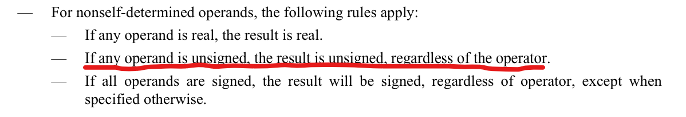

<div class="cover" style="page-break-after:always;font-family:方正公文仿宋;width:100%;height:100%;border:none;margin: 0 auto;text-align:center;">
    <div style="width:50%;margin: 0 auto;height:0;padding-bottom:10%;">
        </br>
        
    </div>
    </br></br></br></br></br>
    <div style="width:50%;margin: 0 auto;height:0;padding-bottom:40%;">
        
	</div>
    </br></br></br></br></br></br></br></br></br></br>
    <span style="font-family:黑体;text-align:center;font-size:20pt;margin: 10pt auto;line-height:30pt;"><b>计算机组成与设计 课程实验报告</b></span>
    </br>
    </br>
    <table style="border:none;text-align:center;width:72%;font-family:仿宋;font-size:14px; margin: 0 auto;">
    <tbody style="font-family:华文宋体;font-size:12pt;">
    	<tr style="font-weight:normal;"> 
    		<td style="width:20%;text-align:right;">授课教师</td>
    		<td style="width:2%">：</td> 
    		<td style="width:40%;font-weight:normal;border-bottom: 1px solid;text-align:center;font-family:华文仿宋"> 刘海风 </td>     </tr>
    	<tr style="font-weight:normal;"> 
    		<td style="width:20%;text-align:right;">姓名</td>
    		<td style="width:2%">：</td> 
    		<td style="width:40%;font-weight:normal;border-bottom: 1px solid;text-align:center;font-family:华文仿宋"> 徐若禺 3220100533</td>     </tr>
    	<tr style="font-weight:normal;"> 
    		<td style="width:20%;text-align:right;">邮箱</td>
    		<td style="width:2%">：</td> 
    		<td style="width:40%;font-weight:normal;border-bottom: 1px solid;text-align:center;font-family:华文仿宋"> xuruoyu326@zju.edu.cn </td>     </tr>
    	<tr style="font-weight:normal;"> 
    		<td style="width:20%;text-align:right;">日期</td>
    		<td style="width:2%">：</td> 
    		<td style="width:40%;font-weight:normal;border-bottom: 1px solid;text-align:center;font-family:华文仿宋"> 2024.3.12</td>     </tr>
    </tbody>              
    </table>
</div>


# Lab1 ALU，Regs 和 FSM

## 操作方法与实验步骤

<!-- 本节重点介绍实验的具体过程，包括：代码设计层次结构图及说明、源代码（包括注释）、PC机上进行的关键步骤截图及说明、调试过程等，这部分的内容应当与实际操作过程和结果相符。本节也可以再细分小节，要求同上。（实验报告中请去除本段） -->

### ALU 模块

#### 模块实现设计

这里的 ALU 模块使用 `case` 语句实现不同指令的处理。需要注意有符号数的处理、逻辑移位与算术移位的区别。最后记得判断结果是否为 `0`。

```verilog
module ALU (
    input [31:0] A,
    input [31:0] B,
    input [3:0] ALU_operation,
    output reg [31:0] res,
    output reg zero
);
    always @(*) begin
        case (ALU_operation)
            4'd0: res = A + B; // ADD
            4'd1: res = A - B; // SUB
            4'd2: res = A << B[4:0]; // SLL
            4'd3: res = ($signed(A) < $signed(B)) ? 1 : 0; // SLT
            4'd4: res = (A < B) ? 1 : 0; // SLTU
            4'd5: res = A ^ B; // XOR
            4'd6: res = A >> B[4:0]; // SRL
            4'd7: res = $signed(A) >>> B[4:0]; // SRA
            4'd8: res = A | B; // OR
            4'd9: res = A & B; // AND
            default: res = 32'b0;
        endcase
        zero = (res == 32'b0) ? 1 : 0;
    end
endmodule
```

#### 仿真代码设计

ALU 模块指令较多，我们先对每个指令逐一进行测试，再设置若干边际测试数据对部分特殊指令（例如加减法可能导致的溢出、算数移位的不同情况）进行测试。结果见 2.1 节。

```verilog
module ALU_tb;
    reg [31:0] A, B;
    reg [3:0] ALU_operation;
    wire[31:0] res;
    wire zero;
    ALU ALU_u(
        .A(A),
        .B(B),
        .ALU_operation(ALU_operation),
        .res(res),
        .zero(zero)
    );

    initial begin
        A = 32'hA5A5A5A5;
        B = 32'h5A5A5A5A;
        ALU_operation = 4'b1000; #100; // A | B
        ALU_operation = 4'b1001; #100; // A & B
        ALU_operation = 4'b0111; #100; // signed(A) >> B[4:0]
        ALU_operation = 4'b0110; #100; // A >> B[4:0]
        ALU_operation = 4'b0101; #100; // A ^ B
        ALU_operation = 4'b0100; #100; // A < B ? 1 : 0
        ALU_operation = 4'b0011; #100; // signed(A) < signed(B)
        ALU_operation = 4'b0010; #100; // A << B[4:0]
        ALU_operation = 4'b0001; #100; // A - B
        ALU_operation = 4'b0000; #100; // A + B

        A = 32'h01234567; B = 32'h76543210; ALU_operation = 4'b0111; #100;
        A = 32'h80000000; B = 32'h7FFFFFFF; ALU_operation = 4'b0001; #100; // Max and min signed integers subtraction
        A = 32'h7FFFFFFF; B = 32'h80000000; ALU_operation = 4'b0001; #100; // Min and max signed integers subtraction
        A = 32'h00000001; B = 32'h00000002; ALU_operation = 4'b0001; #100; // Result is negative
        A = 32'h00000000; B = 32'h00000000; ALU_operation = 4'b0000; #100; // Zero inputs
        A = 32'hFFFFFFFF; B = 32'hFFFFFFFF; ALU_operation = 4'b0000; #100; // All ones inputs
        A = 32'h00000001; B = 32'h00000001; ALU_operation = 4'b0110; #100; // Small inputs for shift operations
        A = 32'h80000000; B = 32'h00000001; ALU_operation = 4'b0111; #100; // Large inputs for shift operations
    end
endmodule
```

### Regs 模块

#### 模块实现设计

寄存器文件模块主要分为三部分
- 根据源寄存器地址 `rs_addr` 读取相应寄存器值存入 `rs_data`；
- 如果复位信号 `rst` 为 1，则将所有寄存器同时置 0；
- 如果写信号为 1 且目标寄存器不为 `Reg0` 则将数据写入。

```verilog
module Regs(
    input clk,
    input rst,
    input [4:0] Rs1_addr, // Address of the first source register
    input [4:0] Rs2_addr, // Address of the second source register
    input [4:0] Wt_addr, // Address of the destination register
    input [31:0] Wt_data, // Data to be written to the destination register
    input RegWrite, // Write enable
    output reg [31:0] Rs1_data, // Data from the first source register
    output reg [31:0] Rs2_data, // Data from the second source register
    output [31:0] Reg00,
    output [31:0] Reg01,
    output [31:0] Reg02,
    output [31:0] Reg03,
    output [31:0] Reg04,
    output [31:0] Reg05,
    output [31:0] Reg06,
    output [31:0] Reg07,
    output [31:0] Reg08,
    output [31:0] Reg09,
    output [31:0] Reg10,
    output [31:0] Reg11,
    output [31:0] Reg12,
    output [31:0] Reg13,
    output [31:0] Reg14,
    output [31:0] Reg15,
    output [31:0] Reg16,
    output [31:0] Reg17,
    output [31:0] Reg18,
    output [31:0] Reg19,
    output [31:0] Reg20,
    output [31:0] Reg21,
    output [31:0] Reg22,
    output [31:0] Reg23,
    output [31:0] Reg24,
    output [31:0] Reg25,
    output [31:0] Reg26,
    output [31:0] Reg27,
    output [31:0] Reg28,
    output [31:0] Reg29,
    output [31:0] Reg30,
    output [31:0] Reg31
);
    reg [31:0] Regs [31:0];

    assign Reg00 = Regs[0];
    assign Reg01 = Regs[1];
    assign Reg02 = Regs[2];
    assign Reg03 = Regs[3];
    assign Reg04 = Regs[4];
    assign Reg05 = Regs[5];
    assign Reg06 = Regs[6];
    assign Reg07 = Regs[7];
    assign Reg08 = Regs[8];
    assign Reg09 = Regs[9];
    assign Reg10 = Regs[10];
    assign Reg11 = Regs[11];
    assign Reg12 = Regs[12];
    assign Reg13 = Regs[13];
    assign Reg14 = Regs[14];
    assign Reg15 = Regs[15];
    assign Reg16 = Regs[16];
    assign Reg17 = Regs[17];
    assign Reg18 = Regs[18];
    assign Reg19 = Regs[19];
    assign Reg20 = Regs[20];
    assign Reg21 = Regs[21];
    assign Reg22 = Regs[22];
    assign Reg23 = Regs[23];
    assign Reg24 = Regs[24];
    assign Reg25 = Regs[25];
    assign Reg26 = Regs[26];
    assign Reg27 = Regs[27];
    assign Reg28 = Regs[28];
    assign Reg29 = Regs[29];
    assign Reg30 = Regs[30];
    assign Reg31 = Regs[31];

    always @(*) begin // Read from the source registers
        Rs1_data = Regs[Rs1_addr];
        Rs2_data = Regs[Rs2_addr];
    end

    always @(posedge clk or posedge rst) begin
        if (rst) begin
            for (integer i = 0; i < 32; i = i + 1) // Initialize all registers to 0
                Regs[i] <= 0;
        end else if (RegWrite && Wt_addr != 0) begin
            Regs[Wt_addr] <= Wt_data; // Write to the destination register
        end
    end
endmodule
```

#### 仿真代码设计

在 `Regs_tb` 仿真测试模块中，先对寄存器进行复位初始化操作，然后进行写入、读取操作的基本测试。之后尝试在一个时钟周期内对某个寄存器同时进行读写操作、一个时钟周期内进行两次写入操作。最后测试 `reset` 功能。测试结果见 2.2 节。

```verilog
`timescale 1ns / 1ps

module Regs_tb;
    reg clk;
    reg rst;
    reg [4:0] Rs1_addr; 
    reg [4:0] Rs2_addr; 
    reg [4:0] Wt_addr; 
    reg [31:0] Wt_data; 
    reg RegWrite; 
    wire [31:0] Rs1_data; 
    wire [31:0] Rs2_data;
    Regs Regs_U(
        .clk(clk),
        .rst(rst),
        .Rs1_addr(Rs1_addr),
        .Rs2_addr(Rs2_addr),
        .Wt_addr(Wt_addr),
        .Wt_data(Wt_data),
        .RegWrite(RegWrite),
        .Rs1_data(Rs1_data),
        .Rs2_data(Rs2_data)
    );

    always #10 clk = ~clk;

    initial begin
        clk = 0;
        rst = 1;
        RegWrite = 0;
        Wt_data = 0;
        Wt_addr = 0;
        Rs1_addr = 0;
        Rs2_addr = 0; #50;
        rst = 0; #50;

        // Basic test for write
        RegWrite = 1;
        Wt_addr = 5'b00101;
        Wt_data = 32'hffffffff; #100;

        Wt_addr = 5'b01010;
        Wt_data = 32'heeeeeeee; #100;

        // Basic test for read
        RegWrite = 0;
        Rs1_addr = 5'b00101;
        Rs2_addr = 5'b01010; #100;

        // Write and read from the same register in the same clock cycle
        RegWrite = 1;
        Wt_addr = 5'b00101;
        Wt_data = 32'hcccccccc;
        Rs1_addr = 5'b00101;
        Rs2_addr = 5'b00101; #100;

        // Perform two writes in the same clock cycle
        RegWrite = 1;
        Wt_addr = 5'b00101;
        Wt_data = 32'h5a5a5a5a;
        Wt_addr = 5'b00101;
        Wt_data = 32'ha5a5a5a5; #100;
        Rs1_addr = 5'b00101;
        Rs2_addr = 5'b00101; #100;

        // Test the reset
        rst = 1; #100;
        rst = 0;
        RegWrite = 0;
        Rs1_addr = 5'b00101;
        Rs2_addr = 5'b01010; #100;
    end

endmodule
```

### TruthEvaluator 模块

#### 模块实现设计

`TruthEvaluator` 模块主要按照 FSM 的**三段式描述**结构设计。

- 初始化时定义状态值、将 `cur` 和 `nxt` 均置为 `HIGHLY_TRUSTWORTHY`；
- 第一段：每个时钟上升沿转移状态；
- 第二段：使用 `case` 语句根据 `cur` 状态决定 `nxt` 状态；
- 第三段：根据 `cur` 状态进行输出。

```Verilog
module TruthEvaluator(
    input clk,
    input truth_detection,
    output wire trust_decision
);
    // State definition
    localparam
        HIGHLY_TRUSTWORTHY = 2'b00,
        TRUSTWORTHY = 2'b01,
        SUSPICIOUS = 2'b10,
        UNTRUSTWORTHY = 2'b11;

    // State register
    reg [1:0] cur, nxt;

    // Initialize state to HIGHLY_TRUSTWORTHY
    initial begin
        cur = HIGHLY_TRUSTWORTHY;
        nxt = HIGHLY_TRUSTWORTHY;
    end

    // State transfer
    always @(posedge clk) begin
        cur <= nxt;
    end

    // Transfer condition
    always @(*) begin
        case (cur)
            HIGHLY_TRUSTWORTHY: nxt = truth_detection ? HIGHLY_TRUSTWORTHY : TRUSTWORTHY;
            TRUSTWORTHY: nxt = truth_detection ? HIGHLY_TRUSTWORTHY : SUSPICIOUS;
            SUSPICIOUS: nxt = truth_detection ? TRUSTWORTHY : UNTRUSTWORTHY;
            UNTRUSTWORTHY: nxt = truth_detection ? SUSPICIOUS : UNTRUSTWORTHY;
        endcase
    end

    // Output
    assign trust_decision = (cur == HIGHLY_TRUSTWORTHY) || (cur == TRUSTWORTHY);
endmodule
```

#### 仿真代码设计

为了遍历所有状态转移情况，我们在仿真代码中设置一个「反复横跳」的过程，即 `truth_detection` 序列为 `101001000`，最后让状态返回 `HIGHLY_TRUSTWORTHY`。

```Verilog
module TruthEvaluator_tb;
    reg clk, truth_detection;
    wire trust_decision;

    TruthEvaluator uut (
        .clk(clk),
        .truth_detection(truth_detection),
        .trust_decision(trust_decision)
    );

    always #5 clk = ~clk;

    initial begin
        clk = 0;
        truth_detection = 1; #10; // cur = HIGHLY_TRUSTWORTHY
        truth_detection = 0; #10; // cur = TRUSTWORTHY
        truth_detection = 1; #10; // cur = HIGHLY_TRUSTWORTHY
        truth_detection = 0; #10; // cur = TRUSTWORTHY
        truth_detection = 0; #10; // cur = SUSPICIOUS
        truth_detection = 1; #10; // cur = TRUSTWORTHY
        truth_detection = 0; #10; // cur = SUSPICIOUS
        truth_detection = 0; #10; // cur = UNTRUSTWORTHY
        truth_detection = 0; #10; // cur = UNTRUSTWORTHY
        truth_detection = 1; #10; // cur = SUSPICIOUS
        truth_detection = 1; #10; // cur = TRUSTWORTHY
        truth_detection = 1; #10; // cur = HIGHLY_TRUSTWORTHY
    end
endmodule
```

## 实验结果与分析

### ALU 仿真结果


首先设置 `A = 32'hA5A5A5A5, B = 32'h5A5A5A5A`，执行所有 ALU 运算，结果均符合预期。


之后测试 A, B 分别为 `INT_MAX`, `INT_MIN` 时的加减法、逻辑右移与算数右移的边界情况。从波形图中可以看到，结果均符合预期。

### RegFile 仿真结果


从波形图中可以看到：
- 前 100ns 进行初始化。
- 在 100ns 向 `Regs[5]` 写入 `32'hffffffff`，停留 100ns 后向 `Regs[10]` 写入 `32'heeeeeeee`。
- 在 300ns 分别读取 `Regs[5]` 和 `Regs[10]` 的数据。以上为基本的写入读取测试。
- 400ns 时尝试同时进行对 `Regs[5]` 的读取与写入操作。**根据黄色光标及左侧 Value 栏**可以看到此时读取的值仍为修改前的 `32'hffffffff`，而 `Regs[5]` 同时被修改为 `32'hcccccccc`；到下一个时钟上升沿再次读取，结果变为 `32'hcccccccc`。
- 500ns 时尝试对 `Regs[5]` 进行**两次**写入操作。可以从读取结果看到，前一次修改被后一次覆盖。
- 最后进行复位测试。

以上结果与仿真代码预期相同。

### FSM 仿真结果


从波形图中可以看到：
- 在 45ns 时（因为 40ns 时 `truth_detection` 为 0，但是到 45ns 时钟变成上升沿时才能进行状态转移），当前状态从 `TRUTH_WORTHY` 变为 `SUSPICIOUS`，输出从 1 变成 0；
- 在 50ns 时 `truth_detection` 变为 1，因此 55ns 后，状态又变回 `TRUTH_WORTHY`，输出变回 1；
- 在 65ns 时输出再次变成 0，此后直到 105ns 才重新变回 1。

以上结果与仿真代码预期相同。

## 心得与讨论

### 实验心得

作为 Warmup 的一部分，lab1 的实验内容同样不难，并没有超过上学期计逻课程的范畴。

ALU 模块设计可以算是对本周理论课内容的巩固，使用 Verilog 语言实现了课堂上提及的几个指令。除此之外，我也通过本模块设计了解了 `$signed()` 与 `$unsigned()` 的用法、算数右移 `>>` 与逻辑右移 `>>>` 的区别。

Regs 模块看似复杂实则~~一点也不简单~~，主要是对寄存器地址、读取、写入等概念的复习。由于本模块读取与写入操作的要求不同，因此需要区分 `always @(posedge)` 和 `always @(*)` 的用法。

FSM 因为已经有模板的提供，状态也较少，设计起来相对简单。一开始因为错将 `trust_decision` 的类型定义成 `reg` 找了许久错误，最后翻看 xvlog 文件发现应当定义为 `wire` 类型~~（计逻没学好导致的）~~。不过这个教训吃得也不亏了。

<!-- 简要地叙述一下实验过程中的感受，以及其他的问题描述和自己的感想。特别是实验中遇到的困难，最后如何解决的。在用verilog代码写程序时遇到语法或其他错误，如何修改解决的。（实验报告中请去除本段） -->

### 思考题

#### ALU

```verilog
assign res = (ALU_operation == 4'd6) ? A >> B : (ALU_operation == 4'd7) ? ($signed(A) >>> $signed(B)) : 32'd0;
```

出错的原因在于，Verilog 的表达式中**只要有任何一个操作数为无符号数**，该表达式的结果就为无符号数。上述代码中 `A >> B` 的结果为无符号数，则后文中 `$signed(A) >>> $signed(B)` 同样会被当成无符号数。如果将 `$signed(A) >>> $signed(B)` 先存储在一个临时寄存器中再参与运算，则仿真结果正确（此处不再放出）。

参考链接：[IEEE Standard for Verilog HDL](http://staff.ustc.edu.cn/~songch/download/IEEE.1364-2005.pdf)。以下为其中第 65 页截取的内容。



#### FSM

