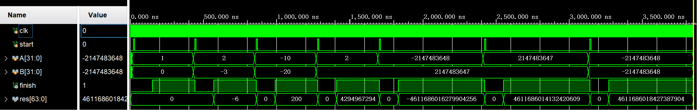
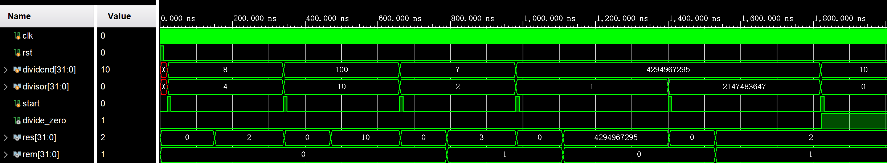
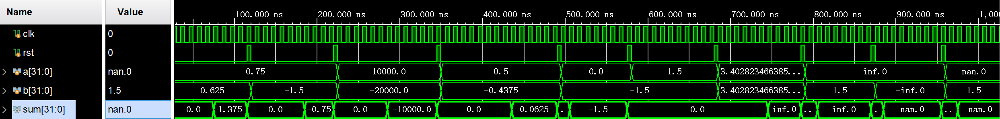

<div class="cover" style="page-break-after:always;font-family:方正公文仿宋;width:100%;height:100%;border:none;margin: 0 auto;text-align:center;">
    <div style="width:50%;margin: 0 auto;height:0;padding-bottom:10%;">
        </br>
        
    </div>
    </br></br></br></br></br>
    <div style="width:50%;margin: 0 auto;height:0;padding-bottom:40%;">
        
	</div>
    </br></br></br></br></br></br></br></br></br></br>
    <span style="font-family:黑体;text-align:center;font-size:20pt;margin: 10pt auto;line-height:30pt;"><b>计算机组成与设计 课程实验报告</b></span>
    </br>
    </br>
    <table style="border:none;text-align:center;width:72%;font-family:仿宋;font-size:14px; margin: 0 auto;">
    <tbody style="font-family:华文宋体;font-size:12pt;">
    	<tr style="font-weight:normal;"> 
    		<td style="width:20%;text-align:right;">授课教师</td>
    		<td style="width:2%">：</td> 
    		<td style="width:40%;font-weight:normal;border-bottom: 1px solid;text-align:center;font-family:华文仿宋"> 刘海风 </td>     </tr>
    	<tr style="font-weight:normal;"> 
    		<td style="width:20%;text-align:right;">姓名</td>
    		<td style="width:2%">：</td> 
    		<td style="width:40%;font-weight:normal;border-bottom: 1px solid;text-align:center;font-family:华文仿宋"> 徐若禺 3220100533</td>     </tr>
    	<tr style="font-weight:normal;"> 
    		<td style="width:20%;text-align:right;">邮箱</td>
    		<td style="width:2%">：</td> 
    		<td style="width:40%;font-weight:normal;border-bottom: 1px solid;text-align:center;font-family:华文仿宋"> xuruoyu326@zju.edu.cn </td>     </tr>
    	<tr style="font-weight:normal;"> 
    		<td style="width:20%;text-align:right;">日期</td>
    		<td style="width:2%">：</td> 
    		<td style="width:40%;font-weight:normal;border-bottom: 1px solid;text-align:center;font-family:华文仿宋"> 2024.3.30</td>     </tr>
    </tbody>              
    </table>
</div>


# Lab3 乘除法器与浮点加法器

## 操作方法与实验步骤

<!-- 本节重点介绍实验的具体过程，包括：代码设计层次结构图及说明、源代码（包括注释）、PC机上进行的关键步骤截图及说明、调试过程等，这部分的内容应当与实际操作过程和结果相符。本节也可以再细分小节，要求同上。（实验报告中请去除本段） -->

### 乘法器

#### 模块实现设计

乘法器模块实现了多周期 32 位有符号乘法：
- 模块用 `state` 表示乘法是否正在执行，若收到开始信号（`start = 1`）且乘法并不在运行中（`state = 0`），则进行初始化并将 `state` 置为 1 表示开始运行；
- 用 `count` 记录已运行周期数，当执行 32 个周期后乘法结束，输出结果。

有符号乘法实现主要分为以下步骤：
1. 根据被乘数、乘数符号得出积的符号后将两者转换为无符号数；将乘数放在 64 位乘积寄存器的**低 32 位**。
2. 每个周期内，根据乘积寄存器最低位（即乘数最低位）判断是否将被乘数加到乘积寄存器**高 32 位**，并整体右移。
3. 32 个周期后，将乘积寄存器最高位加上符号后得到最终结果。

```Verilog
module multiplier(
    input clk,
    input start,
    input [31:0] A,
    input [31:0] B,
    output reg finish,
    output reg [63:0] res
);

    reg [31:0] multiplicand;
    reg [63:0] res_tmp;
    reg [5:0] count;
    reg sign;
    reg state;

    initial begin
        res <= 0;
        count <= 0;
        state <= 0;
        finish <= 0;
        multiplicand <= 0;
    end

    always @(posedge clk) begin
        if (~state && start) begin
            sign <= A[31] ^ B[31]; // sign of the product
            multiplicand <= A[31] ? -A : A; // convert into unsigned
            {res_tmp} <= {32'b0, {B[31] ? -B : B}}; // product register
            res <= 0;
            state <= 1;
            finish <= 0;
        end else if (state) begin
            if (res_tmp[0]) begin // lowest bit of multiplier is 1
                res_tmp[63:32] = res_tmp[63:32] + multiplicand;
            end
            res_tmp = res_tmp >> 1; // right shift
            count = count + 1;
        end
        if (count == 6'b100000) begin // 32 periods, multiplication ends
            count <= 0;
            state <= 0;
            finish <= 1;
            res = sign ? -res_tmp : res_tmp; // convert into signed
        end
    end
endmodule
```

#### 仿真代码设计

将乘法器模块实例化后，测试多种情况：乘数为 0、负数、`INT_MIN` 与 `INT_MAX` 等。

```Verilog
module multiplier_tb;

    reg clk, start;
    reg [31:0] A;
    reg [31:0] B;
    wire finish;
    wire [63:0] res;

    multiplier m0(.clk(clk), .start(start), .A(A), .B(B), .finish(finish), .res(res));

    initial begin

        clk = 0;
        start = 0;
        #10;

        A = 1; B = 0; // pos * zero
        #10 start = 1;
        #10 start = 0;
        #400;

        A = 2; B = -3; // pos * neg
        #10 start = 1;
        #10 start = 0;
        #400;

        A = -10; B = -20; // neg * neg
        #10 start = 1;
        #10 start = 0;
        #400;

        A = 2; B = 2147483647; // max
        #10 start = 1;
        #10 start = 0;
        #400;

        A = -2147483648; B = 2147483647; // min * max
        #10 start = 1;
        #10 start = 0;
        #700;

        A = 2147483647; B = 2147483647; // max * max
        #10 start = 1;
        #10 start = 0;
        #700;

        A = -2147483648; B = -2147483648; // min * min
        #10 start = 1;
        #10 start = 0;
        #700;

        $finish();
    end

    always begin
        #2 clk = ~clk;
    end

endmodule
```

### 除法器

#### 模块实现设计

除法器模块实现了多周期 32 位无符号整数除法，其结构与乘法器相似，此处不再赘述。

除法的实现主要分为以下步骤：
1. 判断除数是否为 0。若否，则将 64 位**结果寄存器**的高 32 位置 0，低 32 位存储被除数，用于与除数作差；
2. 每个周期内，尝试用结果寄存器高半部分减去除数：结果不为负则将结果寄存器末尾置 1；否则加回并置 0。然后整体左移。
3. 32 个周期结束后，结果寄存器低半部分为商，高半部分**右移一位**得到余数。

```Verilog
module divider(
    input clk,
    input rst,
    input start,
    input [31:0] dividend,
    input [31:0] divisor,
    output reg divide_zero,
    output reg finish,
    output reg [31:0] res,
    output reg [31:0] rem
);

    reg [31:0] divisor_tmp;
    reg [64:0] rem_tmp;
    reg [5:0] count;
    reg state;

    initial begin
        res <= 0;
        rem <= 0;
        count <= 0;
        state <= 0;
        finish <= 0;
        divisor_tmp <= 0;
        divide_zero <= 0;
    end

    always @(posedge clk or posedge rst) begin
        if (rst) begin
            res <= 0;
            rem <= 0;
            count <= 0;
            state <= 0;
            finish <= 0;
            divisor_tmp <= 0;
            divide_zero <= 0;
        end else if (~state && start) begin
            if (divisor == 0) begin
                divide_zero <= 1; // divisor is 0, return
            end else begin
                divisor_tmp <= divisor; // divisor reg
                rem_tmp <= {32'b0, dividend[31:0], 1'b0}; // result reg, storing quotient and remainder
                res <= 0;
                state <= 1;
                finish <= 0;
            end
        end else if (state) begin
            if (rem_tmp[63:32] >= divisor_tmp) begin // calculate from high to low
                rem_tmp[63:32] = rem_tmp[63:32] - divisor_tmp;
                rem_tmp = {rem_tmp[63:0], 1'b1};
            end else begin
                rem_tmp = {rem_tmp[63:0], 1'b0}; // add back the divisor
            end
            count = count + 1;
        end
        if (count == 6'b100000) begin
            count <= 0;
            state <= 0;
            finish <= 1;
            rem = rem_tmp[64:33]; // remainder, right shift of the higher half
            res = rem_tmp[31:0]; // quotient
        end
    end
endmodule
```

#### 仿真代码设计

除法器的仿真中，除了测试基本情况的商、余数是否正确之外，还需要检查除零异常、边界情况等。

```Verilog
module divider_tb();
    reg clk;
    reg rst;
    reg [31:0] dividend;
    reg [31:0] divisor;
    reg start;
    wire divide_zero;
    wire [31:0] res;
    wire [31:0] rem;
    wire finish;

    divider u_div (
        .clk(clk),
        .rst(rst),
        .dividend(dividend),
        .divisor(divisor),
        .start(start),
        .divide_zero(divide_zero),
        .res(res),
        .rem(rem),
        .finish(finish)
    );

    initial begin
        clk = 0;
        rst = 1;
        start = 0;
        #10 rst = 0;

        #10 start = 1;
        dividend = 32'd8; // basic, rem = 0
        divisor = 32'd4;
        #10 start = 0;
        #300;

        #10 start = 1;
        dividend = 32'd100; // basic, rem = 0
        divisor = 32'd10;
        #10 start = 0;
        #300;

        #10 start = 1;
        dividend = 32'd7; // basic, rem <> 0
        divisor = 32'd2;
        #10 start = 0;
        #300;

        #10 start = 1;
        dividend = 32'd4294967295; // max, rem = 0
        divisor = 32'd1;
        #10 start = 0;
        #400;

        #10 start = 1;
        dividend = 32'd4294967295; // max
        divisor = 32'd2147483647;
        #10 start = 0;
        #400;

        #10 start = 1;
        dividend = 32'd10; // divisor = 0
        divisor = 32'd0;
        #10 start = 0;
        #300;
        $stop();
    end

    always begin
        #2 clk = ~clk;
    end

endmodule
```

### 浮点加法器

#### 模块实现设计

采用有限状态机分多周期实现单精度浮点数加法。使用 FSM 的好处是，既减少延迟，又让代码逻辑结构清晰，同时也便于调试。

整个加法过程分为七个部分进行，对应 FSM 的七个状态：
1. 初始化 `INIT`：将输入转移到寄存器中，并将 `a`, `b` 的阶码减去 `bias`；
2. 检查不规则数 `CHECK`：判断 `a`, `b` 是否分别为 NaN、Inf、0、非规格数，针对异常情况直接输出 `sum` 并跳到 `FINISH` 状态。若为规则浮点数，则将尾数 `M` 置为 `frac + 1`；
3. 对阶 `ALIGN`：小阶码向大阶码对齐，同时对应尾数右移（注意使用 `$signed`）；
4. 加法 `ADD`：根据两个加数符号计算和的尾数与符号；
5. 规格化 `NORMAL`：若尾数过大则右移，尾数过小则左移（非规格数与零除外）；
6. 舍入 `ROUND`：将尾数向最近偶数舍入，并将结果存到 `sum` 以输出，同时判断溢出等情况
7. 结束 `FINISH`：默认结束状态

```Verilog
module fp_adder(
    input clk,
    input rst,
    input [31:0] a,
    input [31:0] b,
    output reg [31:0] sum
);

    parameter INIT = 3'b000,
              CHECK = 3'b001,
              ALIGN = 3'b010,
              ADD = 3'b011,
              NORMAL = 3'b100,
              ROUND = 3'b101,
              FINISH = 3'b110;
    parameter NaN = 32'b0_11111111_10000000000000000000000, // const: Not a Number
              INF = 32'b0_11111111_00000000000000000000000; // const: +Infinity
    reg [2:0] state;
    reg [7:0] E_a, E_b, E_sum; // exponent
    reg [23:0] M_a, M_b; // mantissa
    reg [24:0] M_sum; // mantissa of sum
    reg S_a, S_b, S_sum; // sign

    initial begin
        state = FINISH;
    end

    always @(posedge clk or posedge rst) begin
        if (rst == 1) begin
            state <= INIT;
            E_sum <= 0;
            M_sum <= 0;
            S_sum <= 0;
            sum <= 0;
        end else if (state == INIT) begin
            S_a <= a[31];
            E_a <= a[30:23] - 127; // exp - bias
            M_a <= {1'b0, a[22:0]}; // frac
            S_b <= b[31];
            E_b <= b[30:23] - 127; // exp - bias
            M_b <= {1'b0, b[22:0]}; // frac
            state <= CHECK;
        end else if (state == CHECK) begin
            if ((E_a == 128 && M_a != 0) || (E_b == 128 && M_b != 0)) begin
                // a = NaN or b = NaN, return NaN
                sum <= NaN;
                state <= FINISH;
            end else if (E_a == 128) begin
                // a = INF and b = INF but sign(a) != sign(b)
                sum <= (E_b == 128 && S_a != S_b) ? NaN : a;
                state <= FINISH;
            end else if (E_b == 128) begin
                // b = INF, return b
                sum <= b;
                state <= FINISH;
            end else if ($signed(E_a) == -127 && M_a == 0) begin
                // a = 0, return b
                sum <= b;
                state <= FINISH;
            end else if ($signed(E_b) == -127 && M_b == 0) begin
                // b = 0, return a
                sum <= a;
                state <= FINISH;
            end else begin
                // check if denormalized
                if ($signed(E_a) == -127) E_a <= -126; else M_a[23] <= 1;
                if ($signed(E_b) == -127) E_b <= -126; else M_b[23] <= 1;
                state <= ALIGN;
            end
        end else if (state == ALIGN) begin
            if ($signed(E_a) > $signed(E_b)) begin
                M_b <= M_b >> (E_a - E_b); // right shift
                E_sum <= E_a;
            end else begin
                M_a <= M_a >> (E_b - E_a);
                E_sum <= E_b;
            end
            state <= ADD;
        end else if (state == ADD) begin
            M_sum <= S_a == S_b ? M_a + M_b : (M_a > M_b ? M_a - M_b : M_b - M_a); // calculate mantissa
            S_sum <= (S_a == S_b || M_a > M_b) ? S_a : S_b; // get sign
            state <= NORMAL;
        end else if (state == NORMAL) begin
            if (M_sum[24]) begin // M too large
                M_sum <= M_sum >> 1; // right shift
                E_sum <= E_sum + 1;
            end else if (~M_sum[23] && $signed(E_sum) > -126) begin // M too small (check denormalized number or 0)
                M_sum <= M_sum << 1; // left shift
                E_sum <= E_sum - 1;
            end else begin
                state <= ROUND;
            end
        end else if (state == ROUND) begin
            if (M_sum[0]) M_sum = M_sum + 1; // Round to Nearest Even

            sum[31] = S_sum;
            sum[30:23] = E_sum + 127; // add back bias
            sum[22:0] = M_sum[22:0];

            if ($signed(E_sum) == -126 && M_sum[23] == 0) sum[30:23] = 0; // denormalized
            if ($signed(E_sum) == -126 && M_sum[23:0] == 24'b0) sum[31] = 1'b0; // -0
            if ($signed(E_sum) == -128) sum[30:0] = INF[30:0]; // overflow
            state = FINISH;
        end

    end
endmodule
```

#### 仿真代码设计

仿真模块测试基本的加法运算是否正确、正负数与 0、两种规格化情况、各种不规则数与溢出。

```Verilog
module fp_adder_tb();

    reg clk, rst;
    reg [31:0] a, b;
    wire [31:0] sum;

    fp_adder U0(.clk(clk), .rst(rst), .a(a), .b(b), .sum(sum));

    initial begin

        clk = 0;
        rst = 0;
        #10;

        // 0.75 + 0.625
        rst = 1; #5; rst = 0;
        a = 32'b0_01111110_10000000000000000000000;
        b = 32'b0_01111110_01000000000000000000000;
        #100;

        // 0.75 - 1.5
        rst = 1; #5; rst = 0;
        a = 32'b0_01111110_10000000000000000000000;
        b = 32'b1_01111111_10000000000000000000000;
        #100;

        // 10000 - 20000
        rst = 1; #5; rst = 0;
        a = 32'b0_10001100_00111000100000000000000;
        b = 32'b1_10001101_00111000100000000000000;
        #120;

        // 0.5 - 0.4375
        rst = 1; #5; rst = 0;
        a = 32'b0_01111110_00000000000000000000000;
        b = 32'b1_01111101_11000000000000000000000;
        #140;

        // 0 - 1.5
        rst = 1; #5; rst = 0;
        a = 32'b0_00000000_00000000000000000000000;
        b = 32'b1_01111111_10000000000000000000000;
        #80;

        // 1.5 - 1.5
        rst = 1; #5; rst = 0;
        a = 32'b0_01111111_10000000000000000000000;
        b = 32'b1_01111111_10000000000000000000000;
        #100;

        // overflow
        rst = 1; #5; rst = 0;
        a = 32'b0_11111110_11111111111111111111111;
        b = 32'b0_11111110_11111111111111111111111;
        #100;

        // +INF + 1.5
        rst = 1; #5; rst = 0;
        a = 32'b0_11111111_00000000000000000000000;
        b = 32'b0_01111111_10000000000000000000000;
        #80;

        // +INF + -INF
        rst = 1; #5; rst = 0;
        a = 32'b0_11111111_00000000000000000000000;
        b = 32'b1_11111111_00000000000000000000000;
        #80;

        // NaN + 1.5
        rst = 1; #5; rst = 0;
        a = 32'b0_11111111_10000000000000000000000;
        b = 32'b0_01111111_10000000000000000000000;
        #80;

    end

    always begin
        #5 clk = ~clk;
    end

endmodule
```

## 仿真结果与分析

### 乘法器



从仿真波形图可以看到，对于基本乘法运算、乘数为 0、有负数、`INT_MIN` 与 `INT_MAX` 的情况，结果均与预期相符。

### 除法器



从仿真波形图可以看到，几种测试样例输出的商与余数均正确，除零异常判断也符合预期。

### 浮点加法器



从仿真波形图可以看到，对于加数为正数/负数/0、规格化时左移/右移、出现不规则数、溢出等多种情况，输出的结果均符合预期。

## 讨论与心得

### 思考题

1. 双精度浮点数 `x, y, z`，若 `x = -1.5e38, y = 1.5e38, z = 1.0`
- **现象**
    - `(x + y) + z = 1.0`；
    - `x + (y + z) = 0.0`；
- **分析**：浮点数执行加法操作时，会先经历**对阶**的过程，即将较小数尾数右移。
    - 如果先执行 `y + z`，由于 `z` 的阶码远小于 `y`，其尾数会在对阶过程中损失大部分精度，舍入之后 `y + z = 1.5e38` 结果不变，与 `x` 相加后得到 `0.0`；
    - 如果先执行 `x + y`，得到结果 `0.0`，与 `z` 相加后不会有精度损失，得到 `1.0`

2. 假设使用单精度浮点数，编写以下代码
```C
float x = SOME_VALUE_0;
float sum = 0.0f;
for(int i = 0; i < SOME_VALUE_1; ++i) sum += x;
printf("%f\n", sum - 100.0f);
```
- **现象**
    - 如果 `SOME_VALUE_0 := 0.1, SOME_VALUE_1 := 1`，得到结果 `-0.000954`
    - 如果 `SOME_VALUE_0 := 0.125, SOME_VALUE_1 := 800`，得到结果 `0.000000`
- **分析**
    - 由于 `0.125` 可以使用二进制精确表示（机内码 `00111110000000000000000000000000`），多次累加后不会有精度损失
    - 而 `0.1` 无法用浮点数精确表示（机内码 `00111101110011001100110011001101` 产生循环），多次累加后产生较大误差。

### 实验心得

本次实验为多周期乘除法器、浮点加法器的设计。

乘法器一开始尝试用 Booth 算法，但无论怎么调试结果总有差别，恼羞成怒的我转而使用“将乘数先转化为无符号数”的做法，想不到异常顺利，一次成功（后来发现是 Booth 中 `$signed` 没加）。

实现除法器的一开始，无论怎么修改，仿真波形总是输出高阻态，查了半天发现是 top 设错了。。。改正后还是错误，又检查许久后发现是仿真的 clk 与 start 出了问题，导致开始信号还未为 1 时除法已经开始执行。

浮点加法器更是遇到不小的麻烦。状态机的设计、各种情况的处理耗费了不少时间，还因为很多小错误调试了很久。最后 `sum` 拼接时，如果采用 `sum = {..., ..., ...}` 的写法会因为中间阶码溢出而出错，分开写就好了。

~~真是一场酣畅淋漓的周处除三害啊~~。刘老师在理论课讲这部分时速度较快，导致当时忙于记笔记而错过了部分关键内容。而通过这次实验的自行设计，我对计算机中乘除法的实现有了更深刻的认识，同时各种奇怪错误也提升了我