<div class="cover" style="page-break-after:always;font-family:方正公文仿宋;width:100%;height:100%;border:none;margin: 0 auto;text-align:center;">
    <div style="width:50%;margin: 0 auto;height:0;padding-bottom:10%;">
        </br>
        
    </div>
    </br></br></br></br></br>
    <div style="width:50%;margin: 0 auto;height:0;padding-bottom:40%;">
        
	</div>
    </br></br></br></br></br></br></br></br></br></br>
    <span style="font-family:黑体;text-align:center;font-size:20pt;margin: 10pt auto;line-height:30pt;"><b>计算机组成与设计 课程实验报告</b></span>
    </br>
    </br>
    <table style="border:none;text-align:center;width:72%;font-family:仿宋;font-size:14px; margin: 0 auto;">
    <tbody style="font-family:华文宋体;font-size:12pt;">
    	<tr style="font-weight:normal;"> 
    		<td style="width:20%;text-align:right;">授课教师</td>
    		<td style="width:2%">：</td> 
    		<td style="width:40%;font-weight:normal;border-bottom: 1px solid;text-align:center;font-family:华文仿宋"> 刘海风 </td>     </tr>
    	<tr style="font-weight:normal;"> 
    		<td style="width:20%;text-align:right;">姓名</td>
    		<td style="width:2%">：</td> 
    		<td style="width:40%;font-weight:normal;border-bottom: 1px solid;text-align:center;font-family:华文仿宋"> 徐若禺 3220100533</td>     </tr>
    	<tr style="font-weight:normal;"> 
    		<td style="width:20%;text-align:right;">邮箱</td>
    		<td style="width:2%">：</td> 
    		<td style="width:40%;font-weight:normal;border-bottom: 1px solid;text-align:center;font-family:华文仿宋"> xuruoyu326@zju.edu.cn </td>     </tr>
    	<tr style="font-weight:normal;"> 
    		<td style="width:20%;text-align:right;">日期</td>
    		<td style="width:2%">：</td> 
    		<td style="width:40%;font-weight:normal;border-bottom: 1px solid;text-align:center;font-family:华文仿宋"> 2024.4.30</td>     </tr>
    </tbody>              
    </table>
</div>


# Lab4-3 单周期 CPU - 数据通路与指令扩展

Lab4 实验报告分为 4-3 和 4-4 两部分，此为第一部分。

## 模块设计

<!-- 本节重点介绍实验的具体过程，包括：代码设计层次结构图及说明、源代码（包括注释）、PC机上进行的关键步骤截图及说明、调试过程等，这部分的内容应当与实际操作过程和结果相符。本节也可以再细分小节，要求同上。（实验报告中请去除本段） -->

### SCPU_ctrl 模块设计

控制单元用于将指令解析为控制信号并提供给数据通路。下面对主要控制信号进行解释：
- `ALUSrc_B`：ALU 第二个操作数选择信号，0 为 `rs2`，1 为立即数。
- `MemtoReg`：写回寄存器的数据来源选择信号，00 为 ALU 计算结果，01 为内存读取数据，10 为 `PC + 4`，11 为立即数 Imm。
- `RegWrite`：寄存器写使能信号，0 为不写，1 为写。
- `MemRW`：内存读写使能信号，0 为读，1 为写。此处的 `MemRW` 与最终传给 RAM 的 `wea` 信号不同，需要在 DataPath 中根据指令类型与地址后两位决定最终四位 `wea` 信号的值（见 DataPath 中的 MemRWProcess 模块）。
- `Jump`：跳转信号，00 为 SB 型指令跳转，01 为 `jal` 跳转，10 为 `jalr` 跳转。
- `ALUOp`：ALU 选择信号。
- `Unsigned`：load 指令是否为无符号。
- `SLType`：内存存取指令位宽，01 为 `lw/sw`，10 为 `lh/lhu/sh`，11 为 `lb/lbu/sb`。
- `Branch`：区分 SB 型指令，01 为 `beq/blt/bltu`，10 为 `bne/bge/bgeu`。另外，ALU 模块新增 `EQ` 运算，当两数相等时输出 1，这样对所有 SB 型指令的 ALU 输出进行了统一。
- `UT`：区分 U 型指令，0 为 `lui`，1 为 `auipc`。
- `ImmSel`：立即数生成信号。

对于 ALU 操作码，本模块采用逐级译码的方式：先根据 `OPcode` 生成 `ALUOp` 指示指令类型，再根据 `ALUOp` 生成 `ALU_Control`。

`SCPU_ctrl` 模块代码如下：

```Verilog
module SCPU_ctrl (
    input Fun7,
    input MIO_ready,
    input [2:0] Fun3,
    input [4:0] OPcode,
    output reg UT,
    output reg MemRW,
    output reg CPU_MIO,
    output reg RegWrite,
    output reg ALUSrc_B,
    output reg Unsigned,
    output reg [1:0] Jump,
    output reg [1:0] Branch,
    output reg [1:0] MemtoReg,
    output reg [1:0] SLType,
    output reg [2:0] ImmSel,
    output reg [3:0] ALU_Control
);

    reg [1:0] ALUOp;

    // ALUSrc_B: 0: rs2, 1: Imm
    // MemtoReg: 00: ALU, 01: Mem, 10: PC+4, 11: Imm
    // RegWrite: 0: No, 1: Yes
    // MemRW: 0: No/Read, 1: Write
    // Jump: 00: No/SB-type, 01: jal, 10: jalr
    // ALUOp: 00: add, 01: sub(SB-type), 10: case(R-type), 11: case(I-type(ALU))
    // Unsigned: 0: lw/lb/lh, 1: lbu/lhu
    // SLType: 01: lw/sw, 10: lb/sb/lbu, 11: lh/sh/lhu
    always @(*) begin
        case (OPcode)
            5'b01100: {ALUSrc_B, MemtoReg, RegWrite, MemRW, Jump, ALUOp, Unsigned, SLType} = 12'b000100010000; // R-type
            5'b00100: {ALUSrc_B, MemtoReg, RegWrite, MemRW, Jump, ALUOp, Unsigned, SLType} = 12'b100100011000; // I-type(ALU)
            5'b00000: begin // I-type(load)
                case (Fun3)
                    3'b000: {ALUSrc_B, MemtoReg, RegWrite, MemRW, Jump, ALUOp, Unsigned, SLType} = 12'b101100000010; // lb
                    3'b001: {ALUSrc_B, MemtoReg, RegWrite, MemRW, Jump, ALUOp, Unsigned, SLType} = 12'b101100000011; // lh
                    3'b010: {ALUSrc_B, MemtoReg, RegWrite, MemRW, Jump, ALUOp, Unsigned, SLType} = 12'b101100000001; // lw
                    3'b100: {ALUSrc_B, MemtoReg, RegWrite, MemRW, Jump, ALUOp, Unsigned, SLType} = 12'b101100000110; // lbu
                    3'b101: {ALUSrc_B, MemtoReg, RegWrite, MemRW, Jump, ALUOp, Unsigned, SLType} = 12'b101100000111; // lhu
                endcase
            end
            5'b01000: begin // S-type
                case (Fun3)
                    3'b000: {ALUSrc_B, MemtoReg, RegWrite, MemRW, Jump, ALUOp, Unsigned, SLType} = 12'b100010000010; // sb
                    3'b001: {ALUSrc_B, MemtoReg, RegWrite, MemRW, Jump, ALUOp, Unsigned, SLType} = 12'b100010000011; // sh
                    3'b010: {ALUSrc_B, MemtoReg, RegWrite, MemRW, Jump, ALUOp, Unsigned, SLType} = 12'b100010000001; // sw
                endcase
            end
            5'b11000: {ALUSrc_B, MemtoReg, RegWrite, MemRW, Jump, ALUOp, Unsigned, SLType} = 12'b000000001000; // SB-type
            5'b11011: {ALUSrc_B, MemtoReg, RegWrite, MemRW, Jump, ALUOp, Unsigned, SLType} = 12'b110100100000; // jal
            5'b11001: {ALUSrc_B, MemtoReg, RegWrite, MemRW, Jump, ALUOp, Unsigned, SLType} = 12'b110101000000; // jalr
            5'b01101: {ALUSrc_B, MemtoReg, RegWrite, MemRW, Jump, ALUOp, Unsigned, SLType} = 12'b011100000000; // lui
            5'b00101: {ALUSrc_B, MemtoReg, RegWrite, MemRW, Jump, ALUOp, Unsigned, SLType} = 12'b011100000000; // auipc
        endcase
        // Branch: 01: beq/blt/bltu, 10: bne/bge/bgeu
        Branch[0] = (OPcode == 5'b11000 && (Fun3 == 3'b000 || Fun3 == 3'b100 || Fun3 == 3'b110)) ? 1'b1 : 1'b0;
        Branch[1] = (OPcode == 5'b11000 && (Fun3 == 3'b001 || Fun3 == 3'b101 || Fun3 == 3'b111)) ? 1'b1 : 1'b0;
        // UT: 1 auipc, 0 lui
        UT = (OPcode == 5'b00101) ? 1'b1 : 1'b0;
    end

    // ImmSel: 000: lui/auipc, 001: I-type, 010: S-type, 011: SB-type, 100: jal, 101: jalr, 110: auipc
    always @(*) begin
        case (OPcode)
            5'b00100: ImmSel = 3'b001; // I-type(ALU)
            5'b00000: ImmSel = 3'b001; // I-type(load)
            5'b01000: ImmSel = 3'b010; // S-type
            5'b11000: ImmSel = 3'b011; // SB-type
            5'b11011: ImmSel = 3'b100; // jal
            5'b11001: ImmSel = 3'b001; // jalr
            5'b01101: ImmSel = 3'b000; // lui
            5'b00101: ImmSel = 3'b000; // auipc
        endcase
    end

    always @(*) begin
        case (ALUOp)
            2'b00: ALU_Control = 4'b0000; // add
            2'b01: begin // SB-type
                case (Fun3)
                    3'b000: ALU_Control = 4'b1010; // beq
                    3'b001: ALU_Control = 4'b1010; // bne
                    3'b100: ALU_Control = 4'b0011; // blt
                    3'b101: ALU_Control = 4'b0011; // bge
                    3'b110: ALU_Control = 4'b0100; // bltu
                    3'b111: ALU_Control = 4'b0100; // bgeu
                endcase
            end
            2'b10: begin // R-type
                case ({Fun3, Fun7})
                    4'b0000: ALU_Control = 4'b0000; // add
                    4'b0001: ALU_Control = 4'b0001; // sub
                    4'b0010: ALU_Control = 4'b0010; // sll
                    4'b0100: ALU_Control = 4'b0011; // slt
                    4'b0110: ALU_Control = 4'b0100; // sltu
                    4'b1000: ALU_Control = 4'b0101; // xor
                    4'b1010: ALU_Control = 4'b0110; // srl
                    4'b1011: ALU_Control = 4'b0111; // sra
                    4'b1100: ALU_Control = 4'b1000; // or
                    4'b1110: ALU_Control = 4'b1001; // and
                endcase
            end
            2'b11: begin // I-type(ALU)
                case (Fun3)
                    3'b000: ALU_Control = 4'b0000; // add
                    3'b001: ALU_Control = 4'b0010; // sll
                    3'b010: ALU_Control = 4'b0011; // slt
                    3'b011: ALU_Control = 4'b0100; // sltu
                    3'b100: ALU_Control = 4'b0101; // xor
                    3'b110: ALU_Control = 4'b1000; // or
                    3'b111: ALU_Control = 4'b1001; // and
                    3'b101: begin
                        case (Fun7)
                            1'b0: ALU_Control = 4'b0110; // srl
                            1'b1: ALU_Control = 4'b0111; // sra
                        endcase
                    end
                endcase
            end
        endcase
        CPU_MIO = 0;
    end

endmodule
```

### DataPath 模块设计

**DataPath 图见末尾附录**

SCPU 中的数据通路部分用于串联各个模块，并根据控制信号实现不同指令的功能。以下对模块中出现的多路选择器进行功能介绍：
- `MUX2T1_0`：根据 `ALUSrc_B` 选择 ALU 第二个操作数来源于 `rs2` 还是立即数。
- `MUX2T1_1`：根据 SB 类型指令比较结果选择下一个指令是 `PC + 4` 还是 `PC + imm`。
- `MUX4T1_0`：根据 `MemtoReg` 信号选择写入寄存器堆的数据来源于 ALU、内存、PC 还是大立即数。
- `MUX4T1_1`：根据 `Jump` 信号决定下一个指令是 `PC + 4`、`PC + imm` 还是 `rs1 + imm`，并写入 PC 寄存器。

以下为数据通路代码：
```Verilog
module DataPath(
    input clk,
    input rst,
    input UT,
    input RegWrite,
    input Unsigned,
    input ALUSrc_B,
    input MemRW_in,
    input [1:0] Jump,
    input [1:0] SLType,
    input [1:0] Branch,
    input [1:0] MemtoReg,
    input [2:0] ImmSel,
    input [3:0] ALU_Control,
    input [31:0] Data_in,
    input [31:0] inst_field,
    output [3:0] MemRW_out,
    output [31:0] PC_out,
    output [31:0] Data_out,
    output [31:0] ALU_out
);

    wire [31:0] Imm_out;
    wire [31:0] Rs1_data;
    wire [31:0] Rs2_data;
    wire [31:0] DataTMUX;
    wire [31:0] add_0_res;
    wire [31:0] add_1_res;
    wire [31:0] MUX2T1_0_res;
    wire [31:0] MUX2T1_1_res;
    wire [31:0] MUX4T1_0_res;
    wire [31:0] MUX4T1_1_res;

    MUX2T1_32 MUX2T1_0 (
        .I0(Rs2_data),
        .I1(Imm_out),
        .S(ALUSrc_B),
        .O(MUX2T1_0_res)
    );

    MUX2T1_32 MUX2T1_1 (
        .I0(add_0_res),
        .I1(add_1_res),
        .S((Branch[0] & ALU_out[0]) | (Branch[1] & (~ALU_out[0]))),
        .O(MUX2T1_1_res)
    );

    MUX4T1_32 MUX4T1_0 (
        .I0(ALU_out),
        .I1(DataTMUX),
        .I2(add_0_res),
        .I3(UT ? add_1_res : Imm_out),
        .S(MemtoReg),
        .O(MUX4T1_0_res)
    );

    MUX4T1_32 MUX4T1_1 (
        .I0(MUX2T1_1_res),
        .I1(add_1_res),
        .I2(ALU_out),
        .I3(MUX2T1_1_res),
        .S(Jump),
        .O(MUX4T1_1_res)
    );

    add_32 add_32_0 (
        .A(PC_out),
        .B(32'h00000004),
        .O(add_0_res)
    );

    add_32 add_32_1 (
        .A(PC_out),
        .B(Imm_out),
        .O(add_1_res)
    );

    DataProcess DP (
        .Addr(ALU_out[1:0]),
        .Data_in(Data_in),
        .DataTMUX(DataTMUX),
        .Unsigned(Unsigned),
        .SLType(SLType)
    );

    MemRWProcess MP (
        .MemRW_in(MemRW_in),
        .SLType(SLType),
        .Addr(ALU_out[1:0]),
        .MemRW_out(MemRW_out),
        .Rs2_data(Rs2_data),
        .Data_out(Data_out)
    );

    ImmGen ImmGen (
        .ImmSel(ImmSel),
        .inst_field(inst_field),
        .Imm_out(Imm_out)
    );

    ALU ALU (
        .A(Rs1_data),
        .ALU_operation(ALU_Control),
        .B(MUX2T1_0_res),
        .res(ALU_out)
    );

    REG32 PC (
        .clk(clk),
        .rst(rst),
        .CE(1'b1),
        .D(MUX4T1_1_res),
        .Q(PC_out)
    );

    Regs Regs (
        .clk(clk),
        .rst(rst),
        .Rs1_addr(inst_field[19:15]),
        .Rs2_addr(inst_field[24:20]),
        .Wt_addr(inst_field[11:7]),
        .Wt_data(MUX4T1_0_res),
        .RegWrite(RegWrite),
        .Rs1_data(Rs1_data),
        .Rs2_data(Rs2_data)
    );

endmodule
```

<!-- - S-type
    - 对于 sb, sh 等指令的处理：通过增加 SCPU_ctrl 中 MemRW 的位数，使其与 RAM 中 wea 相对应（wea 为四位，每一位代表一个字节的写使能）；无需考虑符号扩展。
- I-type(load)
    - 对于 lb, lbu, lh, lhu 等指令的处理：正常从 memory 中读取 32 位数据，然后在 regFile 的 write data 前加一个新模块（根据 MemRW 按字节截取数据，再根据是否为 unsigned 进行扩展，在 Data Process 模块完成）
    - Data Process 模块
        - 输入：MemRW, MemData, MemAddr, MemData
        - 输出：Data
        - 逻辑：根据 MemRW 按字节截取数据，再根据是否为 unsigned 进行扩展
    - 需要注意：由于 MemRW 位数修改，因此 SCPU 和 CSSTE 也需要相应修改
- SB-type
    - 在 ALU 模块新增 EQ 运算，当 `A == B` 时 `res = 1`，为了使 `beq`, `bne` 与其他跳转指令统一
        - `Branch[0] = 1`: beq, blt, bltu
        - `Branch[1] = 1`: bne, bge, bgeu
    - `MUX2T1_1` 中 `S = (Branch[0] & ALU_res[0]) | (Branch[1] & ~ALU_res[0])` -->

#### DataProcess

`DataProcess` 为内存读取处理模块，输入为内存中取出的 `Data_in`，输出为 32 位 `DataTMUX`。先根据 `SLType` 信号与地址后两位决定取 `Data_in` 的哪一部分，再根据指令是否为无符号进行相应扩展。`DataProcess` 模块代码如下：
```Verilog
module DataProcess(
    input Unsigned,
    input [1:0] Addr,
    input [1:0] SLType,
    input [31:0] Data_in,
    output reg [31:0] DataTMUX
);

    // Addr 为数据地址（按字节），需要根据 Addr[1:0] 和 SLType 选择 Data_in 的哪一部分，再根据 Unsigned 选择是否符号扩展
    // Unsigned: 0: lw/lb/lh, 1: lbu/lhu
    // SLType: 01: lw, 10: lb/lbu, 11: lh/lhu
    reg [31:0] tmp;
    always @(*) begin
        case (Addr)
            2'b00: tmp = Data_in;
            2'b01: tmp = {8'b0, Data_in[31:8]};
            2'b10: tmp = {16'b0, Data_in[31:16]};
            2'b11: tmp = {24'b0, Data_in[31:24]};
        endcase
        case (SLType)
            3'b001: DataTMUX = tmp[31:0]; // lw
            3'b010: DataTMUX = (Unsigned) ? {{24{1'b0}}, tmp[7:0]} : {{24{tmp[7]}}, tmp[7:0]}; // lb/lbu
            3'b011: DataTMUX = (Unsigned) ? {{16{1'b0}}, tmp[15:0]} : {{16{tmp[15]}}, tmp[15:0]}; // lh/lhu
            default: DataTMUX = 32'b0;
        endcase
    end

endmodule
```

#### MemRWProcess

`MemRWProcess` 为内存写入处理模块，主要有两个功能：
1. 根据 `SLType` 信号及地址后两位将 `MemRW` 信号扩展为四位 `wea` 表示字内每个字节的写使能，输出 4 位 `MemRW_out`。
2. 根据 `SLType` 信号及地址后两位将写入数据 `Rs2_data` 与内存位置对齐，输出 32 位 `Data_out`。

`MemRWProcess` 模块代码如下：
```Verilog
module MemRWProcess(
    input MemRW_in,
    input [1:0] Addr,
    input [1:0] SLType,
    input [31:0] Rs2_data,
    output reg [3:0] MemRW_out,
    output reg [31:0] Data_out
);

    // SLType: 01: sw, 10: sb, 11: sh
    always @(*) begin
        MemRW_out = 4'b0;
        Data_out = Rs2_data;
        if (MemRW_in) begin
            case (SLType)
                2'b01: {MemRW_out, Data_out} = {4'b1111, Rs2_data}; // sw
                2'b10: begin // sb
                    case (Addr)
                        2'b00: {MemRW_out, Data_out} = {4'b0001, 24'b0, Rs2_data[7:0]};
                        2'b01: {MemRW_out, Data_out} = {4'b0010, 16'b0, Rs2_data[7:0], 8'b0};
                        2'b10: {MemRW_out, Data_out} = {4'b0100, 8'b0, Rs2_data[7:0], 16'b0};
                        2'b11: {MemRW_out, Data_out} = {4'b1000, Rs2_data[7:0], 24'b0};
                    endcase
                end
                2'b11: begin // sh
                    case (Addr)
                        2'b00: {MemRW_out, Data_out} = {4'b0011, 16'b0, Rs2_data[15:0]};
                        2'b01: {MemRW_out, Data_out} = {4'b0110, 8'b0, Rs2_data[15:0], 8'b0};
                        2'b10: {MemRW_out, Data_out} = {4'b1100, Rs2_data[15:0], 16'b0};
                    endcase
                end
            endcase
        end
    end

endmodule
```

#### ImmGen

立即数生成模块有 32 位指令、控制单元提供的立即数选择信号作为输入，32 位生成立即数作为输出。立即数选择信号对应不同的**指令结构**，据此提取 32 位指令中的立即数并扩展为 32 位后输出。`ImmGen` 模块代码如下：

```verilog
module ImmGen(
    input [2:0] ImmSel,
    input [31:0] inst_field,
    output reg [31:0] Imm_out
);

    // ImmSel: 000: U-type, 001: I-type, 010: S-type, 011: SB-type, 100: UJ-type
    always @(*) begin
        case (ImmSel)
            3'b000: Imm_out = {inst_field[31:12], 12'h000}; // U-type
            3'b001: Imm_out = {{21{inst_field[31]}}, inst_field[30:20]}; // I-type
            3'b010: Imm_out = {{21{inst_field[31]}}, inst_field[30:25], inst_field[11:7]}; // S-type
            3'b011: Imm_out = {{20{inst_field[31]}}, inst_field[7], inst_field[30:25], inst_field[11:8], 1'b0}; // SB-type
            3'b100: Imm_out = {{12{inst_field[31]}}, inst_field[19:12], inst_field[20], inst_field[30:21], 1'b0}; // UJ-type
        endcase
    end

endmodule
```

#### REG32

`REG32` 在本实验中为 PC 寄存器，`CE` 为使能信号，`rst` 为复位信号。

```Verilog
module REG32(
    input clk,
    input rst,
    input CE,
    input [31:0] D,
    output reg [31:0] Q
);

    always @(posedge clk or posedge rst) begin
        if (rst) Q <= 32'b0;
        else if (CE) Q <= D;
    end

endmodule
```

### 仿真代码设计

#### ImmGen 仿真设计

ImmGen 的仿真部分，我们对 I-type, J-type, S-type, B-type, U-type 不同类型的所有指令都设计仿真代码，尽量涵盖立即数的边界情况与无符号情况。代码如下：
```Verilog
`include "Lab4_header.vh"

module ImmGen_tb();
    reg [2:0]   ImmSel;
    reg [31:0]  inst_field;
    wire[31:0]  Imm_out;

    ImmGen m0 (.ImmSel(ImmSel), .inst_field(inst_field), .Imm_out(Imm_out));

    `define LET_INST_BE(inst) \
        inst_field = inst; \
        #3;

    initial begin

        /* Test for U-Type */
        ImmSel = `IMM_SEL_U;
        `LET_INST_BE(32'hFFFFF0B7);   //lui x1, 0xFFFFF
        `LET_INST_BE(32'hAAAAA097);   //auipc x1, 0xAAAAA

        /* Test for I-Type */
        ImmSel = `IMM_SEL_I;
        `LET_INST_BE(32'h3E810093);   //addi x1, x2, 1000
        `LET_INST_BE(32'h00A14093);   //xori x1, x2, 10
        `LET_INST_BE(32'h00116093);   //ori x1, x2, 1
        `LET_INST_BE(32'h00017093);   //andi x1, x2, 0
        `LET_INST_BE(32'h01411093);   //slli x1, x2, 20
        `LET_INST_BE(32'h00515093);   //srli x1, x2, 5
        `LET_INST_BE(32'h40F15093);   //srai x1, x2, 15
        `LET_INST_BE(32'hFFF12093);   //slti x1, x2, -1
        `LET_INST_BE(32'h3FF13093);   //sltiu x1, x2, 1023

        `LET_INST_BE(32'h0E910083);   //lb x1, 233(x2)
        `LET_INST_BE(32'h0F114083);   //lh x1, 241(x2)
        `LET_INST_BE(32'h0D914083);   //lbu x1, 217(x2)
        `LET_INST_BE(32'h0D114083);   //lhu x1, 209(x2)

        `LET_INST_BE(32'h00008167);   //jalr x2, 0(x1)

        /* Test for S-Type */
        ImmSel = `IMM_SEL_S;
        `LET_INST_BE(32'hFE110DA3);   //sb x1, -5(x2)
        `LET_INST_BE(32'h00211023);   //sh x2, 0(x2)
        `LET_INST_BE(32'h00C0A523);   //sw x12, 10(x1)

        /* Test for B-Type */
        ImmSel = `IMM_SEL_B;
        `LET_INST_BE(32'hFE108AE3);   //beq x1, x1, -12
        `LET_INST_BE(32'h00211463);   //bne x2, x2, 8
        `LET_INST_BE(32'h0031CA63);   //blt x3, x3, 20
        `LET_INST_BE(32'hFE4256E3);   //bge x4, x4, -20
        `LET_INST_BE(32'h3A20ECE3);   //bltu x1, x2, 3000
        `LET_INST_BE(32'h0020F063);   //bgeu x1, x2, 0

        /* Test for J-Type */
        ImmSel = `IMM_SEL_J;
        `LET_INST_BE(32'hF9DFF06F);   //jal x0, -100
        `LET_INST_BE(32'h3FE000EF);   //jal x1, 1023 NOTE: does ImmGen output 1023?

        #5; $finish();
    end
endmodule
```

#### SCPU_ctrl 仿真设计

`SCPU_ctrl` 模块仿真部分，同样尽量涉及所有指令。仿真代码如下：
```Verilog
`include "Lab4_header.vh"

module SCPU_ctrl_tb();
    reg Fun7;
    reg MIO_ready;
    reg [2:0] Fun3;
    reg [4:0] OPcode;
    wire UT;
    wire MemRW;
    wire CPU_MIO;
    wire RegWrite;
    wire ALUSrc_B;
    wire Unsigned;
    wire [1:0] Jump;
    wire [1:0] Branch;
    wire [1:0] SLType;
    wire [1:0] MemtoReg;
    wire [2:0] ImmSel;
    wire [3:0] ALU_Control;

    SCPU_ctrl m0 (
        .OPcode(OPcode),
        .Fun3(Fun3),
        .Fun7(Fun7),
        .UT(UT),
        .SLType(SLType),
        .Unsigned(Unsigned),
        .MIO_ready(MIO_ready),
        .ImmSel(ImmSel),
        .ALUSrc_B(ALUSrc_B),
        .MemtoReg(MemtoReg),
        .Jump(Jump),
        .Branch(Branch),
        .RegWrite(RegWrite),
        .MemRW(MemRW),
        .ALU_Control(ALU_Control),
        .CPU_MIO(CPU_MIO)
    );

    reg [31:0] inst_for_test;

`define LET_INST_BE(inst) \
    inst_for_test = inst; \
    OPcode = inst_for_test[6:2]; \
    Fun3 = inst_for_test[14:12]; \
    Fun7 = inst_for_test[30]; \
    #5;

    initial begin

        MIO_ready = 0;

        `LET_INST_BE(32'h001100B3); // add x1, x2, x1
        `LET_INST_BE(32'h400080B3); // sub x1, x1, x0
        `LET_INST_BE(32'h002140B3); // xor x1, x2, x2
        `LET_INST_BE(32'h002160B3); // or x1, x2, x2
        `LET_INST_BE(32'h002170B3); // and x1, x2, x2
        `LET_INST_BE(32'h002110B3); // sll x1, x2, x2
        `LET_INST_BE(32'h002150B3); // srl x1, x2, x2
        `LET_INST_BE(32'h402150B3); // sra x1, x2, x2
        `LET_INST_BE(32'h002120B3); // slt x1, x2, x2
        `LET_INST_BE(32'h002130B3); // sltu x1, x2, x2
        `LET_INST_BE(32'h3E810093); // addi x1, x2, 1000
        `LET_INST_BE(32'h00A14093); // xori x1, x2, 10
        `LET_INST_BE(32'h00116093); // ori x1, x2, 1
        `LET_INST_BE(32'h00017093); // andi x1, x2, 0
        `LET_INST_BE(32'h00311093); // slli x1, x2, 3
        `LET_INST_BE(32'h00515093); // srli x1, x2, 5
        `LET_INST_BE(32'h40415093); // srai x1, x2, 4
        `LET_INST_BE(32'hFFF12093); // slti x1, x2, -1
        `LET_INST_BE(32'h7D013093); // sltiu x1, x2, 2000
        `LET_INST_BE(32'h00810083); // lb x1, 8(x2)
        `LET_INST_BE(32'hFF811083); // lh x1, -8(x2)
        `LET_INST_BE(32'h00812083); // lw x1, 8(x2)
        `LET_INST_BE(32'h7D014083); // lbu x1, 2000(x2)
        `LET_INST_BE(32'h7D015083); // lhu x1, 2000(x2)
        `LET_INST_BE(32'h00A28C23); // sb x10, 24(x5)
        `LET_INST_BE(32'h00B31423); // sh x11, 8(x6)
        `LET_INST_BE(32'h00C0A823); // sw x12, 16(x1)
        `LET_INST_BE(32'hFE108AE3); // beq x1, x1, -12
        `LET_INST_BE(32'h00319263); // bne x3, x3, 4
        `LET_INST_BE(32'hFE104EE3); // blt x0, x1, -4
        `LET_INST_BE(32'h00225463); // bge x4, x2, 8
        `LET_INST_BE(32'h7A10E0E3); // bltu x1, x1, 4000
        `LET_INST_BE(32'h7A10F0E3); // bgeu x1, x1, 4000
        `LET_INST_BE(32'hF9DFF06F); // jal x0, -100
        `LET_INST_BE(32'h000100EF); // jal x1, 65536
        `LET_INST_BE(32'h40030067); // jalr x0, x6, 1024
        `LET_INST_BE(32'h830280E7); // jalr x1, x5, -2000
        `LET_INST_BE(32'h10000537); // lui x10, 65536
        `LET_INST_BE(32'h08000597); // auipc x11, 32768

        #50; $finish();
    end
endmodule
```

#### SCPU 仿真设计

SCPU 整体仿真在一个包含 SCPU、RAM、ROM 的简易测试平台中进行。testbench 代码如下：

```Verilog
module testbench(
    input clk,
    input rst,
    output [31:0] x0,
    output [31:0] x1,
    // ...
    output [31:0] x31
);

    /* SCPU 中接出 */
    wire [31:0] Addr_out;
    wire [31:0] Data_out;       
    wire CPU_MIO;
    wire [3:0] MemRW_out;
    wire [31:0] PC_out;
    /* RAM 接出 */
    wire [31:0] douta;
    /* ROM 接出 */
    wire [31:0] spo;

    SCPU u0(
        .clk(clk),
        .rst(rst),
        .Data_in(douta),
        .MIO_ready(CPU_MIO),
        .inst_in(spo),
        .Addr_out(Addr_out),
        .Data_out(Data_out),
        .CPU_MIO(CPU_MIO),
        .MemRW_out(MemRW_out),
        .PC_out(PC_out),
        .x0(x0),
        .ra(x1),
        // ...
        .t6(x31)
    );

    RAM_B u1(
        .clka(~clk),
        .wea(MemRW_out),
        .addra(Addr_out[11:2]),
        .dina(Data_out),
        .douta(douta)
    );

    ROM_B u2(
        .a(PC_out[11:2]),
        .spo(spo)
    );

endmodule
```

仿真代码设计如下：
```Verilog
module testbench_tb();

    reg clk;
    reg rst;
    wire [31:0] x0;
    wire [31:0] x1;
    // ...
    wire [31:0] x31;

    testbench m0(
        .clk(clk),
        .rst(rst),
        .x0(x0),
        .x1(x1),
        // ...
        .x31(x31)
    );

    initial begin
        clk = 1'b0;
        rst = 1'b1;
        #5;
        rst = 1'b0;
    end

    always #50 clk = ~clk;

endmodule
```

接下来设计测试汇编代码。测试按照 R-type、I-type、S-type、load、B-type、J-type、U-type 的顺序基本涵盖了所有指令。若结果均符合预期，则最终 `x10` 和 `x11` 将分别为 `0xEEEEE0B0` 和 `0xFFFFF0B4`；否则若某个部分出错，则会通过分支跳转指令进入 `dummy` 无限循环。汇编代码如下：
```asm
start:
    lui    x10, 0xAAAAA    # x10 = 0xAAAAA000
    lui    x11, 0xBBBBB    # x11 = 0xBBBBB000

    addi   x1, x0, 3       #  x1 = 0x00000003
    xori   x2, x0, 1023    #  x2 = 0x000003FF
    ori    x3, x0, 1022    #  x3 = 0x000003FE
    andi   x4, x2, 31      #  x4 = 0x0000001F
    slli   x5, x1, 2       #  x5 = 0x0000000C
    srli   x6, x10, 4      #  x6 = 0x0AAAAA00
    srai   x7, x10, 4      #  x7 = 0xFAAAAA00
    slti   x8, x0, -1      #  x8 = 0x00000000
    sltiu  x9, x0, -1      #  x9 = 0x00000001

    add    x1, x1, x0      #  x1 = 0x00000003
    sub    x1, x2, x1      #  x1 = 0x000003FC
    xor    x2, x2, x10     #  x2 = 0xAAAAA3FF
    or     x3, x3, x11     #  x3 = 0xBBBBB3FE
    and    x4, x4, x3      #  x4 = 0x0000001E
    sll    x5, x5, x9      #  x5 = 0x00000018
    srl    x6, x11, x9     #  x6 = 0x5DDDD800
    sra    x7, x11, x9     #  x7 = 0xDDDDD800
    slt    x8, x1, x2      #  x8 = 0x00000000
    sltu   x9, x1, x2      #  x9 = 0x00000001

    sw     x3, 8(x8)       #  mem[0x08] = 0xBBBBB3FE
    sh     x2, 10(x8)      #  mem[0x08] = 0xA3FFB3FE
    sb     x1, 11(x8)      #  mem[0x08] = 0xFCFFB3FE

    lw     x1, 8(x8)       #  x1 = 0xFCFFB3FE
    lh     x2, 8(x8)       #  x2 = 0xFFFFB3FE
    lhu    x3, 8(x8)       #  x3 = 0x0000B3FE
    lb     x4, 8(x8)       #  x4 = 0xFFFFFFFE
    lbu    x5, 8(x8)       #  x5 = 0x000000FE

    beq    x1, x2, dummy
    bne    x3, x3, dummy
    blt    x3, x2, dummy
    bge    x4, x3, dummy
    bltu   x4, x5, dummy

    jal    x1, j_test
    jal    x0, end

j_test:
    auipc  x10, 0xCCCCC    # x10 = 0xCCCCC090
    auipc  x11, 0xDDDDD    # x11 = 0xDDDDD094
    bgeu   x10, x11, dummy
    jalr   x0, x1, 0

dummy:
    nop
    nop
    nop
    jal    x0, dummy

end:
    auipc  x10, 0xEEEEE    # x10 = 0xEEEEE0B0
    auipc  x11, 0xFFFFF    # x11 = 0xFFFFF0B4
```

## 实验结果与分析

### 仿真结果与分析

#### ImmGen 模块仿真

对比波形图 `Imm_out` 与仿真代码中的立即数，可以看到仿真结果与预期一致。需要注意的是，对于 `UJ-type` 中 `jal` 指令，其立即数以 2 为步长（最后一位填充 0），因此指令 `jal x1, 1023` 的实际立即数为 `1022`。
    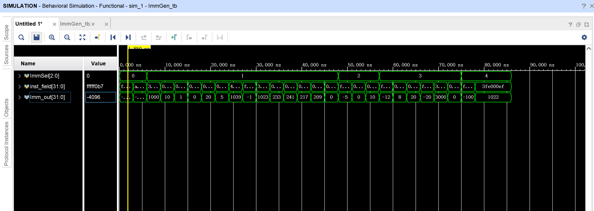

#### SCPU_ctrl 模块仿真

以下为控制单元仿真波形图，下面对每种指令的仿真结果进行简单分析：
- R-type 指令：以 `add x1, x2, x1` 为例（机器码 `0x001100B3`），`ALUSrc_B` 为 0，`RegWrite` 为 1，`ALU_Control` 为 0000，符合预期。
    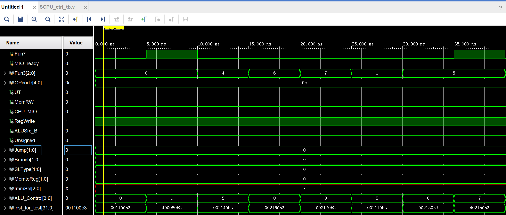
- 立即数运算指令：以 `addi x1, x2, 1000` 为例（机器码 `0x3E810093`），`ALUSrc_B` 为 1，`RegWrite` 为 1，`ALU_Control` 为 0000，`ImmSel` 为 001，符合预期。
    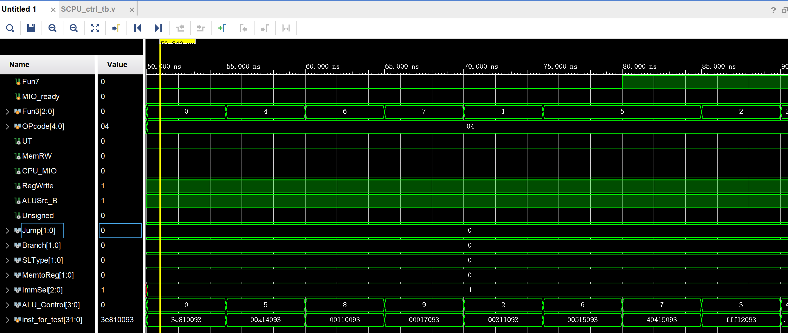
- 内存读取指令：以 `lb x1, 8(x2)` 为例（机器码 `0x00810083`），`ALUSrc_B` 为 1，`RegWrite` 为 1，`ALU_Control` 为 0000，`MemRW` 为 0（表示内存读操作），`SLType` 为 10（表示 `sb/lb/lbu`），`Unsigned` 为 0（不是无符号），`ImmSel` 为 001，符合预期。
- 内存写入指令：以 `sb x10, 24(x5)` 为例（机器码 `0x00A28C23`），`ALUSrc_B` 为 1，`RegWrite` 为 0，`ALU_Control` 为 0000，`MemRW` 为 1（表示内存写操作），`SLType` 为 10（表示 `sb/lb/lbu`），`ImmSel` 为 010，符合预期。
    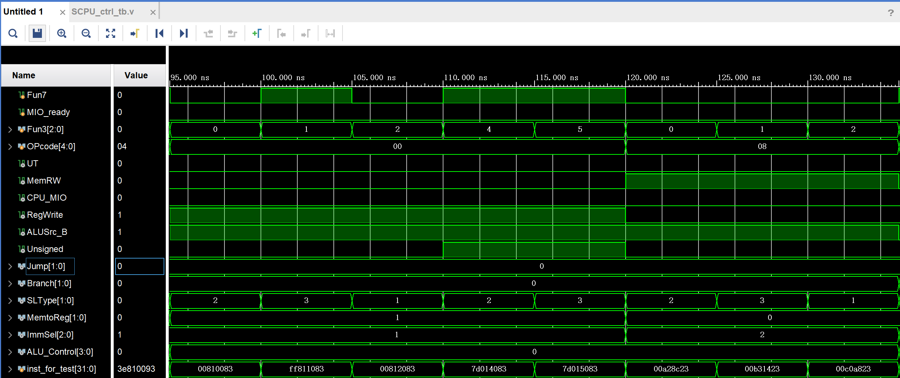
- B-type 指令：以 `beq x1, x1, -12` 为例（机器码 `0xFE108AE3`），`ALUSrc_B` 为 0，`RegWrite` 为 0，`ALU_Control` 为 1010，`Jump` 为 01（表示 B-type），`Branch` 为 01（表示 `beq/blt/bltu`），`ImmSel` 为 011，符合预期。
    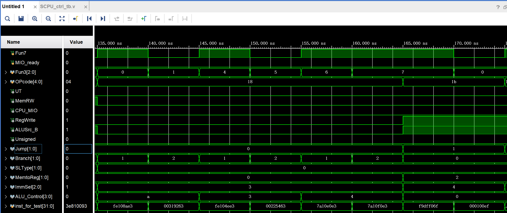
- `jal` 指令：以 `jal x0, -100` 为例（机器码 `0xF9DFF06F`），`RegWrite` 为 1，`Jump` 为 01（表示 `jal`），`ImmSel` 为 100，符合预期。
- `jalr` 指令：以 `jalr x0, x6, 1024` 为例（机器码 `0x40030067`），`ALUSrc_B` 为 1，`RegWrite` 为 1，`ALU_Control` 为 0000，`Jump` 为 10（表示 `jalr`），`ImmSel` 为 001，符合预期。
- U-type 指令：以 `lui x10, 65536` 为例（机器码 `0x10000537`），`RegWrite` 为 1，`UT` 为 0（表示 U-type），`ImmSel` 为 000，符合预期。
    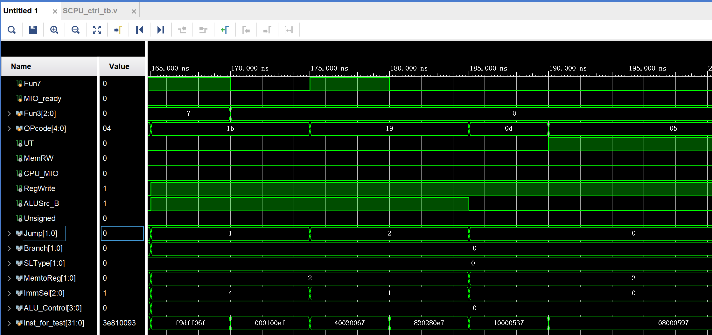


#### SCPU 模块仿真

通过波形图可以看到，`x10` 和 `x11` 寄存器最终分别为 `0xEEEEE0B0` 和 `0xFFFFF0B4`，仿真符合预期。
    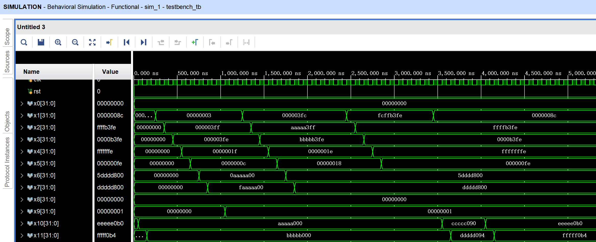

### 上板结果与分析

将验收汇编程序对应的机器码通过 coe 文件写入 ROM，生成 bit 流文件烧录到 NEXYS 板上后，将 CPU 时钟置为手动单步模式，运行若干周期并观察结果。以下为 `x31 = 0x006`, `x31 = 0x007`, `x31 = 0x666` 三个关键节点的 `Inst_in` 与 `addr_bus` 结果：

| `x31` | `Inst_in` | `addr_bus` |
|-------------|------------|-----|
| `0x006` | 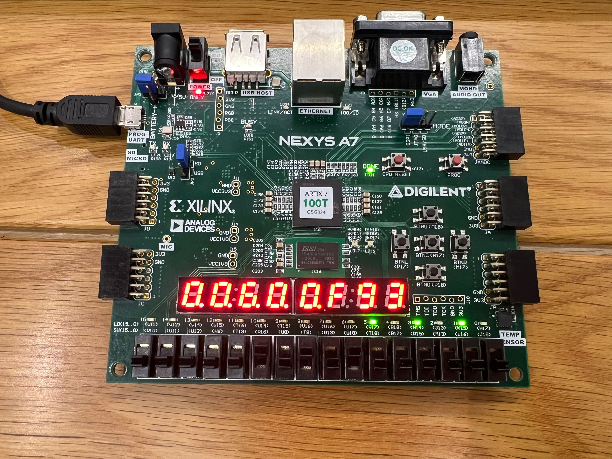 | 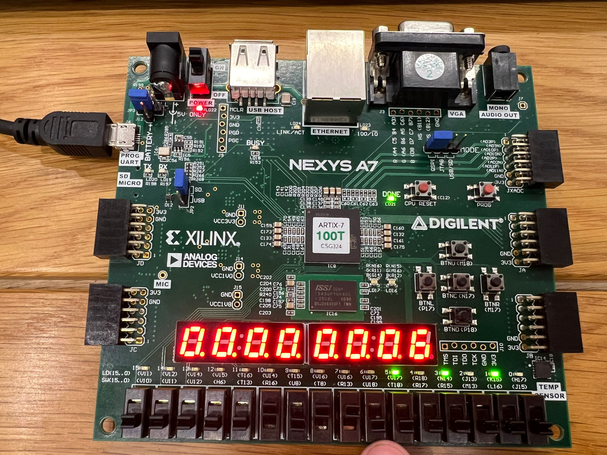 |
| `0x007` | 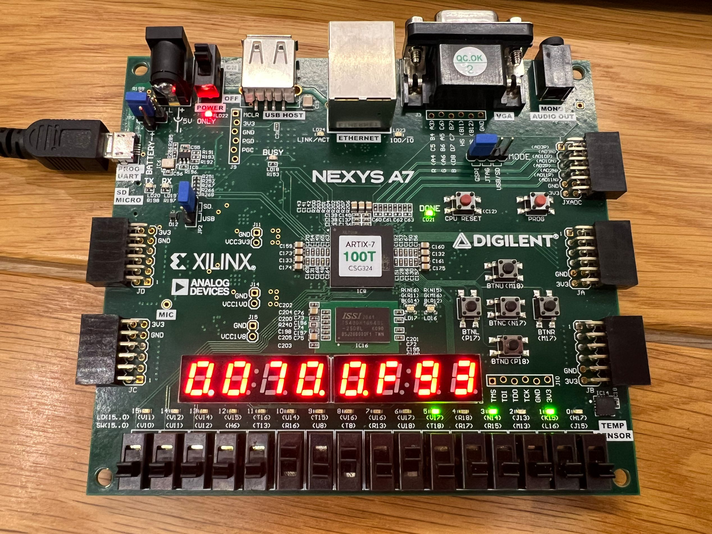 | 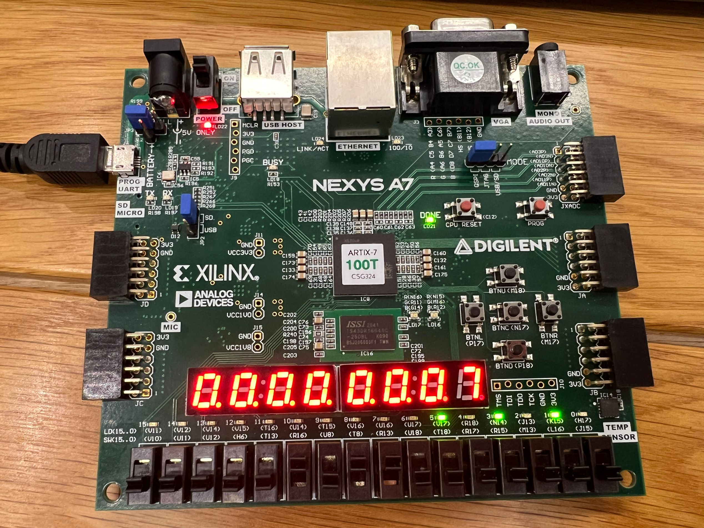 |
| `0x666` | 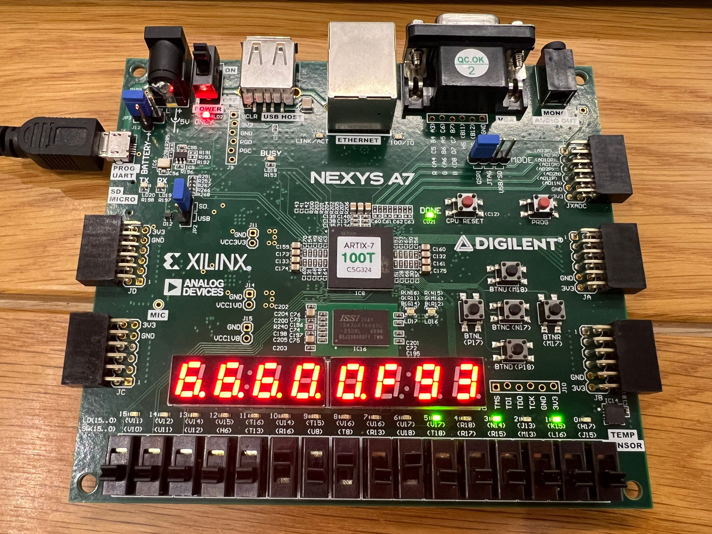 | 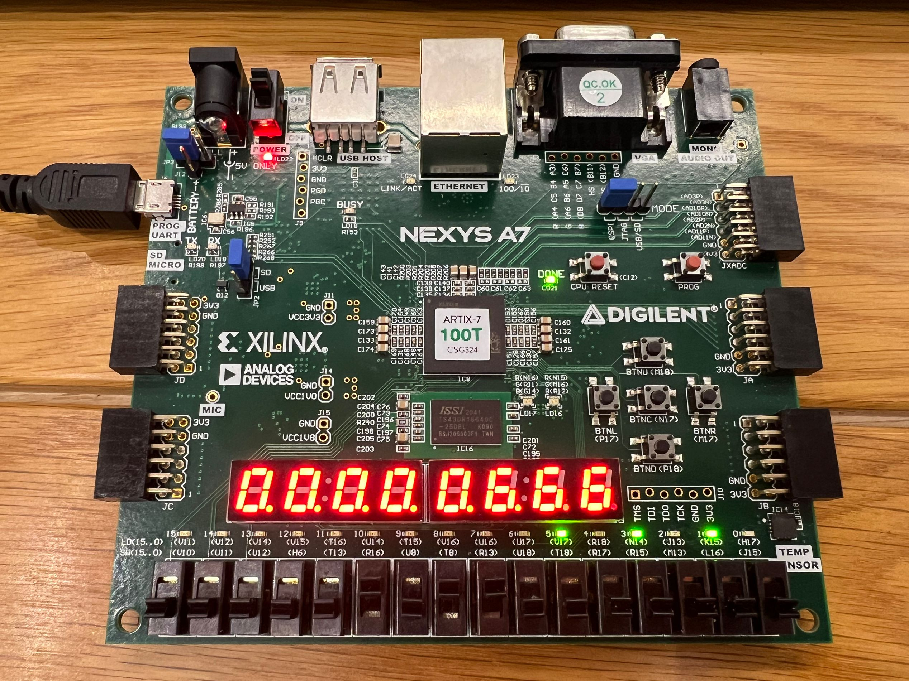 |

通过 VGA 显示的最终结果如下：

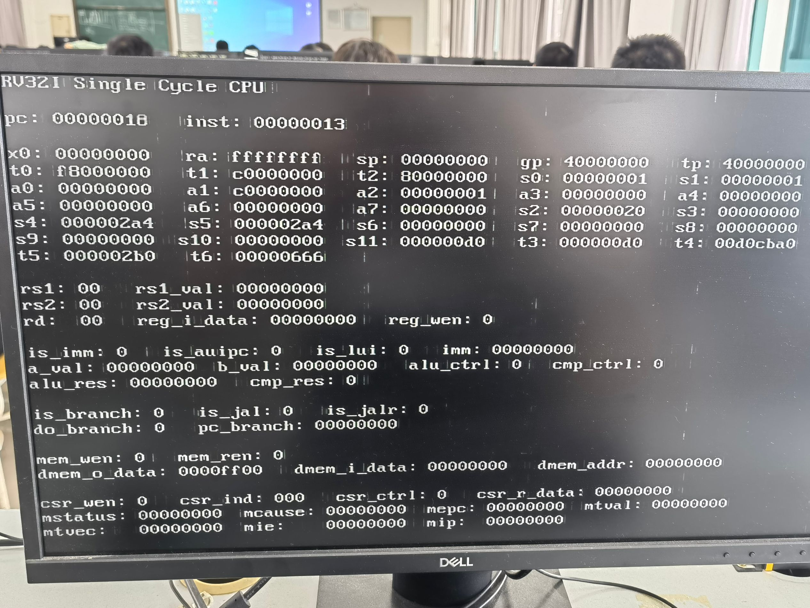

## 讨论与心得

<!-- 简要地叙述一下实验过程中的感受，以及其他的问题描述和自己的感想。特别是实验中遇到的困难，最后如何解决的。在用verilog代码写程序时遇到语法或其他错误，如何修改解决的。（实验报告中请去除本段） -->

见 4-4 实验报告**讨论与心得**部分。