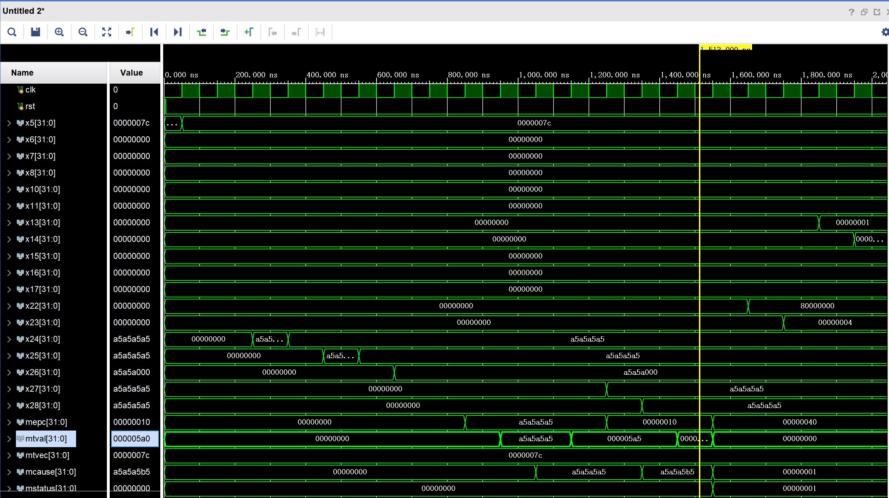
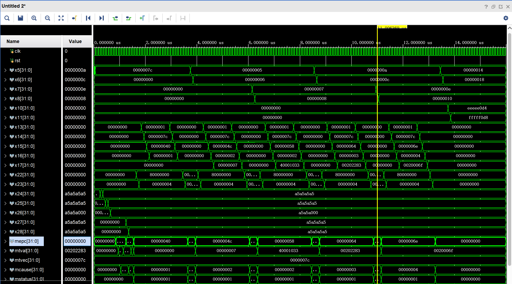
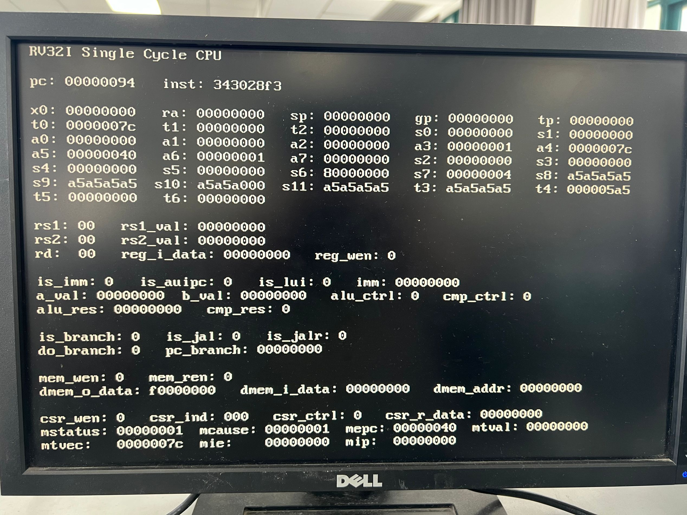
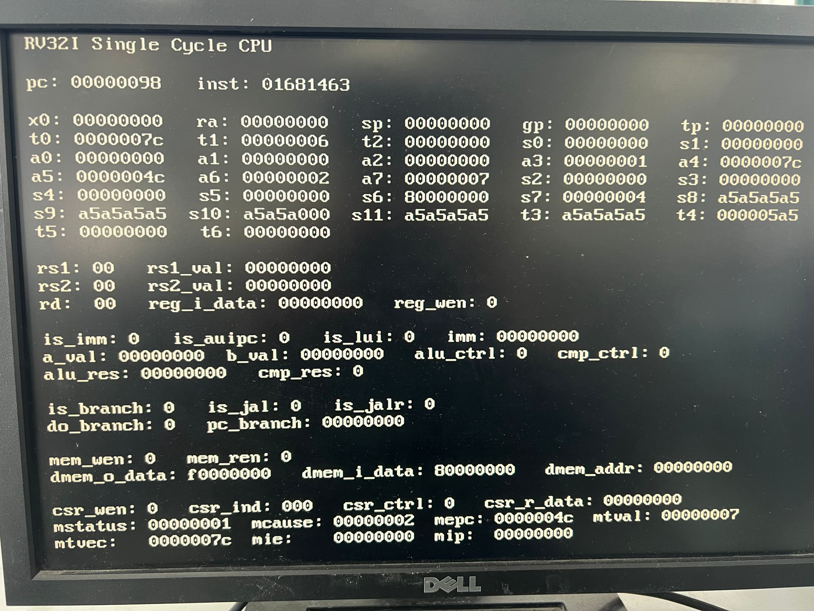
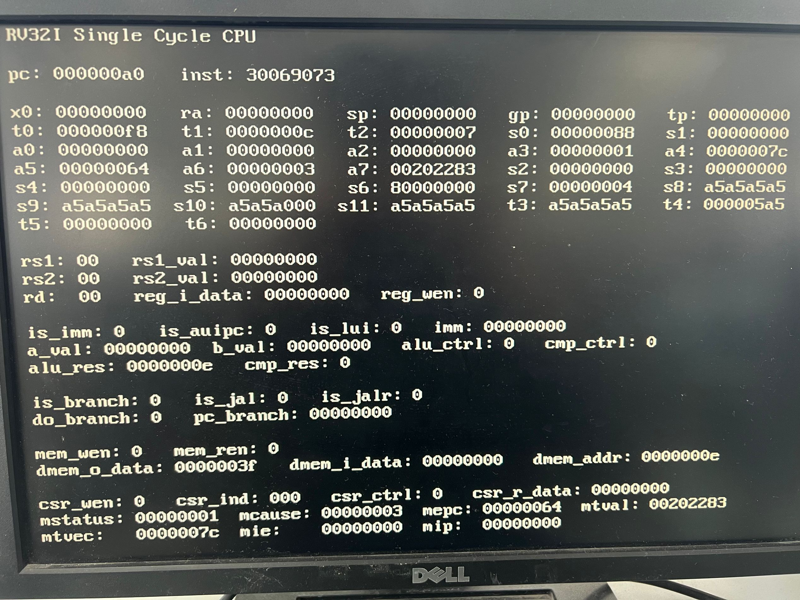
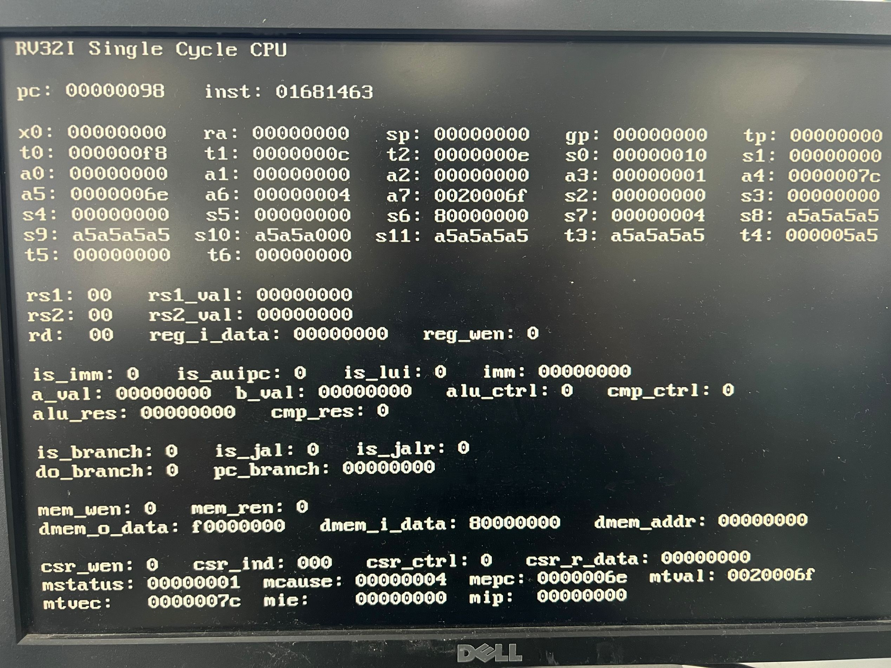
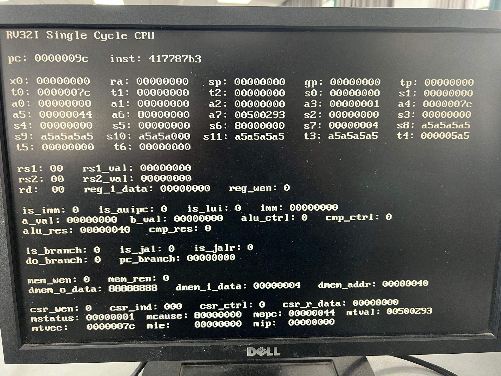
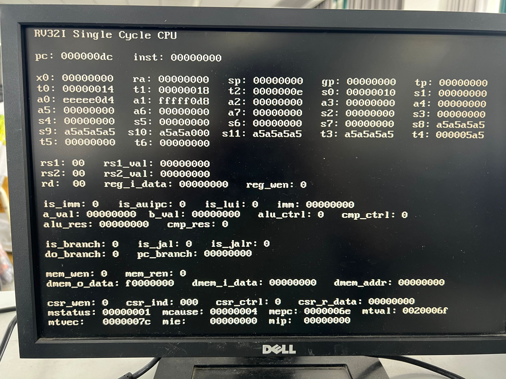

<div class="cover" style="page-break-after:always;font-family:方正公文仿宋;width:100%;height:100%;border:none;margin: 0 auto;text-align:center;">
    <div style="width:50%;margin: 0 auto;height:0;padding-bottom:10%;">
        </br>
        
    </div>
    </br></br></br></br></br>
    <div style="width:50%;margin: 0 auto;height:0;padding-bottom:40%;">
        
	</div>
    </br></br></br></br></br></br></br></br></br></br>
    <span style="font-family:黑体;text-align:center;font-size:20pt;margin: 10pt auto;line-height:30pt;"><b>计算机组成与设计 课程实验报告</b></span>
    </br>
    </br>
    <table style="border:none;text-align:center;width:72%;font-family:仿宋;font-size:14px; margin: 0 auto;">
    <tbody style="font-family:华文宋体;font-size:12pt;">
    	<tr style="font-weight:normal;"> 
    		<td style="width:20%;text-align:right;">授课教师</td>
    		<td style="width:2%">：</td> 
    		<td style="width:40%;font-weight:normal;border-bottom: 1px solid;text-align:center;font-family:华文仿宋"> 刘海风 </td>     </tr>
    	<tr style="font-weight:normal;"> 
    		<td style="width:20%;text-align:right;">姓名</td>
    		<td style="width:2%">：</td> 
    		<td style="width:40%;font-weight:normal;border-bottom: 1px solid;text-align:center;font-family:华文仿宋"> 徐若禺 3220100533</td>     </tr>
    	<tr style="font-weight:normal;"> 
    		<td style="width:20%;text-align:right;">邮箱</td>
    		<td style="width:2%">：</td> 
    		<td style="width:40%;font-weight:normal;border-bottom: 1px solid;text-align:center;font-family:华文仿宋"> xuruoyu326@zju.edu.cn </td>     </tr>
    	<tr style="font-weight:normal;"> 
    		<td style="width:20%;text-align:right;">日期</td>
    		<td style="width:2%">：</td> 
    		<td style="width:40%;font-weight:normal;border-bottom: 1px solid;text-align:center;font-family:华文仿宋"> 2024.5.6</td>     </tr>
    </tbody>              
    </table>
</div>


# Lab4-4 单周期 CPU - 异常与中断处理

## 模块设计

### SCPU_ctrl 模块修改

SCPU 控制单元在 4-3 的基础上主要有以下修改：
1. 新增信号
    - `ecall`：指示当前指令是否为 `ecall` 指令
    - `illegal_inst`：指示当前指令是否为非法指令
    - `CSRWrite`：CSR 寄存器写使能信号
    - `CSR_WSC_Mode`：CSR 寄存器写模式选择信号，00 为 W 模式，01 为 S 模式，10 为 C 模式
    - `CSRImm`：CSR 操作数选择信号，0 为 rs1，1 为立即数
    - `mret`：指示当前指令是否为 `mret` 指令
2. `ImmSel` 信号增加一种情况，用于提取 CSR 指令中的立即数。
3. 在译码过程中，对于所有的 `default` 情况，将 `illegal_inst` 置为 1 表示指令非法。
4. 新增一级 CSR 译码模块，用于识别 CSR 指令并设置相应的信号。`Mcode` 为 `inst_in[21:20]` 用于区分 `ecall` 与 `mret` 指令。该部分代码如下：
   
    ```verilog
    // CSRWrite: 0: No, 1: Yes
    // CSR_WSC_Mode: 00: W, 01: S, 10: C
    // CSRImm: 0: rs1, 1: Imm
    always @(*) begin
        {CSRWrite, CSR_WSC_Mode, CSRImm, ecall, mret} = 6'b000000;
        if (OPcode == 5'b11100) begin
            case (Fun3)
                3'b000: // M Mode
                    case (Mcode)
                        2'b00: ecall = 1;
                        2'b10: mret = 1;
                        default: illegal_inst = 1'b1;
                    endcase
                3'b001: {CSRWrite, CSR_WSC_Mode, CSRImm} = 4'b1000; // CSRRW
                3'b010: {CSRWrite, CSR_WSC_Mode, CSRImm} = 4'b1010; // CSRRS
                3'b011: {CSRWrite, CSR_WSC_Mode, CSRImm} = 4'b1100; // CSRRC
                3'b101: {CSRWrite, CSR_WSC_Mode, CSRImm} = 4'b1001; // CSRRWI
                3'b110: {CSRWrite, CSR_WSC_Mode, CSRImm} = 4'b1011; // CSRRSI
                3'b111: {CSRWrite, CSR_WSC_Mode, CSRImm} = 4'b1101; // CSRRCI
                default: illegal_inst = 1'b1;
            endcase
        end
    end
    ```

### DataPath 模块修改

<!-- - 指令对齐判断模块
    - 数据访存
        - lw：`Addr[1:0] == 0`
        - lh/lhu：`Addr[0] == 0`
    - 跳转地址
        - jal/jalr：`Addr[1:0] == 0`

- mtval 只有出现非法指令时需要修改（保存非法指令内容）。因此 Datapath 中添加一个 2 选 1 MUX（？）选择 CSRRegs 的输入数据，SCPU 接出的 ill_inst 为 1 时输入数据为 inst，csr_w 为 1 时正常。
- 记得在汇编语言中使用 CSR 指令修改 mtvec 的值（trap 基地址）。 -->

`DataPath` 模块主要将新增的 `CSRRegs`、`RV_INT`、`AlignJudge` 模块连接到主模块中，用于处理异常与中断；同时修改 PC 连线，将内存、寄存器堆使能信号与 `RV_INT` 接出的读写使能信号进行与操作。具体代码如下：

```verilog
module DataPath(
    // ...
    input INT,
    input ecall,
    input mret,
    input CSRImm,
    input CSRWrite,
    input illegal_inst,
    input [1:0] CSR_WSC_Mode
);
    // ...

    MemRWProcess MP (
        .MemRW_in(MemRW_in & {4{RV_INT_en}}),
        // ...
    );

    Regs Regs (
        .RegWrite(RegWrite & RV_INT_en),
        // ...
    );

    AlignJudge AJ (
        .PC(add_1_res[1:0]),
        .Addr(ALU_out[1:0]),
        .Code({ALUSrc_B, MemtoReg, RegWrite}),
        .SLType(SLType),
        .l_access_fault(l_access_fault),
        .j_access_fault(j_access_fault)
    );

    REG32 PC (
        .clk(clk),
        .rst(rst),
        .CE(1'b1),
        .D(RV_INT_PC),
        .Q(PC_out)
    );

    RV_INT RV_Int (
        .clk(clk),
        .rst(rst),
        .INT(INT),
        .ecall(ecall),
        .mret(mret),
        .inst_field(inst_field),
        .illegal_inst(illegal_inst),
        .l_access_fault(l_access_fault),
        .j_access_fault(j_access_fault),
        .pc_current(MUX4T1_1_res),
        .pc(RV_INT_PC),
        .en(RV_INT_en),
        .mepc(RV_mepc),
        .mtval(RV_mtval),
        .mtvec(RV_mtvec),
        .mcause(RV_mcause),
        .mstatus(RV_mstatus)
    );

    CSRRegs CSRs (
        .clk(clk),
        .rst(rst),
        .raddr(inst_field[31:20]),
        .waddr(inst_field[31:20]),
        .wdata(CSRImm ? Imm_out : Rs1_data),
        .csr_w(CSRWrite),
        .expt_int(RV_mstatus[0]),
        .mepc_bypasss_in(RV_mepc),
        .mtval_bypasss_in(RV_mtval),
        .mtvec_bypasss_in(RV_mtvec),
        .mcause_bypasss_in(RV_mcause),
        .mstatus_bypasss_in(RV_mstatus),
        .csr_wsc_mode(CSR_WSC_Mode),
        .rdata(CSR_data_out)
    );

endmodule
```

#### AlignJudge

`AlignJudge` 模块用于判断指令对齐情况，主要有以下功能：
- 判断数据访存是否对齐，`lw/sw` 指令要求地址最后两位为 0，`lh/lhu` 指令要求地址最后一位为 0。
- 判断跳转地址是否对齐，`jal` 指令要求地址最后两位为 0。

输入 `Code = {ALUSrc_B, MemtoReg, RegWrite}` 与 `SLType` 用于区分不同指令类型。

```verilog
module AlignJudge (
    input [1:0] PC,
    input [1:0] Addr,
    input [3:0] Code,
    input [1:0] SLType,
    output reg l_access_fault,
    output reg j_access_fault
);

    always @(*) begin
        l_access_fault = 1'b0;
        j_access_fault = 1'b0;
        case (Code)
            4'b1011:
                case (SLType)
                    2'b01: l_access_fault = (Addr != 2'b00); // lw/sw
                    2'b11: l_access_fault = (Addr[0] != 1'b0); // lh/sh/lhu
                endcase
            4'b1101: j_access_fault = (PC != 2'b00); // jal
        endcase
    end

endmodule
```

### CSRRegs 模块

`CSRRegs` 模块与寄存器堆 `Regs` 模块相似，用于处理 CSR 寄存器的读写操作。用输入信号 `csr_wsc_mode` 区分 CSR 指令是 W、S 还是 C 模式，然后执行相应运算。另外，本模块支持旁路输入，由 `expt_int` 信号控制。

注意 `rst` 复位时要将 `mtvec` 置为 `trap` 程序首条指令地址。

```verilog
module CSRRegs (
    input clk, rst,
    input [11:0] raddr, waddr, // 读、写 CSR 寄存器的地址
    input [31:0] wdata, // 写入 CSR 寄存器的数据
    input csr_w, // 写使能
    input expt_int, // 异常中断信号，控制旁路输入
    input [31:0] mepc_bypasss_in, // 旁路输入
    input [31:0] mtval_bypasss_in, // 旁路输入
    input [31:0] mtvec_bypasss_in, // 旁路输入
    input [31:0] mcause_bypasss_in, // 旁路输入
    input [31:0] mstatus_bypasss_in, // 旁路输入
    input [1:0] csr_wsc_mode, // 写入 CSR 寄存器的模式
    output [31:0] rdata, // 读出 CSR 寄存器的数据
    output [31:0] mepc_out,
    output [31:0] mtval_out,
    output [31:0] mtvec_out,
    output [31:0] mcause_out,
    output [31:0] mstatus_out
);

    localparam mtvec_addr = 32'd124; // trap 程序地址
    reg [31:0] mstatus, mtvec, mcause, mtval, mepc;

    always @(posedge clk or posedge rst) begin
        if (rst) begin
            mepc <= 32'b0;
            mtval <= 32'b0;
            mcause <= 32'b0;
            mstatus <= 32'b0;
            mtvec <= mtvec_addr;
        end else if (csr_w && wdata != 32'b0) begin
            case (csr_wsc_mode)
                2'b00: // CSRRW/CSRRWI
                    case (waddr)
                        12'h341: mepc <= wdata;
                        12'h305: mtvec <= wdata;
                        12'h343: mtval <= wdata;
                        12'h342: mcause <= wdata;
                        12'h300: mstatus <= wdata;
                    endcase
                2'b01: // CSRRS/CSRRSI
                    case (waddr)
                        12'h341: mepc <= mepc | wdata;
                        12'h305: mtvec <= mtvec | wdata;
                        12'h343: mtval <= mtval | wdata;
                        12'h342: mcause <= mcause | wdata;
                        12'h300: mstatus <= mstatus | wdata;
                    endcase
                2'b10: // CSRRC/CSRRCI
                    case (waddr)
                        12'h341: mepc <= mepc & ~wdata;
                        12'h305: mtvec <= mtvec & ~wdata;
                        12'h343: mtval <= mtval & ~wdata;
                        12'h342: mcause <= mcause & ~wdata;
                        12'h300: mstatus <= mstatus & ~wdata;
                    endcase
            endcase
        end else if (expt_int) begin
            mepc <= mepc_bypasss_in;
            mtval <= mtval_bypasss_in;
            mtvec <= mtvec_bypasss_in;
            mcause <= mcause_bypasss_in;
            mstatus <= mstatus_bypasss_in;
        end
    end

    assign mepc_out = mepc;
    assign mtval_out = mtval;
    assign mtvec_out = mtvec;
    assign mcause_out = mcause;
    assign mstatus_out = mstatus;
    assign rdata = (raddr == 12'h341) ? mepc
                 : (raddr == 12'h343) ? mtval
                 : (raddr == 12'h305) ? mtvec
                 : (raddr == 12'h342) ? mcause
                 : (raddr == 12'h300) ? mstatus
                 : 32'b0;

endmodule
```

### RV_INT 模块

`RV_INT` 模块用于处理异常与中断。根据不同的异常中断信号，执行：
1. 输出 `en` 信号控制寄存器堆、内存等器件的写使能，在出现异常中断时禁止写入。
2. 输出 `pc` 信号表示下一条指令的 PC 值，根据不同信号决定是否进入 `trap` 程序、是否跳回原先要执行的指令等。
3. 出现异常中断时，通过旁路输入修改 CSR 寄存器的值。五个寄存器含义如下：
    - `mepc`：记录异常中断发生时将要执行指令的 PC 值
    - `mtval`：记录非法指令/不对齐指令内容
    - `mtvec`：记录 `trap` 处理程序首条指令地址
    - `mcause`：记录异常中断原因
    - `mstatus`：记录异常中断状态

```verilog
module RV_INT(
    input clk,
    input rst,
    input INT, // 外部中断信号
    input mret, // MRET 指令
    input ecall, // ECALL 指令
    input illegal_inst, // 非法指令信号
    input l_access_fault, // 数据访存不对齐
    input j_access_fault, // 跳转地址不对齐
    input [31:0] pc_current, // 当前指令 PC 值
    input [31:0] inst_field,
    output en, // 用于控制寄存器堆、内存等器件的写使能
    output [31:0] pc, // 将执行的指令 PC 值
    output reg [31:0] mepc,
    output reg [31:0] mtval,
    output reg [31:0] mtvec,
    output reg [31:0] mcause,
    output reg [31:0] mstatus
);

    localparam mtvec_addr = 32'd124;
    localparam mcause_INT = 32'h80000000,
               mcause_eca = 32'h00000001,
               mcause_ill = 32'h00000002,
               mcause_laf = 32'h00000003,
               mcause_jaf = 32'h00000004;

    wire [5:0] sel;
    assign en = ~(INT | ecall | illegal_inst | l_access_fault | j_access_fault) | mret | mstatus[0];
    assign pc = rst ? 32'b0 : (mret ? mepc : ((INT | ecall | illegal_inst | l_access_fault | j_access_fault) & ~mstatus[0]) ? mtvec : pc_current);
    assign sel = {INT, ecall, illegal_inst, l_access_fault, j_access_fault, mret};

    always @(posedge clk or posedge rst) begin
        if (rst) begin
            mepc <= 32'b0;
            mtval <= 32'b0;
            mcause <= 32'b0;
            mstatus <= 32'b0;
            mtvec <= mtvec_addr;
        end else begin
            case (sel)
                6'b000000: begin
                    mepc <= mepc;
                    mtval <= mtval;
                    mtvec <= mtvec;
                    mcause <= mcause;
                    mstatus <= mstatus;
                end
                6'b000001: begin // mret
                    mepc <= 32'b0;
                    mtval <= mtval;
                    mtvec <= mtvec;
                    mcause <= 32'b0;
                    mstatus <= 32'b0;
                end
                6'b000010: if (~mstatus[0]) begin // j_access_fault
                    mtval <= mtval;
                    mtvec <= mtvec;
                    mepc <= pc_current;
                    mcause <= mcause_jaf;
                    mstatus <= 32'b1;
                end
                6'b000100: if (~mstatus[0]) begin // l_access_fault
                    mtval <= mtval;
                    mtvec <= mtvec;
                    mepc <= pc_current;
                    mcause <= mcause_laf;
                    mstatus <= 32'b1;
                end
                6'b001000: if (~mstatus[0]) begin // illegal_inst
                    mtval <= inst_field;
                    mtvec <= mtvec;
                    mepc <= pc_current;
                    mcause <= mcause_ill;
                    mstatus <= 32'b1;
                end
                6'b010000: if (~mstatus[0]) begin // ecall
                    mtval <= mtval;
                    mtvec <= mtvec;
                    mepc <= pc_current;
                    mcause <= mcause_eca;
                    mstatus <= 32'b1;
                end
                6'b100000: if (~mstatus[0]) begin // INT
                    mtval <= inst_field;
                    mtvec <= mtvec;
                    mepc <= pc_current;
                    mcause <= mcause_INT;
                    mstatus <= 32'b1;
                end
                default: begin
                    mepc <= 32'b0;
                    mtval <= 32'b0;
                    mcause <= 32'b0;
                    mstatus <= 32'b0;
                    mtvec <= mtvec_addr;
                end
            endcase
        end
    end

endmodule
```

### 仿真代码设计

仿真代码主要分为以下几个部分：
- `start`：初始化 `mtvec` 值为 `trap` 处理程序首条指令位置，然后依次测试 `csrrw`、`csrrs`、`csrrc`、`csrrwi`、`csrrsi`、`csrrci` 指令。
- `expt_int`：测试异常处理与中断处理，包括 `ecall`、非法指令、数据访存不对齐、跳转地址不对齐。触发异常中断的指令之间插入一些简单指令便于测试 `mret` 正确性。
- `trap` 处理程序：异常处理与中断处理的处理程序，包括 `mret` 指令。遇到异常中断时，先将 CSR 指令取出存到 `x13` ~ `x17` 中，然后判断是否为**外部中断** `INT`，若是则需要修改 `mtvec` 为 `pc_next - 4`。最后恢复寄存器信息后调用 `mret` 返回。
- `end`：结束程序。

具体内容将在**仿真结果与分析**一节详细解释。代码如下：

```asm
start:
    li    x5, 124
    csrrw x0, 0x305, x5    # mtvec = 0x0000007C
    li    x24, 0xA5A5A5A5
    li    x25, 0xA5A5A5A5
    li    x26, 0xA5A5A000
    csrrw x0, 0x341, x24   # mepc = 0xA5A5A5A5
    csrrw x0, 0x343, x24   # mtval = 0xA5A5A5A5
    csrrs x0, 0x342, x25   # mcause = 0xA5A5A5A5
    csrrc x0, 0x343, x26   # mtval = 0x000005A5
    csrrwi x27, 0x341, 16  # mepc = 0x00000010
    csrrsi x28, 0x342, 16  # mcause = 0xA5A5A5B5
    csrrci x29, 0x343, 31  # mtval = 0x000005A0

expt_int:
    ecall
    addi  x5, x0, 5        # x5 = 0x00000005
    addi  x6, x0, 6        # x6 = 0x00000006
    ill_inst: 0x00000007
    addi  x7, x0, 7        # x7 = 0x00000007
    addi  x8, x0, 8        # x8 = 0x00000008
    ill_inst: 0x40001033
    add   x5, x5, x5       # x5 = 0x0000000A
    add   x6, x6, x6       # x6 = 0x0000000C
    lw    x5, 2(x0)        # l_access_fault: 0x00020203
    add   x7, x7, x7       # x7 = 0x0000000E
    add   x8, x8, x8       # x8 = 0x00000010
    jal   x0, 2            # j_access_fault: 0x0020006F
    add   x5, x5, x5       # x5 = 0x00000014
    add   x6, x6, x6       # x6 = 0x00000018
    jal   x0, end

trap:                      # x13 - x17, x22 - x23 unused
    lui   x22, 0x80000
    li    x23, 4
    csrrs x13, 0x300, x0   # mstatus
    csrrs x14, 0x305, x0   # mtvec
    csrrs x15, 0x341, x0   # mepc
    csrrs x16, 0x342, x0   # mcause
    csrrs x17, 0x343, x0   # mtval
    bne   x16, x22, else   # not caused by INT
    sub   x15, x15, x23    # caused by INT: mepc = pc_next - 4

else:
    csrrw x0, 0x300, x13   # mstatus
    csrrw x0, 0x305, x14   # mtvec
    csrrw x0, 0x341, x15   # mepc
    csrrw x0, 0x342, x16   # mcause
    csrrw x0, 0x343, x17   # mtval
    li    x13, 0
    li    x14, 0
    li    x15, 0
    li    x16, 0
    li    x17, 0
    li    x22, 0
    li    x23, 0
    mret                   # 0x30200073

end:
    auipc  x10, 0xEEEEE    # x10 = 0xEEEEE0D4
    auipc  x11, 0xFFFFF    # x10 = 0xFFFFF0D8
```

## 实验结果与分析

### 仿真结果与分析

程序的开始，将 `trap` 程序首条指令地址写入 `mtvec` 寄存器，然后依次测试六条 CSR 指令：
- 先使用 `csrrw` 指令将 `mepc` 置为 `0xA5A5A5A5`，然后使用 `csrrwi` 指令将 `mepc` 置为零扩展后的 `0x10`。
- 先使用 `csrrs` 指令将 `mcause` 置为 `0xA5A5A5A5`，然后使用 `csrrsi` 指令将 `mcause` 与零扩展后的 `0x10` 进行按位或运算，得到 `0xA5A5A5B5`。
- 先使用 `csrrw` 指令将 `mtval` 置为 `0xA5A5A5A5`；然后使用 `csrrc` 指令将 `mtval` 中对应 `x26 = 0xA5A5A5A5` 为 1 的位清零，得到 `0x000005A5`；最后使用 `csrrci` 指令将 `mtval` 中对应 `5'b11111` 零扩展后为 1 的位清零，得到 `0x000005A0`。



接着测试异常处理与中断处理：
- `ecall` 指令，`mcause` 寄存器值为 `0x00000001` 标识 `ecall` 软件中断。
- 非法指令，`mtval` 记录非法指令内容，`mcause` 置为 `0x00000002` 标识非法指令异常。
- 数据访存不对齐，`mtval` 记录指令内容，`mcause` 置为 `0x00000003` 标识数据访存不对齐异常。
- 跳转地址不对齐，`mtval` 记录指令内容，`mcause` 置为 `0x00000004` 标识跳转地址不对齐异常。

另外，所有异常中断触发后，`mepc` 均记录即将执行指令地址，`mstatus` 置为 `32'b1` 表示异常中断状态；同时可以看到 `x13` ~ `x17` 依次存储了五个 CSR 寄存器的值。处理完毕后  通过 `mret` 指令跳回原先要执行的指令，`mstatus` 置为 `32'b0` 表示正常状态，`mepc`、`mcause`、`mstatus` 恢复为零。

观察 `x5` ~ `x8` 值的变化，可以发现异常中断处理并没有影响程序正常执行。最后通过 `jal` 指令跳转到 `end` 部分，`x10` 和 `x11` 分别存储了 `0xEEEEE0D4` 和 `0xFFFFF0D8`，程序结束。



### 上板结果与分析

上板测试代码与仿真代码一致，主要检查出现外部中断时指令的执行是否符合预期。以下是不同异常中断的 `mcause` 与相应 VGA 显示内容，通过查看底部 CSR 寄存器可以得到所有异常中断的处理均符合预期。

| 异常中断类型 | 图片 | `mcause` |
|-------------|------------|-----|
| `ecall` |  | `0x00000001` |
| 非法指令 |  | `0x00000002` |
| 数据访存不对齐 |  | `0x00000003` |
| 跳转地址不对齐 |  | `0x00000004` |
| 外部中断 |  | `0x80000000` |

以下是程序最终运行结果，可以看到 `x5(t0) = 0x00000014`，`x6(t1) = 0x00000018`，`x7(t2) = 0x0000000e`，`x8(s0) = 0x00000010`，`x10(a0) = 0xEEEEE0D4` 和 `x11(a1) = 0xFFFFF0D8`，说明所有指令运行正常。



## 讨论与心得

<!-- 简要地叙述一下实验过程中的感受，以及其他的问题描述和自己的感想。特别是实验中遇到的困难，最后如何解决的。在用verilog代码写程序时遇到语法或其他错误，如何修改解决的。（实验报告中请去除本段） -->

### 思考题

```asm
lui t1, 0xDEADB
addi t1, t1, 0xEEF
```
- 无法通过以上代码生成 `0xDEADBEEF`，因为 `addi` 中的立即数为 `12` 位**有符号**数，`0xEEF = 0b1110_1110_1111` 会被当成负数处理从而产生借位，故得到的结果是 `0xDEADAEEF`。
- 我们可以将 `lui t1, 0xDEADB` 修改为 `lui t1, 0xDEADC` 得到 `0xDEADBEEF`。

### 实验心得

终于赶在 ddl 到来之前完成了单周期 CPU 实验所有内容，前后共耗费一个多月的时间的 Lab 4 到此告一段落。本实验分为两部分，4-3 直接实现了指令扩展与数据通路，4-4 则是在此基础上实现异常中断处理。

Lab 4-3 过程中我参考了「计算机组成」课程 ppt，但本课程需要实现的指令更多，因此 DataPath 与 SCPU_ctrl 两部分实现时需要考虑更多情况。印象最深刻的是 load 指令的实现，耗费了一整个晚上，原因是对 RAM 核存取方式不够熟悉（一开始在 CS61C Venus 平台上模拟，但是该平台并没有考虑地址对齐），后来经过长时间的摸爬滚打终于搞明白其中规律，也帮助几个同学解答了这部分的疑问。

关于 Lab 4-4，其实一开始并不是很理解为什么要增加一个 `CSRRegs` 模块，因为 `RV_INT` 模块即可完成除了 `csrrw` 等指令外所有的功能。尽管后来允许通过旁路输入的方式解决两个模块之间的同步问题，但整个 4-4 做下来仍然有种不知从何谈起的不舒服感~~（可能是每次上板都需要等上好几分钟导致的）~~。希望明年助教可以继续完善这部分内容（包括指令不对齐等部分的实现），相信整个实验的体验感会越来越好。

此外，在完成整个实验的过程中，我也发现自己对 Verilog 语法还不够熟悉，直接导致了在一些低级错误上浪费了很多时间。~~果然击落欠下的债还是要祭祖来还。~~相信补足了这些缺陷能使 Lab 5 的设计更加顺利。