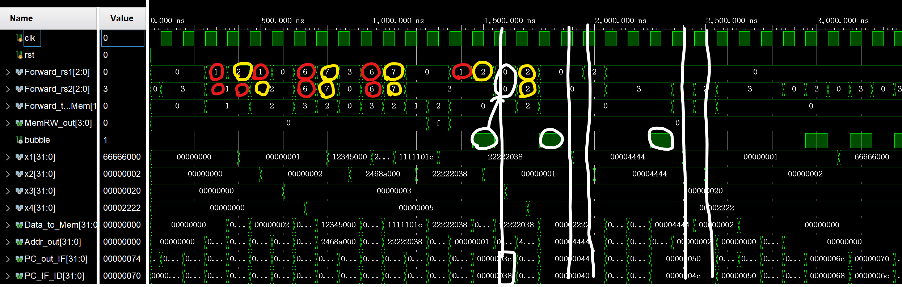
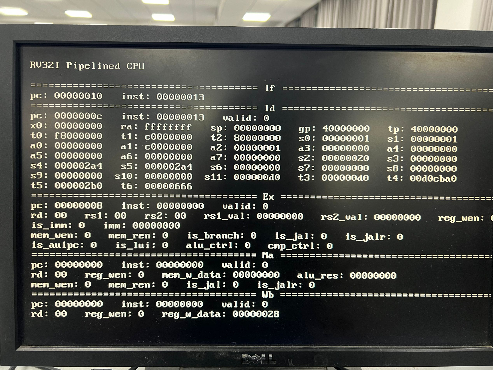
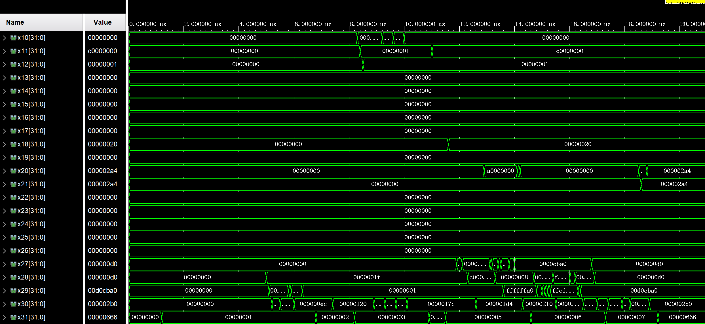
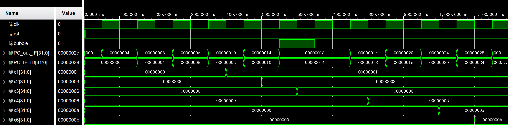

<div class="cover" style="page-break-after:always;font-family:方正公文仿宋;width:100%;height:100%;border:none;margin: 0 auto;text-align:center;">
    <div style="width:50%;margin: 0 auto;height:0;padding-bottom:10%;">
        </br>
        
    </div>
    </br></br></br></br></br>
    <div style="width:50%;margin: 0 auto;height:0;padding-bottom:40%;">
        
	</div>
    </br></br></br></br></br></br></br></br></br></br>
    <span style="font-family:黑体;text-align:center;font-size:20pt;margin: 10pt auto;line-height:30pt;"><b>计算机组成与设计 课程实验报告</b></span>
    </br>
    </br>
    <table style="border:none;text-align:center;width:72%;font-family:仿宋;font-size:14px; margin: 0 auto;">
    <tbody style="font-family:华文宋体;font-size:12pt;">
    	<tr style="font-weight:normal;"> 
    		<td style="width:20%;text-align:right;">授课教师</td>
    		<td style="width:2%">：</td> 
    		<td style="width:40%;font-weight:normal;border-bottom: 1px solid;text-align:center;font-family:华文仿宋"> 刘海风 </td>     </tr>
    	<tr style="font-weight:normal;"> 
    		<td style="width:20%;text-align:right;">姓名</td>
    		<td style="width:2%">：</td> 
    		<td style="width:40%;font-weight:normal;border-bottom: 1px solid;text-align:center;font-family:华文仿宋"> 徐若禺 3220100533</td>     </tr>
    	<tr style="font-weight:normal;"> 
    		<td style="width:20%;text-align:right;">邮箱</td>
    		<td style="width:2%">：</td> 
    		<td style="width:40%;font-weight:normal;border-bottom: 1px solid;text-align:center;font-family:华文仿宋"> xuruoyu326@zju.edu.cn </td>     </tr>
    	<tr style="font-weight:normal;"> 
    		<td style="width:20%;text-align:right;">日期</td>
    		<td style="width:2%">：</td> 
    		<td style="width:40%;font-weight:normal;border-bottom: 1px solid;text-align:center;font-family:华文仿宋"> 2024.5.30</td>     </tr>
    </tbody>              
    </table>
</div>


# Lab5 流水线 CPU

## 模块设计

<!-- 本节重点介绍实验的具体过程，包括：代码设计层次结构图及说明、源代码（包括注释）、PC机上进行的关键步骤截图及说明、调试过程等，这部分的内容应当与实际操作过程和结果相符。本节也可以再细分小节，要求同上。（实验报告中请去除本段） -->

### PCPU 模块

PCPU 模块包含五级流水线 CPU 的数据通路：
- IF 阶段：从 IMem 中取出指令，选择下一周期的 PC
- ID 阶段：对指令进行译码，并处理跳转指令，计算分支跳转指令的跳转目标，结果返回至 IF 阶段；包含 stall 检测
- EX 阶段：对涉及运算的指令进行运算，包含 Forwarding 处理
- MEM 阶段：向 DMem 写入/加载数据
- WB 阶段：将数据写回寄存器

整体框架如下。数据通路手绘图附在报告末尾。
```verilog
module PCPU (
	input ...

	output ...
);

	// wire ...
	// wire ...
	// ...

    IF Instruction_Fetch (...); // IF 阶段

    Reg_IF_ID Register_IF_ID (...); // IF/ID 寄存器

    ID Instruction_Decoder (...); // ID 阶段

    StallUnit HazardDetection (...); // Stall 检测模块

    Reg_ID_Ex Register_ID_Ex (...); // ID/EX 寄存器

    ForwardingUnit ForwardingUnit (...); // Forwarding 检测

    MUX8T1_32 M8_rs1 (...); // 写入 EX 阶段 rs1 的前递数据

    MUX8T1_32 M8_rs2 (...); // 写入 EX 阶段 rs2 的前递数据

    Ex Execute (...); // EX 阶段

    MUX4T1_32 M4_to_Mem (...); // 写入 DMEM 的前递数据

    Reg_Ex_Mem Register_Ex_Mem (...); // EX/MEM 寄存器

    Mem Memory_Access (...); // MEM 阶段

    Reg_Mem_WB Register_Mem_WB (...); // MEM/WB 寄存器

    WB Write_Back (...); // WB 阶段

endmodule
```

### 数据前递检测模块

前递检测模块主要接收各个阶段的信号，输出 `Forward_rs1`, `Forward_rs2`, `Forward_to_Mem` 三个信号，分别表示 Rs1, Rs2 的前递来源（参与 ALU 运算等），以及内存写入数据的前递来源。

对于 `Forward_rs1/2`，前递来源有以下几种情况：
1. `000`：没有数据冒险，不需要前递，选择 ID/EX 阶段的 `Rs1_out` 作为源操作数
2. `001`：前递来源为 EX/MEM 阶段的 ALU 运算结果（相邻指令）
3. `010`：前递来源为 MEM/WB 阶段的数据写入寄存器的数据（间隔一条指令）
4. `011`：不需要前递。rs1 为 PC（`auipc` 指令），rs2 为立即数
5. `100`：前递来源为 EX/MEM 阶段的 PC + 4
6. `101`：前递来源为 MEM/WB 阶段的 PC + 4
7. `110`：前递来源为 EX/MEM 阶段的 U 型指令结果
8. `111`：前递来源为 MEM/WB 阶段的 U 型指令结果

对于 `Forward_to_Mem`，前递来源有以下几种情况：
1. `00`：默认情况（没有数据冒险），选择 rs2 的值
2. `01`：EX/MEM 阶段（相邻指令）的 ALU 运算结果
3. `10`：间隔指令的运算结果（WB 写回数据，包含所有情况）
4. `11`：EX/MEM 阶段（相邻指令）的 `lui/auipc` 指令结果

另外，分支跳转指令也会涉及数据前递。由于跳转条件处理被前提到 ID 阶段进行，我们需要在 ID 阶段单独处理，具体细节见下文。以下为 `ForwardingUnit` 的实现：
```verilog
module ForwardingUnit (
    input UT,
    input ALUSrc_B,
    input RegWrite_Ex_Mem,
    input RegWrite_Mem_WB,
    input [1:0] MemtoReg_Ex_Mem,
    input [1:0] MemtoReg_Mem_WB,
    input [4:0] Rs1_ID_Ex,
    input [4:0] Rs2_ID_Ex,
    input [4:0] Rd_Ex_Mem,
    input [4:0] Rd_Mem_WB,
    // 000: Rs1_ID_Ex, 001: ALU_out_Ex_Mem, 010: Data_to_Reg_WB, 011: PC_ID_Ex / Imm_ID_Ex
    // 100: PCP4_Ex_Mem, 101: PCP4_Mem_WB, 110: UI_Ex_Mem, 111: UI_Mem_WB
    output reg [2:0] Forward_rs1,
    output reg [2:0] Forward_rs2,
    // 00: Rs2_out, 01: ALU_res, 10: Data_to_Reg(WB), 11: lui/auipc
    output reg [1:0] Forward_to_Mem
);

    always @(*) begin
        if (UT) begin
            Forward_rs1 = 3'b011;
        end else begin
            if (RegWrite_Ex_Mem && Rd_Ex_Mem != 0 && Rs1_ID_Ex == Rd_Ex_Mem) begin
                case (MemtoReg_Ex_Mem)
                    2'b10: Forward_rs1 = 3'b100; // PC + 4
                    2'b11: Forward_rs1 = 3'b110; // lui/auipc
                    default: Forward_rs1 = 3'b001; // ALU_res
                endcase
            end else if (RegWrite_Mem_WB && Rd_Mem_WB != 0 && Rs1_ID_Ex == Rd_Mem_WB) begin
                case (MemtoReg_Mem_WB)
                    2'b10: Forward_rs1 = 3'b101; // PC + 4
                    2'b11: Forward_rs1 = 3'b111; // lui/auipc
                    default: Forward_rs1 = 3'b010; // ALU/Mem
                endcase
            end else Forward_rs1 = 3'b000;
        end

        if (ALUSrc_B) begin
            Forward_rs2 = 3'b011; // imm
        end else begin
            if (RegWrite_Ex_Mem && Rd_Ex_Mem != 0 && Rs2_ID_Ex == Rd_Ex_Mem) begin
                case (MemtoReg_Ex_Mem)
                    2'b10: Forward_rs2 = 3'b100; // PC + 4
                    2'b11: Forward_rs2 = 3'b110; // lui/auipc
                    default: Forward_rs2 = 3'b001; // ALU_res
                endcase
            end else if (RegWrite_Mem_WB && Rd_Mem_WB != 0 && Rs2_ID_Ex == Rd_Mem_WB) begin
                case (MemtoReg_Mem_WB)
                    2'b10: Forward_rs2 = 3'b101; // PC + 4
                    2'b11: Forward_rs2 = 3'b111; // lui/auipc
                    default: Forward_rs2 = 3'b010; // ALU/Mem
                endcase
            end else Forward_rs2 = 3'b000;
        end

        if (RegWrite_Ex_Mem && Rd_Ex_Mem != 0 && Rs2_ID_Ex == Rd_Ex_Mem) begin
            if (MemtoReg_Ex_Mem == 2'b11) Forward_to_Mem = 2'b11; // lui/auipc
            else Forward_to_Mem = 2'b01; // ALU_res
        end else if (RegWrite_Mem_WB && Rd_Mem_WB != 0 && Rs2_ID_Ex == Rd_Mem_WB) Forward_to_Mem = 2'b10;
        else Forward_to_Mem = 2'b00;

    end

endmodule
```

### 跳转指令处理

采用 stall 的方式解决控制冒险。

为了提高跳转指令处理效率，我们将跳转条件判断过程前提到 ID 阶段。由于此阶段 rs1 与 rs2 的值已经被读出且相关信号已经被译码，故可以直接增设一个类似 ALU 的判断模块处理分支条件。需要注意的是，此阶段也可能涉及 Forwarding，需要根据指令源寄存器将后面的结果进行相应前递。
- 遇到跳转指令（branch, `jal` 或 `jalr`）时，CPU 首先会在 IF 阶段插入一个 nop 指令（使用 `JB` 信号判断），待下一个周期跳转目标于 ID 计算完毕后决定是否跳转。因此，所有跳转指令都会至少使 CPU 暂停一个时钟周期。
- 如果跳转指令出现数据冒险（如 `addi x1, x0, 1`, `beq x1, x2, dummy`），需要多暂停一个周期以等待前一条指令的结果从 EX 阶段前递。对于这种情况，在 StallUnit 中进行检测，然后将当前指令的控制信号进行 flush。

相关代码如下，其中多路选择器 `M4_tmp` 用于选择可能会前递的数据，`reg1` 和 `reg2` 为参与分支条件比较的数据，`ALU_0` 为比较结果。

```verilog
IF Instruction_Fetch (
	.clk(clk),
	.rst(rst),
	.stall(bubble),
	.ALU_0(ALU_0),
	.Jump(Jump_ID),
	.Branch(Branch_ID),
	.PCPI(PC_IF_ID + Imm_out_ID),
	.PC_jalr(reg1 + Imm_out_ID),
	.PC_out(PC_out_IF)
);

Reg_IF_ID Register_IF_ID (
	.en(1'b1),
	.clk(clk),
	.rst(rst),
	.flush(JB),
	.stall(bubble),
	.PC_in(PC_out_IF),
	.inst_in(inst_in),
	.PC_out(PC_IF_ID),
	.inst_out(inst_out_IF_ID)
);

assign JB = Jump_ID[0] | Jump_ID[1] | Branch_ID[0] | Branch_ID[1];
assign Rs1_addr_IF_ID = inst_out_IF_ID[19:15];
assign Rs2_addr_IF_ID = inst_out_IF_ID[24:20];

MUX4T1_32 M4_tmp (
	.I0(ALU_out_Ex_Mem),
	.I1(Data_in_Mem),
	.I2(PCP4_Ex_Mem),
	.I3(UI_Ex_Mem),
	.S(MemtoReg_Ex_Mem),
	.O(tmp)
);

assign reg1 = (JB && RegWrite_Ex_Mem && (Rd_addr_Ex_Mem != 0) && Rd_addr_Ex_Mem == Rs1_addr_IF_ID) ? tmp : Rs1_out_ID;
assign reg2 = (JB && RegWrite_Ex_Mem && (Rd_addr_Ex_Mem != 0) && Rd_addr_Ex_Mem == Rs2_addr_IF_ID) ? tmp : Rs2_out_ID;
assign ALU_0 = (ALU_control_ID == 4'b1010) ? (reg1 == reg2) : // beq/bne
				(ALU_control_ID == 4'b0011) ? ($signed(reg1) < $signed(reg2)) : // blt/bge
				(reg1 < reg2); // bltu/bgeu

```

IF 阶段主要实现如下。其中，`Jump` 表示无条件跳转指令，`Branch` 和 `ALU_0` 信号结合判断分支条件是否满足；如果 `stall` 信号不为 1 则 PC 正常更新，否则暂停。
```verilog
wire [31:0] PC_in;

assign PC_in = (Jump == 2'b01) ? PCPI : // jal
				(Jump == 2'b10) ? PC_jalr : // jalr
				((Branch[0] & ALU_0) | (Branch[1] & ~ALU_0)) ? PCPI : // branch ok
				(Jump[0] | Jump[1] | Branch[0] | Branch[1]) ? PC_out : PC_out + 4; // bubble_stop

REG32 PC (
	.clk(clk),
	.rst(rst),
	.CE(~stall),
	.D(PC_in),
	.Q(PC_out)
);
```

### Stall 检测模块

Stall 检测模块主要接收各个阶段的信号，输出 `bubble` 信号，表示是否需要插入气泡对流水线进行暂停。暂停有两种情况：
- load-use：在 load 指令后立即使用读取的数据，需要暂停一个周期
- branch 指令：由于分支判断被提前到 ID 阶段进行，因此如果前一个指令需写回的目标寄存器是分支指令的源寄存器，需要暂停一个周期

```verilog
module StallUnit (
    input jump, // calculated by |Branch[1:0]
    input MemRead_ID_Ex, // calculated by (|SLType[1:0]) & RegWrite
    input RegWrite_ID_Ex,
    input [4:0] Rd_ID_Ex,
    input [4:0] Rs1_IF_ID,
    input [4:0] Rs2_IF_ID,
    output bubble
);

    assign bubble = (MemRead_ID_Ex || (jump && RegWrite_ID_Ex && Rd_ID_Ex != 0))
                 && (Rs1_IF_ID == Rd_ID_Ex || Rs2_IF_ID == Rd_ID_Ex);

endmodule
```

### 仿真代码设计

仿真代码主要针对 Forwarding 和 Stall 进行设计。在 `forwarding_test` 部分，我们测试前递检测模块中可能出现的所有情况；在 `branch_test` 部分，我们测试跳转指令的处理，包括能否正常 stall 处理控制冒险、跳转指令出现数据冒险的情况。汇编代码如下：
```asm
forwarding_test:
	addi    x1, x0, 1       # x1 = 0x00000001
	add     x2, x1, x1      # x2 = 0x00000002
	add     x3, x1, x2      # x3 = 0x00000003
	add     x4, x3, x2      # x4 = 0x00000005

	lui     x1, 0x12345     # x1 = 0x12345000
	add     x2, x1, x1      # x1 = 0x2468A000
	add     x1, x1, x1      # x1 = 0x48D14000

	auipc   x1, 0x11111     # x1 = 0x1111101C
	add     x2, x1, x1      # x2 = 0x22222038
	add     x1, x1, x1      # x1 = 0x22222038

	sw      x1, 0(x0)       # mem[0] = 0x22222038
	addi    x2, x0, 1       # x2 = 0x00000001
	lb      x3, 0(x2)       # x3 = 0x00000020
	lh      x4, 1(x2)       # x4 = 0x00002222
	add     x1, x4, x4      # x1 = 0x00004444
	add     x2, x4, x4      # x2 = 0x00004444

branch_test:
	bne     x2, x1, dummy
	addi    x1, x0, 1       # x1 = 0x00000001
	addi    x2, x0, 2       # x2 = 0x00000002
	beq     x1, x2, dummy

	jal     x0, end

dummy:
	addi    x1, x0, 3
	addi    x1, x1, 3
	jal     x0, dummy

end:
	lui     x1, 0x66666
```

## 实验结果与分析

<!-- 1.这里应给出详实的实验结果。分析应有条理，要求采用规范的书面语。

2.实验四后每个实验都需要做模拟，要到每一个模拟结果的每一段结果做分析说明。

3.对下载到SWORD实验台的图片结果做分析说明。

4.原则上要求使用图片与文字结合的形式说明，因为word和PDF文档不支持视频，所以请不要使用视频文件。

5.图片请在垂直方向，不要横向。不要用很大的图片，请先做裁剪操作。

（实验报告中请去除以上内容） -->

### 仿真结果与分析

仿真结果波形图如下：
<center></center>

用红色圆圈表示相邻两条指令的前递，黄色圆圈表示间隔一条指令的前递；用白色圆圈表示流水线中 stall 的情况，其中第一个 stall 为 load-use hazard，后两个 stall 为分支跳转指令中的数据冒险。分析如下：
- 第一条指令为 `addi x1, x0, 1`，之后三条 `add` 指令用于测试 ALU 结果前递情况，可以看到 `x1` ~ `x4` 分别被写入 1, 3, 4, 5
- 然后测试 `lui/auipc` 指令的前递情况，圆圈内前递信号的 6, 7 分别对应相邻指令、间隔指令的情况。最后 `x1` 被写入 `0x22222038`
- 之后测试 store 和 load 指令，先将 `x1` 的结果存入 0x00，再先后测试按字节、按半字读取（前递信号分别为 1, 2），后面紧跟着 load-use 的情况（白色圆圈标识）
- 再测试跳转指令，由于 `bne x2, x2, dummy` 的两个源寄存器需要前递，故此处有一个周期的暂停（白色圆圈标识）；随后的 `beq` 同理。之后用 `jal` 指令跳过 `dummy` 到~~结算画面~~ `end` 处。

整个汇编程序被有效执行的语句有 22 条，3 次 stall，3 条跳转指令，五阶段流水线再加 4 个周期，`22 + 3 + 3 + 4 = 32`。32 个周期后，`x1` 的值被正确写入为 `0x66666`，符合预期。

### 上板结果与分析

上板使用 Lab4-3 的验收代码，最后出现 `x31 = 0x666` 则符合预期。上板结果如下：
<center></center>

对应的仿真结果如下：
<center></center>

## 讨论与心得

<!-- 简要地叙述一下实验过程中的感受，以及其他的问题描述和自己的感想。特别是实验中遇到的困难，最后如何解决的。在用verilog代码写程序时遇到语法或其他错误，如何修改解决的。（实验报告中请去除本段） -->

### 思考题

#### 思考题 1

基于你完成的流水线，对于以下两段代码分别分析：不同指令之间是否存在冲突（如果有，请逐条列出）、在你的流水线上运行的 CPI 为何。

1. **TP-0**
```asm
addi    x1, x0, 0
addi    x2, x0, -1
addi    x3, x0, 1
addi    x4, x0, -1
addi    x5, x0, 1
addi    x6, x0, -1
addi    x1, x1, 0
addi    x2, x2, 1
addi    x3, x3, -1
addi    x4, x4, 1
addi    x5, x5, -1
addi    x6, x6, 1
```
没有冲突，CPI 为 1。

2. **TP-1**
```asm
addi    x1, x0, 1
addi    x2, x1, 2
addi    x3, x1, 3
addi    x4, x3, 4
```
指令 1, 2 之间、指令 1, 3 之间、指令 3, 4 之间存在数据冲突。由于我的流水线使用 Forwarding 解决数据冲突，故不会有 stall，因此 CPI 可以视为 1。

#### 思考题 2

对以下代码进行仿真：
```asm
addi    x1, x0, 1
addi    x2, x1, 2
addi    x3, x2, 3
sw      x3, 0(x0)
lw      x4, 0(x0)
addi    x5, x4, 4
addi    x6, x4, 5
```
结果如下。可以看到，在 **12** 个周期（7 条指令，1 次因 load-use 产生的 stall，五阶段流水线再加 4 周期）后，`x6` 的值为 `0x0000000B`，符合预期。


### 实验心得

~~写流水线只需要记好每个阶段的信号和冒险就行了，而单周期要考虑的就很多了。~~流水线 CPU 的难度相较单周期提升了不少。虽然理论课对流水线 CPU 的基本架构有所介绍，但实现起来问题重重。

Lab4-3 中我们对 CPU 支持的指令进行了扩展，而我自己的实现又对原本的数据通路进行了不少重构，因此改造为流水线并不能照搬理论课所学。一开始由于没有将 PC MUX 前置，导致每三个周期才能输入一条指令；U-type, J-type 指令的加入导致 Forwarding 的情况变得更加复杂；跳转指令一开始忘记 flush 了，在翻看 PPT 后恍然大悟。

流水线 CPU 的信号非常多，且仿真波形中写回数据与当前信号之间存在几个周期的偏差，导致 debug 的过程非常困难，常常因为一个控制信号写错（如 ID/EX 与 EX/MEM 写反）坐牢几个小时。

最后 0x666 出现在显示器上的那一刻带来的成就感还是很大的，有种如释重负的感觉。随着 CPU 终于告一段落，计组实验也接近尾声。感谢海风老师的教导与两位学长的辛勤付出！~~我们龙芯杯再见~~