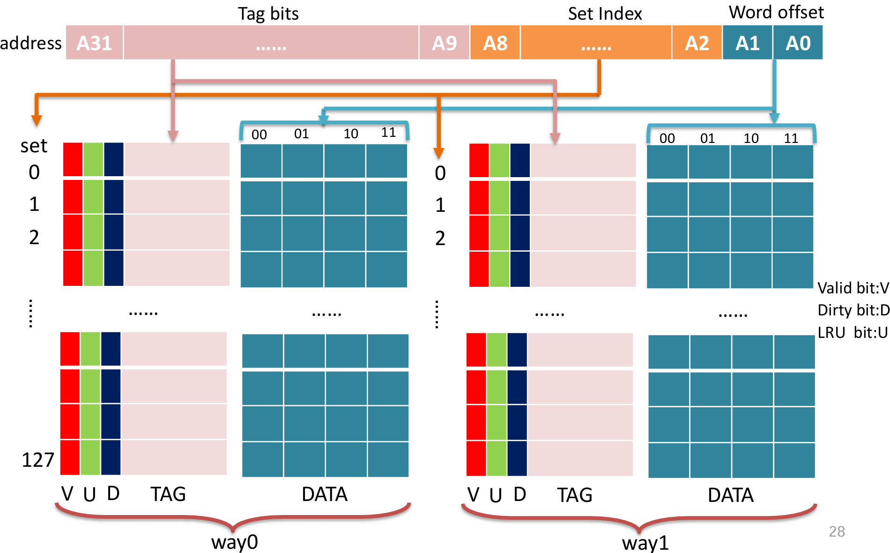
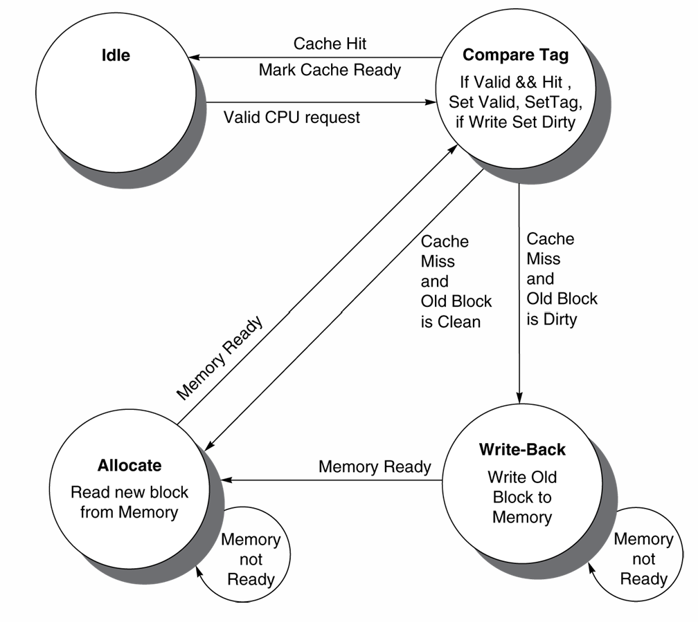
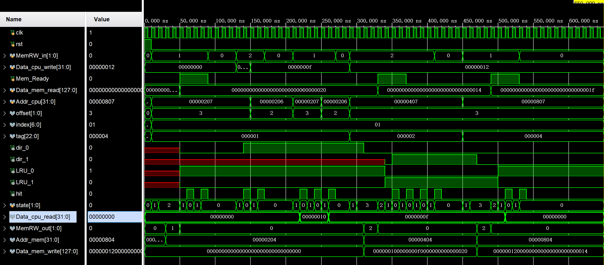

<div class="cover" style="page-break-after:always;font-family:方正公文仿宋;width:100%;height:100%;border:none;margin: 0 auto;text-align:center;">
    <div style="width:50%;margin: 0 auto;height:0;padding-bottom:10%;">
        </br>
        
    </div>
    </br></br></br></br></br>
    <div style="width:50%;margin: 0 auto;height:0;padding-bottom:40%;">
        
	</div>
    </br></br></br></br></br></br></br></br></br></br>
    <span style="font-family:黑体;text-align:center;font-size:20pt;margin: 10pt auto;line-height:30pt;"><b>计算机组成与设计 课程实验报告</b></span>
    </br>
    </br>
    <table style="border:none;text-align:center;width:72%;font-family:仿宋;font-size:14px; margin: 0 auto;">
    <tbody style="font-family:华文宋体;font-size:12pt;">
    	<tr style="font-weight:normal;"> 
    		<td style="width:20%;text-align:right;">授课教师</td>
    		<td style="width:2%">：</td> 
    		<td style="width:40%;font-weight:normal;border-bottom: 1px solid;text-align:center;font-family:华文仿宋"> 刘海风 </td>     </tr>
    	<tr style="font-weight:normal;"> 
    		<td style="width:20%;text-align:right;">姓名</td>
    		<td style="width:2%">：</td> 
    		<td style="width:40%;font-weight:normal;border-bottom: 1px solid;text-align:center;font-family:华文仿宋"> 徐若禺 3220100533</td>     </tr>
    	<tr style="font-weight:normal;"> 
    		<td style="width:20%;text-align:right;">邮箱</td>
    		<td style="width:2%">：</td> 
    		<td style="width:40%;font-weight:normal;border-bottom: 1px solid;text-align:center;font-family:华文仿宋"> xuruoyu326@zju.edu.cn </td>     </tr>
    	<tr style="font-weight:normal;"> 
    		<td style="width:20%;text-align:right;">日期</td>
    		<td style="width:2%">：</td> 
    		<td style="width:40%;font-weight:normal;border-bottom: 1px solid;text-align:center;font-family:华文仿宋"> 2024.6.6</td>     </tr>
    </tbody>              
    </table>
</div>


# Lab6 Cache

## 模块设计

<!-- 本节重点介绍实验的具体过程，包括：代码设计层次结构图及说明、源代码（包括注释）、PC机上进行的关键步骤截图及说明、调试过程等，这部分的内容应当与实际操作过程和结果相符。本节也可以再细分小节，要求同上。（实验报告中请去除本段） -->

### Cache 模块设计

#### 模块定义

模块接口主要有两部分：CPU 与 Cache 之间的数据交互信号，以及 Cache 与主内存之间的数据交互信号。信号包括 CPU 读写请求、地址、数据，内存读写请求、地址、数据等。

Cache 模块内部主要存储两路数据，每路数据分为 128 组，每组包括四个 32 位数据块（用 128 位寄存器存储）。此外，每路数据还包括 128 组 26 位标签，包含 1 位有效位、1 位 LRU 位、1 位脏位和 23 位标签。具体示意图如下：
<center></center>

输入的 CPU 地址由索引（标识组）、偏移量（标识组内数据块）与标签（用于匹配 Cache 中的数据）三部分组成。如果 valid 位为 1 且 tag 匹配，则表示 Cache 命中，否则 Cache 未命中。

```verilog
module Cache (
    input wire clk,
    input wire rst,
    // cpu <-> cache
    input wire [1:0] MemRW_in,
    input wire [31:0] Addr_cpu,
    input wire [31:0] Data_cpu_write,
    output reg Ready,
    output reg [31:0] Data_cpu_read,
    // cache <-> memory
    input wire Mem_Ready,
    input wire [127:0] Data_mem_read,
    output reg [1:0] MemRW_out,
    output reg [31:0] Addr_mem,
    output reg [127:0] Data_mem_write
);

    reg [1:0] state;

    wire [1:0] offset;
    wire [6:0] index;
    wire [22:0] tag;
    assign offset = Addr_cpu[1:0];
    assign index = Addr_cpu[8:2];
    assign tag = Addr_cpu[31:9];

    reg [127:0] cache_d0 [127:0]; // cache data way 0
    reg [127:0] cache_d1 [127:0]; // cache data way 1
    // [25] valid bit, [24] LRU bit, [23] dirty bit, [22:0] tag
    reg [25:0] cache_t0 [127:0]; // cache tag way 0
    reg [25:0] cache_t1 [127:0]; // cache tag way 1

    wire dir_0, dir_1; // 1 dirty, 0 clean
    wire LRU_0, LRU_1; // 1 replaced, 0 unreplaced
    wire val_0, val_1;
    wire [22:0] tag_0, tag_1;
    assign val_0 = cache_t0[index][25];
    assign val_1 = cache_t1[index][25];
    assign LRU_0 = cache_t0[index][24];
    assign LRU_1 = cache_t1[index][24];
    assign dir_0 = cache_t0[index][23];
    assign dir_1 = cache_t1[index][23];
    assign tag_0 = cache_t0[index][22:0];
    assign tag_1 = cache_t1[index][22:0];

    wire hit_0, hit_1, hit;
    assign hit_0 = val_0 && (tag_0 == tag);
    assign hit_1 = val_1 && (tag_1 == tag);
    assign hit = hit_0 | hit_1;

	//...
endmodule
```

#### FSM 设计

Cache 的控制使用 FSM 实现，状态设计如下图所示。
<center></center>

下面结合代码进行详细介绍。
- `IDLE`：默认状态，等待读写请求。
- `COMPARE_TAG`：Cache 内部 tag 比较状态。首先判断是否命中（地址的标签是否与 Cache 中索引对应的匹配）：
	- 若命中，则将 `Ready` 信号置为 1 表示 hit，然后分读写请求两种情况讨论（对匹配的那一路进行操作）：
		- 读请求：将 Cache 中对应的数据输出到 `Data_cpu_read`，等待 CPU 读取。
		- 写请求：将 `Data_cpu_write` 对应的数据写入 Cache，把 LRU bit 置为 1 表示最近使用过，并标记为 dirty。
	- 若未命中，将 `Ready` 信号置为 0 表示 miss。
- `ALLOCATE`：Cache 未命中，需要从主存中读取数据。根据 `Mem_Ready` 判断主存数据是否就绪：
	- 已就绪：将 `MemRW_out` 置为 0 表示无请求，再使用 LRU 替换策略，将最近未使用的一路数据替换为主存中的数据。
	- 未就绪：将 `MemRW_out` 置为 1 表示读请求，同时设置主存地址 `Addr_mem` 为当前请求地址。
- `WRITE_BACK`：有脏位为 1，需要向主存写回数据。如果 `Mem_Ready == 0` 表示主存尚未写入，则将 `MemRW_out` 置为 2 表示写请求，并更新写地址、写数据；若读取完毕，将 `MemRW_out` 置为 0 表示无请求。

```verilog
always @(posedge clk or posedge rst) begin
	if (rst) begin
		state <= `IDLE;
		Data_cpu_read <= 32'b0;
		Ready <= 1'b0;
		MemRW_out <= 2'b0;
		Addr_mem <= 32'b0;
		Data_mem_write <= 32'b0;
	end else case (state)
		`IDLE: begin
			Ready <= 1'b0;
			MemRW_out <= 2'b0;
		end
		`COMPARE_TAG: begin
			if (hit) begin
				Ready <= 1'b1;
				if (MemRW_in == `MEM_READ) begin
					if (hit_0) begin
						Data_cpu_read <= cache_d0[index][(offset*32)+:32];
					end else if (hit_1) begin
						Data_cpu_read <= cache_d1[index][(offset*32)+:32];
					end
				end else if (MemRW_in == `MEM_WRITE) begin
					if (hit_0) begin
						cache_d0[index][(offset*32)+:32] <= Data_cpu_write;
						cache_t0[index][24:23] <= 2'b11; // LRU && dirty
					end else if (hit_1) begin
						cache_d1[index][(offset*32)+:32] <= Data_cpu_write;
						cache_t1[index][24:23] <= 2'b11; // LRU && dirty
					end
				end
			end else begin
				Ready <= 1'b0;
			end
		end
		`ALLOCATE: begin
			if (Mem_Ready) begin
				MemRW_out <= 2'b00;
				if (LRU_0) begin // Way 0 is recently replaced
					cache_t0[index][24] <= 1'b0; // Mark way 0 as unreplaced
					cache_t1[index] <= {3'b110, tag}; // Replace way 1
					cache_d1[index] <= Data_mem_read;
				end else begin // Replaced way 0
					cache_t1[index][24] <= 1'b0; // Mark way 1 as unreplaced
					cache_t0[index] <= {3'b110, tag}; // Replace way 0
					cache_d0[index] <= Data_mem_read;
				end
			end else begin
				MemRW_out <= `MEM_READ;
				Addr_mem <= {tag, index, 2'b00};
			end
		end
		`WRITE_BACK: begin
			if (!Mem_Ready) begin
				MemRW_out <= `MEM_WRITE;
				Addr_mem <= {tag, index, 2'b00};
				if (dir_0) begin
					Data_mem_write <= cache_d0[index];
					cache_t0[index][23] <= 1'b0;
				end else if (dir_1) begin
					Data_mem_write <= cache_d1[index];
					cache_t1[index][23] <= 1'b0;
				end
			end else begin
				MemRW_out <= 2'b00;
			end
		end
	endcase
end
```

#### 状态转移

状态转移分四种情况讨论：
- `IDLE`：空闲状态，如果有读写请求（`MemRW_in` 不为 0）则转移到`COMPARE_TAG`状态。
- `COMPARE_TAG`：
	- 如果命中则转移到 `IDLE` 状态，等待下一次请求；
	- 如果未命中而当前有一路数据标记为 dirty，则转移到 `WRITE_BACK` 状态进行写回主存；
	- 否则，需要从主存中读取数据，转移到 `ALLOCATE` 状态。
- `ALLOCATE`：等待主存数据返回（`Mem_Ready` 标识），返回后转移到 `COMPARE_TAG` 状态。
- `WRITE_BACK`：向主存写回成功后（同样由 `Mem_Ready` 标识）转移到 `ALLOCATE` 状态。

```verilog
always @(posedge clk) begin
	if (!rst) case (state)
		`IDLE:
			if (|MemRW_in) state <= `COMPARE_TAG;
			else state <= `IDLE;
		`COMPARE_TAG:
			if (hit) state <= `IDLE;
			else if (dir_0 || dir_1) state <= `WRITE_BACK;
			else state <= `ALLOCATE;
		`ALLOCATE:
			if (Mem_Ready) state <= `COMPARE_TAG;
			else state <= `ALLOCATE;
		`WRITE_BACK:
			if (Mem_Ready) state <= `ALLOCATE;
			else state <= `WRITE_BACK;
		default: state <= `IDLE;
	endcase
end
```

### 仿真代码设计

在仿真测试中，我们通过改变 CPU 的读写请求，模拟 Cache 的读写命中与未命中情况与 Cache 的替换策略。以下是仿真代码，具体分析见下一部分。

```verilog
`define MEM_READ 2'b01
`define MEM_WRITE 2'b10

module Cache_tb;

    reg clk, rst;
    reg [1:0] MemRW_in;
    reg [31:0] Addr_cpu, Data_cpu_write;
    reg Mem_Ready;
    reg [127:0] Data_mem_read;

    wire hit;
    wire [31:0] Data_cpu_read;
    wire [1:0] MemRW_out;
    wire [31:0] Addr_mem;
    wire [127:0] Data_mem_write;

    Cache U1 (
        .clk(clk),
        .rst(rst),
        .MemRW_in(MemRW_in),
        .Addr_cpu(Addr_cpu),
        .Data_cpu_write(Data_cpu_write),
        .Ready(hit),
        .Data_cpu_read(Data_cpu_read),
        .Mem_Ready(Mem_Ready),
        .Data_mem_read(Data_mem_read),
        .MemRW_out(MemRW_out),
        .Addr_mem(Addr_mem),
        .Data_mem_write(Data_mem_write)
    );

    initial begin
        clk = 1'b1; 
        rst = 1'b1;
        MemRW_in = 0;
        Addr_cpu = 0;
        Data_cpu_write = 0;
        Mem_Ready = 0;
        Data_mem_read = 0;
        #10;
        rst = 1'b0;
        // read miss
        MemRW_in = `MEM_READ;
        Addr_cpu = 32'h00000207;
        #40; // 50
        Mem_Ready = 1;
        Data_mem_read = 32;
        #40; // 90
        Mem_Ready = 0;
        MemRW_in = 0;
        #40; // 130
        // write hit
        MemRW_in = `MEM_WRITE;
        Addr_cpu = 32'h00000207;
        Data_cpu_write = 16;
        #20; // 150
        Addr_cpu = 32'h00000206;
        Data_cpu_write = 15;
        #20; // 170
        MemRW_in = 0;
        #40; // 210
        // read hit
        MemRW_in = `MEM_READ;
        Addr_cpu = 32'h00000207;
        #40; // 250
        Addr_cpu = 32'h00000206;
        #20; // 270
        MemRW_in = 0;
        #20; // 290
        // write miss
        MemRW_in = `MEM_WRITE;
        Addr_cpu = 32'h00000407;
        Data_cpu_write = 18;
        #40; // 330
        Mem_Ready = 1;
        Data_mem_read = 20;
        #40; // 370
        Mem_Ready = 0;
        #40; // 410
        MemRW_in = 0;
        #40; // 450
        // read miss (LRU replace)
        MemRW_in = `MEM_READ;
        Addr_cpu = 32'h00000807;
        #40; // 490
        Mem_Ready = 1;
        Data_mem_read = 31;
        #40; // 530
        Mem_Ready = 0;
        MemRW_in = 0;
        #40; // 570
    end

    always #5 clk = ~clk;

endmodule
```

## 实验结果与分析

仿真波形如下图所示：

<center></center>

对 Cache 进行 reset 后，我们首先测试读取未命中的情况：将 `MemRW_in` 置为 1 表示读请求，地址为 0x207，此时 Cache 未命中，`Ready` 信号为 0 表示 miss（10 - 50 ns）。随后将 `Mem_Ready` 置为 1，并返回主存数据 0x20，Cache 将数据写入，`Ready` 信号变为 1 表示 hit（50 - 90 ns）。在这个过程中，`state` 从 `IDLE` 转移到 `COMPARE_TAG` 状态，再转移到 `ALLOCATE` 状态（因为未命中）。

随后测试写入命中的情况：将 `MemRW_in` 置为 2 表示写请求，尝试向地址 0x207 写入数据 0x10；随后向地址 0x206 写入数据 0x0F。由于两者 tag 均与前一步相同，Cache 中已有记录，可以看到在 130-150 ns 与 150-170 ns `hit` 信号均变为 1 表示命中。

然后尝试读取我们刚刚存入的数据：在第 220 ns 与 260 ns，我们分别读取地址 0x207 与 0x206 的数据，可以看到 `hit` 信号均为 1 表示命中。同时，`Data_cpu_read` 输出分别为 0x10 与 0x0F，可见我们成功读取刚刚写入的数据。

再测试写入未命中的情况：将 `MemRW_in` 置为 2 表示写请求，尝试向地址 0x407 写入数据 0x12。此时 Cache 未命中，`Ready` 信号为 0 表示 miss（290 - 330 ns）。随后将 `Mem_Ready` 置为 1，并将 `Data_mem_read` 输入置为 0x14，Cache 将数据写入，`Ready` 信号变为 1 表示 hit（330 - 370 ns）。

最后，测试 Cache 写入的 LRU 替换策略。我们尝试读取地址 0x807 的数据。在 490 ns 时，index 为 0x01，Cache 中该组数据 `LRU_0` 为 0（最近未访问），`LRU_1` 为 1（最近访问过），故我们将替换 way 0 的数据。之后 `state` 从 `ALLOCATE` 变为 `COMPARE_TAG`，再变为 `IDLE` 状态。LRU bit 也分别取反。

## 实验心得

<!-- 简要地叙述一下实验过程中的感受，以及其他的问题描述和自己的感想。特别是实验中遇到的困难，最后如何解决的。在用verilog代码写程序时遇到语法或其他错误，如何修改解决的。（实验报告中请去除本段） -->

Lab6 的完成也意味着本学期计组课程实验部分的结束。在选这门课之前，我很好奇本课程与《计算机组成》的区别，课程名中的“与设计”三个字是什么意思。此刻回头望去，突然感觉豁然开朗。

相较《计算机组成》，本课程的实验文档少了传统 PPT 中对各个模块条条框框的约束，更加考验对计算机部件运作逻辑的理解，且允许在基本要求范围内发挥主观能动性进行设计；同时，在单周期 CPU 指令扩展、异常中断，流水线 CPU 冲突处理等部分，本课程的内容更完善，考察要求更高，实验成果也更加贴近现有的 CPU 设计。从无到有设计出 CPU、并通过不断的思考对其进行修改完善，这一过程带来的成就感很难用语言描述。

落其实者思其树，饮其流者思其源。最后的最后，感谢海风老师的理论指导，也感谢郭家豪和秦嘉俊两位学长的辛勤付出！（鞠躬.jpg）
