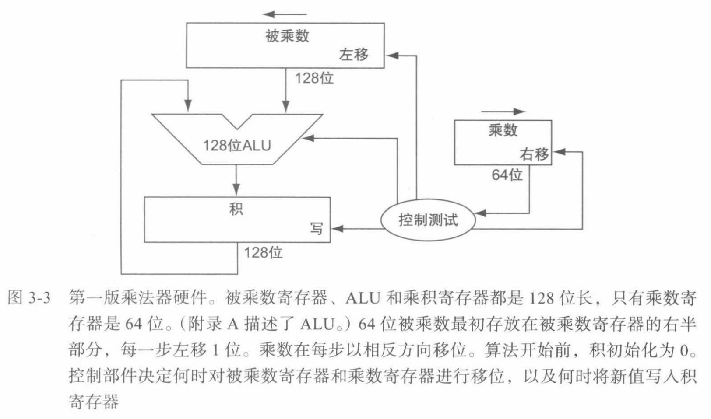
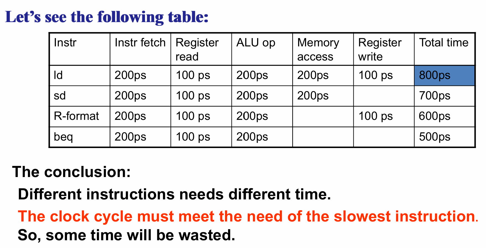
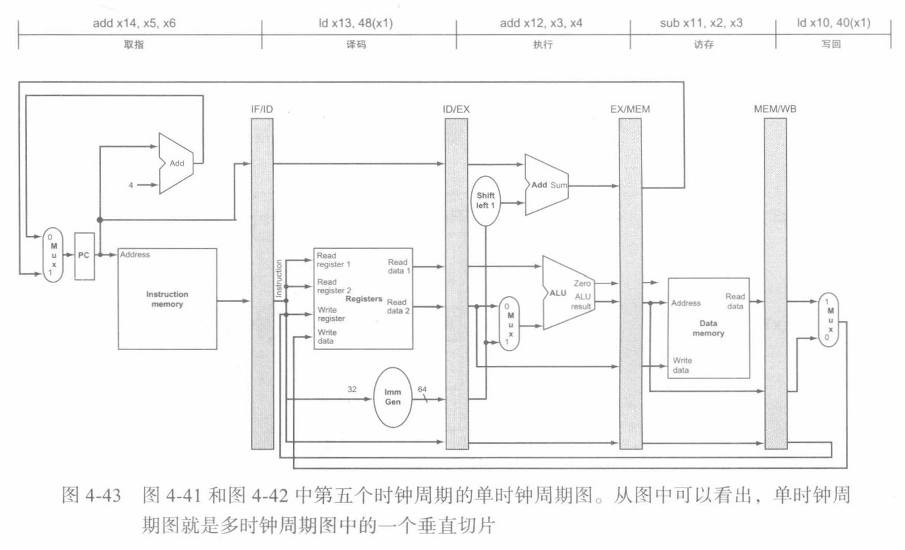
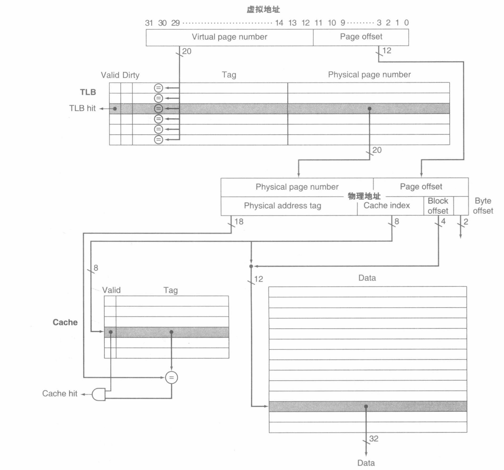

# CO note

## Chapter 1: Computer Abstraction & Technology

### Performance

#### CPU Time

- IC: Instruction Count（指令条数）
- CPI: Cycles per Instruction（每条指令所占周期数）
- Clock Rate：时钟频率
- 计算
    $$
        \begin{align*}
        Clock\ Cycles &= IC * CPI \\
            CPU\ Time &= Clock\ Cycles \times Clock\ Cycle\ Time \\
                        &= \frac{IC \times CPI}{Clock\ Rate}
        \end{align*}
    $$

#### Depends on

- 算法：IC、Possibly CPI
- 编程语言：IC、CPI
- 编译器：IC、CPI
- 指令系统体系结构：IC、CPI、Clock Rate

#### Power Wall

- 功耗 = 负载电容 * 电压$^ 2$ * 开关频率

## Chapter 3: Arithmetic for Computer

<!-- ### Intro -->

### Intro

#### Add & Sub

- 用补码实现减法
    <center></center>

#### Signed & Unsigned Number

- Unsigned: $(1001)_2 = 9_{10}$
- Signed:
    - Sign & Magnitude: $(1001)_2 = (-1)_{10}$
    - 1's Complement: $(1001)_2 = (-6)_{10}$
    - 2's Complement: $(1001)_2 = (-7)_{10}$
- Biased Notation: $[X]_b=  2^n + X$
    <center></center>
    加上 $2^{31}$（相当于最高位翻转）让右侧数值递增
- Sign Extension：假设要将 8 位有符号数 $(1111\ 0101)_2 = (-11)_{10}$ 扩展为 16 位，则将最高位（此处为 1）复制即可，得到 $1111\ 1111\ 1111\ 0101$

#### Logical & Arithmetic Shift

- `srl` 逻辑右移
    - 格式 `srl rd, rs1, rs2`
    - 表示将 `rs1` 的值左移 `rs2` 位储存到 `rd` 中
    - 不考虑符号位（左边补 0）

- `sra` 算数右移
    - 格式 `sra rd, rs1, rs2`
    - 表示将 `rs1` 的值左移 `rs2` 位储存到 `rd` 中
    - 考虑符号位（左边补符号位）

- `slli` 逻辑左移立即数
    - 格式 `slli rd, rs1, imm`
    - 表示将 `rs1` 的值左移 `imm`（常数）位储存到 `rd` 中
    - 右边补 0

### ALU

#### Half & Full Adder

- Half Adder
    $$
    sum = \bar ab + a \bar b \\
    carry = ab
    $$
- Full Adder
    $$
    sum = a\ \mathrm{xor}\ b\ \mathrm{xor}\ c_{in} \\
    carry_{out} = bc_{in} + ac_{in} + ab
    $$

#### Extended 1 bit ALU

- Substraction
    - Inverting b
    - 第一个 $carry_{in}$ 置为 1
- Comparison
    - 格式 `slt rd, rs, rt`，表示 `rd = (rs < rt) ? 1 : 0`

### Fast Adders

- 行波进位加法器会产生 2n 单位延迟
- 目标：通过硬件资源换取时间

#### Carry Look-ahead Adder

- 通过预先计算每一位的进位值来减少进位的传播延迟
- 生成与传播
    - Generate: $G_i = A_i \cdot B_i$
    - Propagate: $P_i = A_i + B_i$
    - $C_i = G_i + (Pi \cdot C_{i - 1})$

#### Carry Skip Adder

- 通过跳过不必要的进位以提高速度

#### Carry Select Adder

- 并行计算两种可能的进位值（0、1）减少进位的传播延迟，之后根据前一位的实际进位值选择正确的结果
- 以 8 位 CSA 为例：
    - 8 位分成两组，每组各 4 位
    - 对于每一组，分别假设进位值为 0, 1 后计算两种可能的加法结果和进位值
    - 第一组取进位值为 0 的结果，第二组根据第一组的实际进位选择结果，然后组合两组结果
- Demo
    <center></center>

### Multiplication

#### Unsigned Multiplication

##### Version 1

- 以 64 位乘法为例，先初始化 128 位乘积寄存器为 0，并将 128 位被乘数寄存器初始化为左半部分 0 及右 64 位被乘数
- **被乘数**寄存器每执行一步便左移一位，根据**乘数**最低位判断是否将被乘数与 128 位乘积寄存器中间结果累加，然后乘数寄存器右移
- Diagram
    <center></center>

##### Version 2

- 通过并行执行被乘数与乘数的移位操作进行时间优化
- 不移动被乘数寄存器，而是移动乘积寄存器
- 将乘数放到乘积寄存器**右半部分**（不再需要乘数寄存器），根据其最低位决定是否将被乘数累加到乘积寄存器的**左半部分**，然后整体右移
- Diagram
    <center></center>
- Demo
    <center></center>

#### Signed Multiplication

##### Basic Approach

- 先记下被乘数、乘数的符号后将两者转为无符号数
- 按照之前的算法进行乘法
- 如果符号相同，则结果符号为 0，反之为 1

##### Booth's Algorithm

- 原理：通过将二进制数中连续的 1 分解为两个二进制数之差减少运算次数。e.g.
    - `M * 0 0 1 1 1 1 1 0` = 
    - `M * 0 1 0 0 0 0-1 0` = `M * 62`
- 将乘积寄存器设为 0，乘数依然放在低半部分，并在最低位右边设置一个初始为 0 的 Booth 位（用于存储前一周期乘积寄存器的最低位）
- 从乘数最低位开始：
    - 检查乘积寄存器的最低位和 Booth 位：
        - `01`：将被乘数加到乘积寄存器高半部分
        - `10`：将被乘数从乘积寄存器高半部分中减去
        - `00` 或 `11`：不执行操作
    - 将乘积寄存器连同 Booth 位同时**算数右移**
- Demo
    <center></center>

#### Faster Multiplication

使用并行运算，可以将 64 位乘法等待时间从 64 次缩减到 6 次
<center></center>

#### RISC-V Multiplication

RISC-V 指令集提供了四种乘法指令（以 64 位为例）：

- `mul`：对两个寄存器进行有符号乘法运算，结果的**低** 64 位存到目标寄存器中
- `mulh`：同上，但是存储**高** 64 位
- `mulhu`：进行**无符号**乘法运算，存储高 64 位
- `mulhsu`：将一个寄存器视为有符号，另一个视为无符号相乘，存储高 64 位

### Division

#### Unsigned Division

##### Version 1

- 初始将 64 位除数放到除数寄存器的高半部分，余数寄存器初始化为被除数
- 从余数寄存器中减去除数寄存器，左移商寄存器，ALU 控制逻辑判断：
    - 结果为正数：商中生成一位 1
    - 结果为负数：商中生成一位 0，将除数寄存器加回余数寄存器
- 右移除数寄存器
- Diagram
    <center></center>

##### Version 2

- 初始将被除数放在余数寄存器低半部分，左移一位
- 将余数寄存器高半部分减去除数，ALU 控制逻辑判断：
    - 结果为正数：商的最后一位置 1
    - 结果为负数：商的最后一位置 0，将除数加回
- 整体左移
- 最终低半部分为商，高半部分**右移一位**得到余数（因此余数寄存器应为 129 位防止进位丢失）
- Diagram
    <center></center>
- Demo: $7 \div 2$
    <center></center>

#### Signed Division

- 始终记住：被除数 = 商 $\times$ 除数 + 余数
- 要求余数符号与被除数保持一致（由此得出，如果源操作数符号相反则商必为负）

#### RISC-V Division

RISC-V 指令集提供了两种除法指令（以 64 位为例）：

- `div`：有符号除法，将商存储到目标寄存器
- `divu`：无符号除法

和两种计算余数指令：

- `rem`：有符号余数计算
- `remu`：无符号余数计算

### Floating Point Numbers

#### Floating Point Representation

- 二进制下科学计数法表示浮点数：
    $$ 1.xxxxx_2 \times 2^{yyy} $$

##### IEEE 754 Floating-point Format

- 标准格式：$N = (-1) ^ S \times M \times 2 ^ E$
    1. $S$（符号位）：$S = 1$ 时表示负数
    2. $M$（尾数）：$M = 1 + frac$
    3. $E$（阶码）：采用移码表示，$E = exp - Bias$，其中 $Bias = 127$ (single) or $1023$ (double)
- 两种主要格式
    |Type|S|exp|frac|
    |----|-|---|----|
    |`float`|1|8|23|
    |`double`|1|11|52|
- Demo - Represent $0.75$
    <center></center>

##### Range

- Single
    - 阶码的 `000...00` 和 `111...11` 不考虑
    - 最小：
        - $exp = 000\dots01$，实际上 $E = exp - Bias = 1 - 127 = -126$
        - $frac = 000\dots00$，即 $significand = 1.0$
        - $\pm 1.0 \times 2 ^{-126} \approx \pm 1.2 \times 10^{-38}$
    - 最大：
        - $exp = 111\dots10$, 实际上 $E = 254 - 127 = 127$
        - $frac = 111\dots11$，即 $significand \approx 2.0$
        - $\pm 2.0 \times 2 ^{127} \approx \pm 3.4 \times 10^{38}$
- Double
    - 最小：$\pm 1.0 \times 2 ^{-1022} \approx \pm 2.2 \times 10^{-308}$
    - 最大：$\pm 2.0 \times 2 ^{1023} \approx \pm 1.8 \times 10^{308}$

##### Denormal Numbers

- $x = (-1)^S \times (0 + frac) \times 2 ^{1 - Bias}$
- 即阶码 $exp = 000\dots00$ 时，认为这是非规格化数，用于表示接近零的非常小的数

##### Inf & NaN

- $exp = 111\dots11$, $frac = 000\dots00$，表示无穷（Inf）
- $exp = 111\dots11$, $frac \neq 000\dots00$，表示 Not-a-Number（NaN）

##### Summary

<center></center>

#### Floating Point Add & Sub

- Steps
    1. 对阶（Alignment）：小的浮点数**尾数**右移直到阶码相等
    2. 尾数相加（Addition of Significands）
    3. 规格化（Normalization）：若结果超过尾数表示范围，则将结果右移、阶码加 1；若过小则右移
    4. 舍入溢出（Rounding）
- Demo - Addition
    <center></center>
- Demo - Subtraction
    <center></center>
- Hardware
    <center></center>

#### Floating Point Mul & Div

- Steps（乘法，除法类似）
    1. 阶数相加（两个 $exp$ 相加后要减去 $Bias$）
    2. 尾数相乘
    3. 规格化
    4. 舍入溢出
- Demo1 - Mul
    <center></center>
- Demo2 - Mul
    <center></center>

#### RISC-V

##### Instructions

<center></center>

##### Demo - Array Multiplication

- C Code
    ```C
    void mm(double c[][], double a[][], double b[][]) {
        size_t i, j, k;
        for (int i = 0; i < 32; i = i + 1)
            for (int j = 0; j < 32; j = j + 1) 
                for (int k = 0; k < 32; k = k + 1)
                    c[i][j] = c[i][j] + a[i][k] * a[k][j]
    }
    ```
    Addresses of `c, a, b` in `x10, x11, x12`, and `i, j, k` in `x5, x6, x7`
- RISC-V Code
    <center></center>
    <center></center>


#### Accurate Arithmatic

保证计算机使用的数误差在半个 ulp 之内

##### Guard & Round

- IEEE 754 在中间计算时，总是在右边保留两个额外的位：**保护位**（guard）和**舍入位**（round）
- 后两位在 $0 \sim 49$ 之间时舍去，$51 \sim 99$ 之间进位
- Demo
    <center></center>

##### Sticky

- 用于判断是否有被舍去的位包含非零信息
- 为所有后续位的或，即如果舍入位右边有至少一个 1，则将 sticky bit 置为 1
- 如果 guard bit 是 1 且 round 或 sticky 至少一个是 1，则进位；否则舍去
- halfway case：如果舍入位为 1 且 round 和 sticky 都为 0，则向偶数舍入

## Chapter 2: Instructions: Language of the Computer

### RISC-V Assembly Language

#### Arithmetic

- `add rd, rs1, rs2`: 将 rs1 和 rs2 的值相加存储到 rd 中
- `sub rd, rs1, rs2`: 将 rs1 的值减去 rs2 存储到 rd 中

#### Register

- RISC-V 中有 32 个通用寄存器，一般 64 位
- 个数越少越快，一般不超过 32 个
- 32 位称作 `word`，64 位称作 `doubleword`

|Name|Register Name|Usage|Preserved on call?|
|----|-------------|-----|------------|
|x0|0|The constant value 0|n.a.|
|x1(ra)|1|Return address(link register)|yes|
|x2(sp)|2|Stack pointer|yes|
|x3(gp)|3|Global pointer|yes|
|x4(tp)|4|Thread pointer|yes|
|x5-x7|5-7|Temporaries|no|
|x8-x9|8-9|Saved|yes|
|x10-x17|10-17|Arguments/results|no|
|x18-x27|18-27|Saved|yes|
|x28-x31|28-31|Temporaries|no|

- callee-saved registers(saved register)：x8-x9, x18-x27
    - 由被调用函数保存/恢复
    - 返回时保持被调用前的值
    - 通常用于传参/保存在函数调用过程中需要保持不变的寄存器
- caller-saved registers(temporary register)：x5-x7, x28-x31
    - 由调用函数保存/恢复
    - 子函数可以随便使用
    - 通常用于保存临时变量

#### Memory

- 存储器只能被数据传输指令访问，保存数据结构、数组和换出的寄存器的内容。
- 使用字节寻址法（双字的地址与双字内 8 个字节之一的地址匹配），共 $2^{64} / 2^3 = 2^{61}$ 个（`memory[0], memory[8], ..., memory[2^64 - 8]`）
    <center></center>
- Endianness
    - Big endian
        - 数据的高字节存放在低地址
        - 数据的低字节存放在高地址
        - PowerPC
    - Little Endian
        - 数据的高字节存放在高地址
        - 数据的低字节存放在低地址
        - RISC-V
- Memory Alignment
    <center></center>
- Demo
    - C
        ```C
        A[12] = h + A[8];
        ```
    - RISC-V
        ```asm
        ld x9, 64(x22)
        add x9, x21, x9
        sd x9, 96(x22)
        ```

### Representing Instructions

#### R-type（寄存器类型）

|funct7|rs2|rs1|funct3|rd|opcode|
|-|-|-|-|-|-|
|7bits|5bits|5bits|3bits|5bits|7bits|

- 主要用于执行寄存器之间的操作（如算数、逻辑运算与移位操作）
- `opcode`（操作码）：用于区分指令类型，所有 R 型指令均为 `0110011`
- `rs1`, `rs2`, `rd`：源寄存器、目标寄存器
- `funct3`, `funct7`：功能码 3，用于区分不同 R-type 指令

#### I-type（立即数类型）

|imm[11:0]|rs1|funct3|rd|opcode|
|-|-|-|-|-|
|12bits|5bits|3bits|5bits|7bits|

- 主要用于执行寄存器和立即数之间的操作
- `rs1`, `rd`：源寄存器、目标寄存器
- `imm[11:0]`：立即数

#### S-type（存储类型）

|imm[11:5]|rs2|rs1|funct3|imm[4:0]|opcode|
|-|-|-|-|-|-|
|7bits|5bits|5bits|3bits|5bits|7bits|

- 主要用于执行内存存储操作
- `imm[11:5]` 和 `imm[4:0]`：两个立即数
- `rs2` 和 `rs1`：两个源寄存器

#### B-type（分支类型）

|imm[12]|imm[10:5]|rs2|rs1|funct3|imm[4:1]|imm[11]|opcode|
|-|-|-|-|-|-|-|-|
|1bit|6bits|5bits|5bits|3bits|4bits|1bit|7bits|

- 主要用于条件分支
- `imm[12|10:5|4:1|11]`：立即数，用于指定跳转偏移量

#### U-type（上位立即数类型）

|imm[31:12]|rd|opcode|
|-|-|-|
|20bits|5bits|7bits|

- 主要用于生成大的立即数

#### J-type（跳转类型）

|imm[20]|imm[10:1]|imm[11]|imm[19:12]|rd|opcode|
|-|-|-|-|-|-|
|1bit|10bits|1bit|8bits|5bits|7bits|

- 主要用于无条件跳转
- `imm` 用于指定跳转偏移量，`rd` 用于存储跳转返回地址

<center></center>

### Instructions

#### Branch Instructions

- `beq rs1, rs2, offset`：寄存器 `rs1` 等于 `rs2` 则跳转到 `offset`（加到程序计数器 PC 上，注意立即数 `offset` 只有 12 位，因此跳转范围有限制）
- `bne rs1, rs2, offset`：不相等则跳转
- `blt rs1, rs2, offset`：`rs1 < rs2` 则跳转（默认比较**有符号**，无符号需用 `bltu`）
- `bge rs1, rs2, offset`：`rs1 >= rs2` 则跳转
- Demo-case
    <center></center>
- Demo-loop
    <center></center>

简便方法
- 如果 `x20 >= x11 || x20 < 0` 则跳转 `IndexOutOfBounds`：`bgeu x20, x11, IndexOutOfBounds`

#### Set-if Instructions

- `slt rsd, rs1, rs2`：如果 `rs1` 的值小于 `rs2`，则将 `rd` 的值设置为 1，否则置为 0。比较有符号。
- 类似还有 `sltu`, `slti`, `sltiu` 等。
    <center></center>

#### Jump Address Table

- 跳转地址表是一个存储多个地址的数组，每个地址对应一个跳转目标。可用于实现 `switch` 语句、函数指针等特性。
- `jal rd, offset`：将 PC + 4 的结果（即下一条指令的地址）存储到 `rd` 中，再将 PC 加上有符号 20 位立即数 `offset` 作为新的 PC（即跳转）。跳转的子程序执行完毕后可以通过 `rd` 返回。
- `jalr rd, rs1, offset`：将 PC + 4 的结果存到 `rd` 中，再将 `rs1` 加上有符号 12 位立即数 `offset` 的结果作为新的 PC。

以下为 `switch` 语句的指令转化：

- C code
    ```C
    switch (k) {
        case 0: f = i + j; break;
        case 1: f = g + h; break;
        case 2: f = g - h; break;
        case 3: f = i - j; break;
    }
    ```
- RISC-V Instructions（`x6` 为表的基地址）
    <center></center>

### Procedures

- Registers
    - `x10 ~ x17`：用于传递参数/返回值的寄存器
    - `x1`：用于返回到起始点的返回寄存器
- Instructions:
    - Procedure call: `jal x1, X` 跳到过程地址 X 并将返回地址写入 `x1`
    - Procedure return: `jalr x0, 0(x1)` 跳转到 `x1` 中的地址，`x0` 表示不会改变任何寄存器的值
    - 以上两条指令一起使用实现函数调用和返回
- Leaf Procedure：不调用其他过程的过程
- **Key**：
    - 函数过程中的所有临时变量都需要申请栈空间（即提前将寄存器的值存入栈里）
    - 关注形参存在哪个寄存器。如果嵌套则需要将 x1 也提前存到栈里

### Communicating with People

#### String

三种存储方式：
- 第一个位置存储长度（Java）
- 用另外一个变量存储长度
- 字符串末尾以 `0` 表示结束

### Wide Immediate Addressing

- `lui rd, imm`：将 20 位常数存储到寄存器 `rd[31:12]` 并将 `rd[31]` 扩展到 `rd[63:32]` 中，再将 `rd[11:0]` 置 0（U-Type）
- Demo：存储 32 位，先用 `lui` 再用 `addi` 存低 12 位
    <center></center>

#### Branch Addressing

- SB-Type (Store Byte)：分支跳转指令，范围 $-4096 \sim 4096$
- 是 PC-relative 寻址，Target Address = PC + Branch offset
    <center></center>

#### Jump Addressing

- UJ-Type：无条件跳转，范围 $-2^{20} \sim 2^{20}$
    <center></center>
- 长距离跳转
    - `beq x10, x0, L1`
    - 以下写法实现长距离跳转
        ```asm
            bne x10, x0, L2
            jal x0, L1
        L2:
        ```
- Demo
    <center></center>

#### Summary

- Addressing 一条指令中可能涉及多种寻址方式
    <center></center>
- RISC-V Encoding
    <center></center>
- Instruction Format
    <center></center>
```asm
# gcd(x, y) = y == 0 ? x : gcd(y, x % y)
# x in x10, y in x11, gcd in x10
gcd:
    addi sp, sp, -12
    sw x1, 0(sp)
    sw x10, 4(sp)
    sw x11, 8(sp)

    bne x11, x0, L1 # x10 为 gcd
    jalr x0, 0(x1)

L1:
    rem x5, x10, x11 # x5 = x % y
    addi x10, x11, 0
    addi x11, x5, 0
    jal x1, gcd
```

### Synchronization

- Data Race：任务之间不同步引起的**数据竞争**
- Mutual Exclusion：互斥
- 原子指令对
    - `lr.d`（Load Reserved Doubleword）：原子加载指令，读取双字的值并将其标记为 _reserved_
    - `sc.d`（Store Conditional Doubleword）：尝试将双字的值写入内存，仅在该地址从上次 `ld.r` 执行以来一直处于 _reserved_ 时成功
    - Demo: atomic swap
        <center></center>

### Array vs Pointer

- 指针写法不需要在循环中计算地址，稍快
- 但是编译器会优化数组写法

<center></center>

## Chapter 4: The Processor (Single Cycle)

### CPU Construction

#### DataPath

<center></center>

<center></center>

#### Control Unit

<center></center>

<center></center>

根据输入指令 `inst[31:0]` 产生控制信号
- `RegWrite`：是否向寄存器写入数据
- `ALUSrc`：控制 ALU 的第二个操作数来自寄存器还是立即数
- `MemRead`/`MemWrite`：控制内存是否读取/存储数据
- `Branch`：是否执行分支跳转
- `ALUOp`：控制 ALU 执行的操作
- `Jump`：用于是否执行无条件跳转（`PC + 4` 还是 `PC + offset`）
- `MemtoReg`：决定被写入寄存器的数据来自哪里
    - Memory：如 `ld` 等加载指令
    - ALU：如 `add` 等算数/逻辑指令
    - PC Adder：如 `jal` 等跳转指令


| Inst | ALUSB | Mem2Reg | RegWr | MemRW | Branch | Jump | ALUOp |
| ---- | ----- | ------- | ----- | ----- | ------ | ---- | ----- |
| R    | 0     | 0       | 1     | 00    | 0      | 00   | TBD   |
| l    | 1     | 0       | 1     | 00    | 0      | 00   | RBD   |
| ld   | 1     | 1       | 1     | 01    | 0      | 00   | +     |
| S    | 1     | x       | 0     | 10    | 0      | 00   | +     |
| B    | 0     | x       | 0     | 00    | 1      | 00   | cmp   |
| J    | x     | 10      | 1     | 00    | 0      | 01   | x     |
| jalr | 1     | 10      | 1     | 00    | 0      | 10   | +     |
| lui  | x     | 11      | 1     | 00    | 0      | 00   | x     |

#### Others

- ALU：内存地址、分支比较控制、计算算术结果
    - 读取数据/存储数据：加法（内存地址）
    - 分支比较：减法（zero 信号）
    - R-type：取决于 opCode
- ImmGen：根据输入指令产生立即数、将立即数符号扩展为 32/64 位有符号数
- Memory：内存，根据 `MemRead`, `MemWrite` 分别判断是否读取/存储数据
- RegisterFile：寄存器堆，支持同时读取两个寄存器的数据、向一个寄存器写入数据

#### Performance

<center></center>

### Exception

- Exception（异常）：指令执行过程中的错误
    - CPU 内部产生
    - 例如除零、内存访问越界、非法指令等
- Interrupt（中断）：外部事件导致的异常
    - CPU 外部设备产生
    - 例如时钟中断、I/O 中断等

#### Exception Handling

- 通过异常处理程序（Exception Handler）处理异常
- 通过中断向 CPU 发送信号
- 通过异常处理程序处理中断

#### Interrupt Registers

- `mie/mip`：中断使能/中断挂起
    - `mie`：中断使能寄存器，用于控制中断是否被响应
    - `mip`：中断挂起寄存器，用于记录中断是否被触发
- `mtvec`：中断处理程序入口地址
    - `mtvec[1:0]`：模式选择位
    - `mtvec[63:2]`：中断处理程序入口地址
- `mepc`：中断处理程序的返回地址
- `mcause`：中断原因
    <center></center>

#### Interrupt Instruction

- `ecall`

## Chapter 4: The Processor (Pipelining)

### Pipelining

- Pipelining：将 CPU 的执行过程分为多个阶段，使得多个指令可以同时执行

#### Stage

- IF（Instruction Fetch）：取指令
- ID（Instruction Decode）：译码
- EX（Execute）：执行
- MEM（Memory）：访存
- WB（Write Back）：写回
    <center></center>

#### Pipelining Performance

- Comparison
    <center></center>
- Speedup: $Time between inst_{pipelined} = \frac{Time between inst_{not pipelined}}{Number of stages}$

### RISC-V Pipelined Datapath

#### Datapath

- 前一个 rd 需要通过流水线寄存器传递，防止 `ld` 等指令写回时写到下一个 rd 中
<center></center>

#### Pipeline Instruction Execution
<center></center>

#### Pipeline Registers

作用
- 存储每个阶段的数据
- 将数据传递到下一个阶段
- 防止数据冒险

### Pilepine Hazard

Hazard Type
- Structural Hazard：硬件资源冲突
    - 两条及以上指令在同一时间访问同一资源
    - 因缺乏硬件支持导致指令无法在预定的时钟周期内执行
- Data Hazard：指令之间的数据依赖关系导致的冲突（当前指令的执行需要等待前一条指令的执行结果）
    - RAW：指令 i 写回结果之前，指令 j 就需要读取该结果（基础流水线主要出现）
    - WAW：指令 i 写回结果之前，指令 j 就已经将结果写回
    - WAR：指令 i 读取数据之前，指令 j 就已经将结果写回
- Control Hazard：分支指令导致的冲突（指令非顺序执行导致下一条执行的指令不是真实期望的）

#### Structural Hazard

- 增加硬件资源：如增加多个 ALU、将内存分为指令内存和数据内存等
- stall：暂停流水线，等待资源可用（可以解决任何 Hazard）
    - 可能导致 bubble（空指令周期）
- Demo1: 分离指令内存和数据内存
    <center></center>

#### Data Hazard

- stall：暂停流水线，等待数据可用（硬件检测并阻塞）
- nop：插入空指令，与 stall 相似（编译时插入）
- Forwarding：将 DataPath 生成的中间数据直接往前传递到 ALU 输入端参与后面指令的运算
    <center></center>

#### Control Hazard

- Branch Prediction：预测分支的方向
    - 静态预测：总是预测跳转/不跳转
    - 动态预测：根据历史记录预测
- Delayed Branch：延迟分支
    - 在分支指令后插入一条无条件跳转指令，使得分支指令后的指令可以继续执行
    - 但是会增加流水线长度

#### Stall

##### When to Stall

- Structural Hazard：同一时间内访问同一资源
- Data Hazard：当前指令需要使用之前的结果，但该结果尚未写回寄存器
- Control Hazard：分支指令还在解码阶段，而取指阶段已经取得了后续的指令

##### How to Stall

1. Add hardware interlock
- 检测需要 stall 的情况
- 向流水线插入 bubble（空指令周期）
2. Add stall control logic
    <center></center>
3. 最终的 Datapath
    <center></center>

##### Performance with Stall

$CPI_{pipelined} = 1 + stall\ clk\ cycles\ per\ inst$

$Speedup = \frac{pipeline\ depth}{1 + stall\ clk\ cycles\ per\ inst} $

## Chapter 5: Memory

### Cache

#### Basics

- Two Issues
    1. 如何知道数据是否在 cache 中
    2. 如果在 cache 中，如何找到数据
- Example: Direct Mapped
    - block size is one word of data

#### Direct Mapped Cache

- （Cache Block Address）对于一个内存地址，其在 cache 中的位置由以下三部分决定：
    - Tag：用于识别存储在特定 Cache 槽中的数据属于哪个内存块，确定是否命中
    - Index：用于确定该内存块映射到 Cache 中的哪个槽
    - Offset：用于从 Cache 块中找到具体的数据字节
    <center></center>
- 读取规则
    - 利用内存地址的 Index 直接定位 Cache 中的位置。因此所有内存地址被分组，同组内的地址映射到同一个 Cache 槽中
    - Hit：如果 Tag 匹配且有效位有效，则命中，数据可以直接被使用
    - Miss：如果 Tag 不匹配或者有效位无效，则未命中，需要从内存中读取数据或进行替换
    <center></center>
- Demo
    <center></center>
    <center></center>
- 大小计算：一般 Cache 以其包含数据量命名（如 4KiB Cache 可以容纳 4KiB 数据），但是还包含 tag, valid bit 等。其中 tag 位宽 = 地址位宽 - index（块数决定） - block offset（）
    <center></center>

#### Handling Cache Hits & Misses

- Read
    - Read Hits：直接从 Cache 中读取数据
    - Read Misses：从内存中读取数据，同时将数据写入 Cache
- Write Hits：写入的数据已经在缓存中
    - Write-back：减少主内存写操作提升性能
        - 数据仅被写入缓存，不立即写入主内存
        - 每个缓存块有一个 dirty bit，记录是否被修改
        - 当缓存块被替换等，才将数据写回主内存
    - Write-through：提升数据一致性，但可能降低性能
        - 数据同时被写入缓存和主内存
- Write Misses
    - Write Allocate：假设后续写操作会再次访问该数据，因此将数据读入 Cache
        - 先将缺失的数据从主内存加载到 Cache
        - 再执行写命中的策略
    - No Write Allocate：直接写入主内存，不写入 Cache
    <center></center>
- CPI 计算
    <center></center>

### Virtual Memory

- Virtual Memory：将主存看作是一个存储在磁盘上的地址空间的高速缓存

#### 工作原理

- 将虚拟内存分为固定大小的块，称为页（page），对应虚拟地址；将物理内存分为固定大小的块，称为页框（page frame），对应物理地址
- 通过页表（page table）将虚拟地址映射到物理地址。程序访问内存时，操作系统查找页表，找到对应的页框进行访问
- Replacement：当所有页都被使用时，如果程序需要更多内存，操作系统会选择一个页，将其写回磁盘，再将新的页加载到内存
- Page fault：当程序访问的页不在主存中时，产生一个 page fault，操作系统将该页从磁盘加载到主存；如果主存已满，则选择一个页进行替换，同时更改页表的状态位
    <center></center>

#### Page Table

Page table：存储虚拟地址到物理地址的映射信息
- 虚拟内存使用全相联映射策略
- Page table 位于内存中，以虚拟页号为索引，存储页表项（Page table entry，PTE）表示映射信息，每个 PTE 包含物理页号和一些状态位
    <center></center>
- 虚拟页号一般比物理页号多（因为部分物理地址在磁盘中）
- 大小计算：
    - 页数 = 地址空间大小 / 页大小（一个虚拟地址由虚拟页号 + 页内偏移组成）
    - 页表大小 = 页数 * 页表项大小
        <center></center>

#### TLB: Translation Lookaside Buffer

- TLB：用于加速虚拟地址到物理地址的转换；位于 CPU 中，存储最近使用的 PTE，可以视为页表的小但快速的缓存
    <center></center>
- 工作原理：当 CPU 尝试访问一个虚拟地址时，会首先查找 TLB
    - 如果找到对应的 PTE（hit），则直接将虚拟地址转换为物理地址
    - 如果未找到（miss），则访问主内存的 page table 查找对应 PTE，并加载到 TLB 中，然后将虚拟地址转换为物理地址
        <center></center>

[复习](https://blog.csdn.net/weixin_44176696/article/details/112536115)
